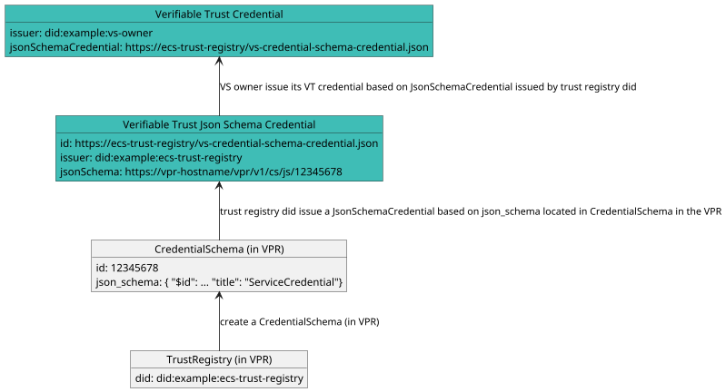

# Verifiable Trust v1 Specification

**Specification Status:** *Draft*

**Latest Draft:** [verana-labs/verifiable-trust-spec](https://github.com/verana-labs/verifiable-trust-spec)

**Editors:**

~ [Fabrice Rochette](https://www.linkedin.com/in/fabricerochette) (The Verana Foundation, 2060.io)

<!-- -->

**Participate:**

~ [GitHub repo](https://github.com/verana-labs/verifiable-trust-spec)

~ [File a bug](https://github.com/verana-labs/verifiable-trust-spec/issues)

~ [Commit history](https://github.com/verana-labs/verifiable-trust-spec/commits/main)

---

## Abstract

The Internet is broken. All existing communication channels are insecure, and obsolete. Because all existing communication channels rely on public identifiers, anyone that knows your identifier can reach you.

Furthermore, existing communication channels do not provide a sure-fire way of verifying service provider and end-user Identity. This is an open door to spam, phishing, fraud, identity theft...

Regarding service providers and services, each service has it own registration process, fastidious password rules... And/or they are usually using federated login, that makes you depend on a third party service for accessing your accounts.

If the World Wide Web was initially designed for interoperability, major companies have managed to transform it to a closed, centralized internet, that we all depend on.

Not to talk about privacy, and what's done with our data.

To build a new, trustable internet, we need new, zero trust communication channels, where both ends can be clearly identified, and where providing a service, accessing a service, or creating a new account, should be as simple as clicking a link or presenting a credential.

## About this Document

In order to fully understand the concepts developed in this document, you should have some basic knowledge of [[ref:DID]], [[ref:DIDComm]], [[ref:VS]], [[ref:trust registry]], ledger-based applications, and more generally, all terms present in the [Terminology](#terminology) section.

## Introduction

### What is a Verifiable Communication Channel?

*This section is non-normative.*

A verifiable communication channel is a communication channel, where participants have been fully authenticated with a [[ref: verifiable credential]].

A communication channel is considered a verifiable communication channel if:

- communication channel supports verifiable credentials, either through linked-vp and/or present proof;
- all communication channel participants presented a [[ref: verifiable credential]], and presented [[ref: verifiable credentials]] were considered acceptable by other participants (authorized issuers, and optionally matching claims).
- when public resolvable DID(s) are involved for establishing the connection, ciphering keys for bootstrapping the connection MUST be keys defined in DID Document(s);
- when direct did:peer DIDs are involved for bootstrapping the connection, they can be accepted only if originating from a compliant user agent.

All the above is detailed in this spec.

Verifiable communication channel can be persistent or ephemerous.

:::note
Presented credentials do not necessarily need to be human/organization identity related. An IoT service could present a deviceId credential to authenticate itself.
:::

### What is a Verifiable Service?

*This section is non-normative.*

A [[ref: verifiable service]] is a service that provide a way to identify itself *before* connecting to it. Entities that want to connect to a [[ref: verifiable service]] can review its presented [[ref: verifiable credentials]], prove their legitimacy by performing a [[ref: trust resolution]], and based on the result, decide to connect or not.

Additionally, a [[ref: verifiable service]] that would like to issue or request verification of credentials must prove it is allowed to do so.

### What is a Verifiable User Agent?

*This section is non-normative.*

A Verifiable User Agent ([[ref: VUA]]) is a software (a browser, an app, a wallet...) for connecting to VSs and other VUAs. When establishing connections, a VUA must verify the connection peer(s) and allow connection(s) only to compliant VS and VUA peers.

Additionally, VUAs must perform a trust resolution by verifying the credentials presented by the peers and query VPR(s) to check that these credentials have been issued by verified issuers.

### What is a Verifiable Public Registry?

*This section is non-normative.*

A Verifiable Public Registry ([[ref: VPR]]) is a "registry of registries" public service, which provides:

- trust registry features, that can be used by all its [[ref: participants]]: create trust registries, for each trust registry, define its credential schemas, who can issue, verify credential of a specific credential schema,...
- a query API, used by VSs, VUAs, to enforce application of governance frameworks and rules of created trust registries.

### Conformance

As well as sections marked as non-normative, all authoring guidelines, diagrams, examples, and notes in this specification are non-normative. Everything else in this specification is normative.
The key words MAY, MUST, MUST NOT, OPTIONAL, RECOMMENDED, REQUIRED, SHOULD, and SHOULD NOT in this document are to be interpreted as described in [BCP 14](https://datatracker.ietf.org/doc/html/bcp14) [RFC2119](https://w3c.github.io/vc-data-model/#bib-rfc2119) [RFC8174](https://w3c.github.io/vc-data-model/#bib-rfc8174) when, and only when, they appear in all capitals, as shown here.

## Terminology

[[def: credential schema, credential schemas]]:
~ An [[ref: VPR]] resource which represents a verifiable credential definition and the associated permissions and business rules for issuing, verifying or holding a credential linked to this credential schema.

[[def: decentralized identifier, DID, DIDs]]:
~ A decentralized identifier, as specified in [[spec-norm:DID-CORE]].

[[def: decentralized identifier communication, DIDComm]]:
~ [DIDComm](https://identity.foundation/didcomm-messaging/spec/) uses [[ref: DIDs]] to establish confidential, ongoing connections.

[[def: decentralized identifier document, DID Document, DID Documents]]:
~ A DID Document, as specified in [[spec-norm:DID-CORE]].

[[def: verifiable public registry, VPR, VPRs]]:
~ a public, normally decentralized network, which provides: trust registry features, that can be used by all its [[ref: participants]]: create trust registries, for each trust registry, define its credential schemas, who can issue, verify credential of a specific credential schema,... For more information, please refer to [VPR Spec](https://verana-labs.github.io/verifiable-trust-vpr-spec/).

[[def: verifiable service, VS, VSs]]:
~ A service, identified by a resolvable [[ref: DID]] that can be deployed anywhere by its owner, and that is conforming to this spec and has a resolvable [[ref: proof of trust]].

[[def: verifiable user agent, VUA, VUAs]]:
~ A user agent for accessing and using [[ref: VSs]]. To be considered a [[ref: VUA]], a user agent must conform and enforce this spec, such as presenting a proof of trust to end user before accepting connecting to [[ref: VS]] compliant services, and refuse connecting to not compliant services.

[[def: essential credential schema, essential credential schemas]]:
~ Default [[ref: credential schema]], owned by a [[ref: trust registry]], that provide the basis for a trust layer to exist in the ecosystem so that [[ref: VUA]] can generate a [[ref: proof of trust]].

[[def: holder, holders]]:
~ A role an entity might perform by possessing one or more verifiable credentials and generating verifiable presentations from them. A holder is often, but not always, a [[ref: subject]] of the verifiable credentials they are holding. Holders store their credentials in credential repositories. Example holders include organizations, persons, things.

[[def: issuer, issuers]]:
~ A role an entity can perform by asserting claims about one or more [[ref: subjects]], creating a verifiable credential from these claims, and transmitting the verifiable credential to a [[ref: holder]]. Example issuers include corporations, non-profit organizations, trade associations, governments, and individuals.

[[def: json schema, json schemas]]:
~ A json schema as defined in [JSON-SCHEMA](https://json-schema.org).

[[def: json schema credential, json schema credentials]]:
~ A json schema credential as defined in [[spec-norm:VC-JSON-SCHEMA]].

[[def: linked-vp]]:
~ A presentation of a [[ref: verifiable credential]] as specified in [LINKED-VP](https://identity.foundation/linked-vp/).

[[def: participant, participants]]:
~ An entity that uses an [[ref: VPR]] and its trust layer to provide or use services.

[[def: proof of trust]]:
~ Visual representation using [[ref: essential credential schemas]] of a [[ref: trust resolution]] process of a [[ref: Verifiable Service]], for identifying the [[ref: VS]], its owner, and the [[ref: issuer]] of the verifiable credential of its owner.

[[def: session]]:
~ A session defines a connection to a DID Document provided service from a third party VS or VUA.

[[def: subject, subjects]]:
~ A thing about which claims are made. Example subjects include human beings, animals, things, and organization, a [[ref: DID]]...

[[def:trust registry, trust registries]]
~ An approved list of [[ref: issuers]] and [[ref: verifiers]] that are authorized to issue/verify certain credentials in an ecosystem.

[[def: trust resolution]]:
~ Process run by, for example a [[ref: VUA]] or a [[ref: VS]], which purpose is to recursively resolve [[ref: DID]] by digging into [[ref: DID Documents]] and look for [[ref: linked-vp]] entries and their [[ref: issuer]] [[ref: DIDs]], and trust-registry entries to gather whether the service provided by the [[ref: DID]] is trustable (and legitimate), or not.

[[def: verifier, verifiers]]:
~ A role an entity performs by receiving one or more verifiable credentials, optionally inside a verifiable presentation for processing. Example verifiers include service providers.

[[def: verifiable credential, verifiable credentials]]:
~ A verifiable credential as defined in [[spec-norm:VC-DATA-MODEL]].

## Specification

### VPR stored Verifiable Credential Json Schemas

*This section is not part of this specification and is provided for understanding only.*

As specified in the [[ref:VPR]] spec, Credential Schemas (CS) are created and linked to a Trust Registry in a [[ref: VPR]].

A Trust Registry creates itself in a [[ref: VPR]] by creating a `TrustRegistry` entry `tr`, and create one or more `CredentialSchema` entry(ies), which definition are Json Schema(s).

Example:

```json
{
  "$id": "https://vpr-hostname/vpr/v1/cs/js/{$schema_id}",
  "$schema": "https://json-schema.org/draft/2020-12/schema",
  "title": "SimpleExampleCredential",
  "description": "SimpleExampleCredential using JsonSchema",
  "type": "object",
  "properties": {
    "credentialSubject": {
      "type": "object",
      "properties": {
        "id": {
          "type": "string",
          "format": "uri"
        },
        "firstName": {
          "type": "string",
          "minLength": 0,
          "maxLength": 256
        },
        "lastName": {
          "type": "string",
          "minLength": 1,
          "maxLength": 256
        },
        "expirationDate": {
          "type": "string",
          "format": "date"
        },
        "countryOfResidence": {
          "type": "string",
          "minLength": 2,
          "maxLength": 2
        }
      },
      "required": [
        "id",
        "lastName",
        "birthDate",
        "expirationDate",
        "countryOfResidence"
      ]
    }
  }
}
```

### [ECS] Essential Credential Schemas

Essential Credential Schemas are the Verifiable Trust basic needed schemas for enabling a minimum trust resolution in Services and User Agents by answering these questions:

- who is the provider of this Verifiable Service?
- what is the minimum age required to access this service?
- is the User Agent trying to connect to a Verifiable Service a Verifiable User Agent?
- ...

Essential Credential Schemas (ECS) are created and linked to a Trust Registry in a [[ref: VPR]]. There are 4 kinds of ECS:

- Service;
- Organization;
- Person;
- UserAgent.

A Trust Registry creates itself in a [[ref: VPR]] by creating a `TrustRegistry` entry `tr`. For this Trust Registry to qualify for being used for trust resolution in [[ref: VSs]] and [[ref: VUAs]], it MUST provide, associated to the `TrustRegistry` entry `tr`, all 4 `CredentialSchema` entries, with a respective `json_schema` attribute defined as follows in [ECS-SERVICE], [ECS-ORG], [ECS-PERSON], [ECS-USER-AGENT].

#### [ECS-SERVICE] Service Credential Json Schema

Credential subject object of schema MUST contain the following attributes:

- `id` (string) (*mandatory*): the [[ref: DID]] of the service the credential will be issued to.
- `name` (string) (*mandatory*): service name. UTF8 charset, max length: 512 bytes.
- `type` (string) (*mandatory*): service type. UTF8 charset, max length: 128 bytes. Service types will be defined later.
- `description` (string) (*mandatory*): service description. UTF8 charset, max length: 4096 bytes.
- `logo` (image) (*mandatory*): the logo of the service, as it will be shown in browsers and search engines.
- `minimumAgeRequired` (integer) (*mandatory*): minimum required age to connect to service. Allowed value: 0 to 255. Used by browsers that provide a simple birth date based parental control.
- `termsAndConditions` (string) (*mandatory*): URL of the terms and conditions of the service. It is recommended to store terms and conditions in a file, in a repository that allows file hash verification (IPFS).
- `termsAndConditionsHash` (string) (*optional*): If terms and conditions of the service are stored in a file, optional hash of the file for data integrity verification.
- `privacyPolicy` (string) (*mandatory*): URL of the terms and conditions of the service. MAY be the same URL that `terms_and_conditions` if file are combined. It is recommended to store privacy policy in a file repository that allows file hash verification (IPFS).
- `privacyPolicyHash` (string) (*optional*): If privacy policy of the service are stored in a file, optional hash of the file for data integrity verification.

the resulting `json_schema` attribute will be the following Json Schema. Replace:

- `{$schema_id}` with the `schema_id` of the created `CredentialSchema` entry.

```json
{
  "$id": "https://vpr-hostname/vpr/v1/cs/js/{$schema_id}",
  "$schema": "https://json-schema.org/draft/2020-12/schema",
  "title": "ServiceCredential",
  "description": "ServiceCredential using JsonSchema",
  "type": "object",
  "properties": {
    "credentialSubject": {
      "type": "object",
      "properties": {
        "id": {
          "type": "string",
          "format": "uri"
        },
        "name": {
          "type": "string",
          "minLength": 1,
          "maxLength": 512
        },
        "type": {
          "type": "string",
          "minLength": 1,
          "maxLength": 128
        },
        "description": {
          "type": "string",
          "minLength": 0,
          "maxLength": 4096
        },
        "logo": {
          "type": "string",
          "contentEncoding": "base64",
          "contentMediaType": "image/png"
        },
        "minimumAgeRequired": {
          "type": "number",
          "minimum": 0,
          "exclusiveMaximum": 150
        },
        "termsAndConditions": {
          "type": "string",
          "format": "uri",
          "maxLength": 2048
        },
        "termsAndConditionsHash": {
          "type": "string"
        },
        "privacyPolicy": {
          "type": "string",
          "format": "uri",
          "maxLength": 2048
        },
        "privacyPolicyHash": {
          "type": "string"
        }
      },
      "required": [
        "id",
        "name",
        "type",
        "description",
        "logo",
        "minimumAgeRequired",
        "termsAndConditions",
        "privacyPolicy"
      ]
    }
  }
}
```

#### [ECS-ORG] OrganizationCredential Json Schema

Credential subject object of schema MUST contain the following attributes:

- `id` (string) (*mandatory*): the [[ref: DID]] of the service the credential has been issued to, which is the subject of the [[ref: verifiable credential]].
- `name` (string) (*mandatory*): name of the organization.
- `logo` (image) (*mandatory*): the logo of the organization, as it will be shown in browsers and search engines.
- `registryId` (string) (*mandatory*): registry id of the organization.
- `registryUrl` (string) (*mandatory*): link to registry data.
- `address` (string) (*mandatory*): address of the organization.
- `type` (enum) (*mandatory*): type of organization. PUBLIC, PRIVATE, FOUNDATION.
- `countryCode` (string) (*mandatory*): country where the company is registered.

the resulting `json_schema` attribute will be the following Json Schema. Replace:

- `{$schema_id}` with the `schema_id` of the created `CredentialSchema` entry.


```json
{
  "$id": "https://vpr-hostname/vpr/v1/cs/js/{$schema_id}",
  "$schema": "https://json-schema.org/draft/2020-12/schema",
  "title": "OrganizationCredential",
  "description": "OrganizationCredential using JsonSchema",
  "type": "object",
  "properties": {
    "credentialSubject": {
      "type": "object",
      "properties": {
        "id": {
          "type": "string",
          "format": "uri"
        },
        "name": {
          "type": "string",
          "minLength": 0,
          "maxLength": 256
        },
        "logo": {
          "type": "string",
          "contentEncoding": "base64",
          "contentMediaType": "image/png"
        },
        "registryId": {
          "type": "string",
          "minLength": 0,
          "maxLength": 256
        },
        "registryUrl": {
          "type": "string",
          "minLength": 0,
          "maxLength": 256
        },
        "address": {
          "type": "string",
          "minLength": 0,
          "maxLength": 1024
        },
        "type": {
          "type": "enum",
          "value": ["PUBLIC", "PRIVATE", "FOUNDATION"]
        },
        "countryCode": {
          "type": "string",
          "minLength": 2,
          "maxLength": 2
        }
      },
      "required": [
        "id",
        "name",
        "logo",
        "registryId",
        "registryUrl",
        "address",
        "type",
        "countryCode"
      ]
    }
  }
}
```

#### [ECS-PERSON] Person Credential Json Schema

Credential subject object of schema MUST contain the following attributes:

- `id` (string) (*mandatory*): the [[ref: DID]] of the service the credential has been issued to.
- `firstName` (string) (*optional*): first name of the person.
- `lastName` (string) (*mandatory*): last name of the person.
- `avatar` (image) (*optional*): the avatar of this person, as it will be shown in browsers and search engines.
- `birthDate` (date) (*mandatory*): date of birth.
- `countryOfResidence` (string) (*mandatory*): the country of residence.

the resulting `json_schema` attribute will be the following Json Schema. Replace:

- `{$schema_id}` with the `schema_id` of the created `CredentialSchema` entry.

```json
{
  "$id": "https://vpr-hostname/vpr/v1/cs/js/{$schema_id}",
  "$schema": "https://json-schema.org/draft/2020-12/schema",
  "title": "PersonCredential",
  "description": "PersonCredential using JsonSchema",
  "type": "object",
  "properties": {
    "credentialSubject": {
      "type": "object",
      "properties": {
        "id": {
          "type": "string",
          "format": "uri"
        },
        "firstName": {
          "type": "string",
          "minLength": 0,
          "maxLength": 256
        },
        "lastName": {
          "type": "string",
          "minLength": 1,
          "maxLength": 256
        },
        "avatar": {
          "type": "string",
          "contentEncoding": "base64",
          "contentMediaType": "image/png"
        },
        "birthDate": {
          "type": "string",
          "format": "date"
        },
        "countryOfResidence": {
          "type": "string",
          "minLength": 2,
          "maxLength": 2
        }
      },
      "required": [
        "id",
        "lastName",
        "birthDate",
        "countryOfResidence"
      ]
    }
  }
}
```

#### [ECS-USER-AGENT] User Agent Credential Json Schema

Credential subject object of schema MUST contain the following attributes:

- `id` (string) (*mandatory*): the [[ref: DID]] of the user agent the credential will be issued to.
- `name` (string) (*mandatory*): agent name. UTF8 charset, max length: 512 bytes.
- `description` (string) (*mandatory*): agent description. UTF8 charset, max length: 4096 bytes.
- `category` (string) (*mandatory*): the category of the agent, ie SOCIAL_NETWORK,...
- `logo` (image) (*mandatory*): the logo of the agent, as it will be shown in search engines.
- `wallet` (boolean) (*mandatory*): If the agent implements the DTW (Verifiable Trust Wallet) spec, and thus provides wallet features.
- `termsAndConditions` (string) (*mandatory*): URL of the terms and conditions of the service. It is recommended to store terms and conditions in a file, in a repository that allows file hash verification (IPFS).
- `termsAndConditionsHash` (string) (*optional*): If terms and conditions of the service are stored in a file, optional hash of the file for data integrity verification.
- `privacyPolicy` (string) (*mandatory*): URL of the terms and conditions of the service. MAY be the same URL that `terms_and_conditions` if file are combined. It is recommended to store privacy policy in a file repository that allows file hash verification (IPFS).
- `privacyPolicyHash` (string) (*optional*): If privacy policy of the service are stored in a file, optional hash of the file for data integrity verification.

the resulting `json_schema` attribute will be the following Json Schema. Replace:

- `{$schema_id}` with the `schema_id` of the created `CredentialSchema` entry.

```json
{
  "$id": "https://vpr-hostname/vpr/v1/cs/js/{$schema_id}",
  "$schema": "https://json-schema.org/draft/2020-12/schema",
  "title": "UserAgentCredential",
  "description": "UserAgentCredential using JsonSchema",
  "type": "object",
  "properties": {
    "credentialSubject": {
      "type": "object",
      "properties": {
        "id": {
          "type": "string",
          "format": "uri"
        },
        "name": {
          "type": "string",
          "minLength": 1,
          "maxLength": 512
        },
        "description": {
          "type": "string",
          "minLength": 0,
          "maxLength": 4096
        },
        "category": {
          "type": "string",
          "minLength": 1,
          "maxLength": 128
        },
        "logo": {
          "type": "string",
          "contentEncoding": "base64",
          "contentMediaType": "image/png"
        },
        "wallet": {
          "type": "boolean"
        },
        "termsAndConditions": {
          "type": "string",
          "format": "uri",
          "maxLength": 2048
        },
        "termsAndConditionsHash": {
          "type": "string"
        },
        "privacyPolicy": {
          "type": "string",
          "format": "uri",
          "maxLength": 2048
        },
        "privacyPolicyHash": {
          "type": "string"
        }
      },
      "required": [
        "id",
        "name",
        "description",
        "category",
        "logo",
        "wallet",
        "termsAndConditions",
        "privacyPolicy"
      ]
    }
  }
}
```

### [VT-JSON-SCHEMA-CRED] Verifiable Trust Json Schema Credential

A Verifiable Trust Json Schema Credential is a [[ref: json schema credential]] self-issued by a Trust Registry DID, that MUST refer to the json schema of a `CredentialSchema` entry created in a `VPR`. Issuer of the Verifiable Trust Json Schema Credential MUST be the same DID that the DID of the `TrustRegistry` entry created in the [[ref: VPR]] than owns the `CredentialSchema` entry in the [[ref: VPR]].

A Verifiable Trust Json Schema Credential MUST have a `credentialSchema` property that contains exactly the following:

```json
  "credentialSchema": {
    "id": "https://w3c.github.io/vc-json-schema/schema/json-schema-credential-schema.json",
    "type": "JsonSchema",
    "digestSRI": "sha384-S57yQDg1MTzF56Oi9DbSQ14u7jBy0RDdx0YbeV7shwhCS88G8SCXeFq82PafhCrW"
  }
```

Additionally, it MUST have a `credentialSubject` object with:

- a `id` properties that is the URL to access the [[ref: json schema]] in the VPR,
- `type` MUST be set to "JsonSchema",
- an object `jsonSchema` MUST be present with an `$ref` properties that is the URL to access the [[ref: json schema]] in the VPR
- a digestSRI property that MUST match the [[ref: json schema]] file content hash.

Example of a Verifiable Trust Json Schema Credential:

VtJsonSchemaCredential.json:

```json

{
  "@context": [
      "https://www.w3.org/ns/credentials/v2"
  ],
  "id": "https://ecs-trust-registry/vt-credential-schema-credential.json",
  "type": ["VerifiableCredential", "JsonSchemaCredential"],
  "issuer": "did:example:ecs-trust-registry",
  "issuanceDate": "2024-01-01T19:23:24Z",
  "credentialSchema": {
    "id": "https://w3c.github.io/vc-json-schema/schema/json-schema-credential-schema.json",
    "type": "JsonSchema",
    "digestSRI": "sha384-S57yQDg1MTzF56Oi9DbSQ14u7jBy0RDdx0YbeV7shwhCS88G8SCXeFq82PafhCrW"
  },
  "credentialSubject": {
    "id": "https://vpr-hostname/vpr/v1/cs/js/12345678",
    "type": "JsonSchema",
    "jsonSchema": {
      "$ref": "https://vpr-hostname/vpr/v1/cs/js/12345678"
    },
    "digestSRI": "sha384-ABCSGyugst67rs67rdbugsy0RDdx0YbeV7shwhCS88G8SCXeFq82PafhCeZ" 
  }
}

```

:::note
This is subject to a slight update of [vc-json-schema](https://w3c.github.io/vc-json-schema/) as specified in this [issue](https://github.com/w3c/vc-json-schema/issues/235)
:::

### [VT-TR-DIDDOC] Trust Registry DID Document

For each `CredentialSchema` entry a Trust Registry has created in a [[ref: VPR]], the Trust Registry MUST self-issue the corresponding Verifiable Trust Json Schema Credential as specified in [VT-JSON-SCHEMA-CRED].

Additionally, in MUST present the Verifiable Trust Json Schema Credential(s) in its DIDDocument, as well as the corresponding trust registry entry for verification. To do so, it MUST define the following entries in its DIDDocument:

- for each `CredentialSchema` entry it wants to be resolvable, a "LinkedVerifiablePresentation" service entry with a fragment that MUST start with to `#vpr-schemas`, that MUST point to a self-issued Verifiable Trust Json Schema Credential as specified in [VT-JSON-SCHEMA-CRED].
- a "VerifiableTrustRegistry" service entry with fragment name equal to `#vpr-schemas-trust-registry`, that MUST point to the API of the DID's trust registry in the VPR.

Example:

```json
  "service": [
    {
      "id": "did:example:dl-trust-registry#vpr-schemas-driving-license-credential-schema-credential",
      "type": "LinkedVerifiablePresentation",
      "serviceEndpoint": ["https://dl-trust-registry/driving-license-credential-schema-presentation.json"]
    },
    {
      "id": "did:example:dl-trust-registry#vpr-schemas-trust-registry",
      "type": "VerifiableTrustRegistry",
      "version": "1.0",
      "serviceEndpoint": ["https://vpr-hostname/vpr/v1/"]
    }
    ...
  ]
```

If the Trust Registry wishes to provide ECS trust resolution, it MUST present 4 VT Json Credential Schemas of the 4 ECSs required for trust resolution, as well as the corresponding trust registry entry for verification. To do that, it MUST define the following entries in its DIDDocument:

- a "LinkedVerifiablePresentation" service entry with fragment name equal to `#vpr-essential-schemas-service-credential-schema-credential`, that MUST point to a self-issued Service Verifiable Trust Json Schema Credential as specified in [SERVICE-JSON-SCHEMA-CRED] of a service json schema as specified in [ECS-SERVICE].
- a "LinkedVerifiablePresentation" service entry with fragment name equal to `#vpr-essential-schemas-org-credential-schema-credential`, that MUST point to a self-issued [[ref: json schema credential]] of a VT json schema as specified in [ECS-ORG].
- a "LinkedVerifiablePresentation" service entry with fragment name equal to `#vpr-essential-schemas-person-credential-schema-credential`, that MUST point to a self-issued [[ref: json schema credential]] of a VT json schema as specified in [ECS-PERSON].
- a "LinkedVerifiablePresentation" service entry with fragment name equal to `#vpr-essential-schemas-user-agent-credential-schema-credential`, that MUST point to a self-issued [[ref: json schema credential]] of a VT json schema as specified in [ECS-USER-AGENT].
- a "VerifiableTrustRegistry" service entry with fragment name equal to `#vpr-essential-schemas-trust-registry`, that MUST point to the API URL of this DID's trust registry in the VPR.

Example:

```json
  "service": [
    {
      "id": "did:example:ecs-trust-registry#vpr-essential-schemas-service-credential-schema-credential",
      "type": "LinkedVerifiablePresentation",
      "serviceEndpoint": ["https://ecs-trust-registry/service-credential-schema-presentation.json"]
    },
    {
      "id": "did:example:ecs-trust-registry#vpr-essential-schemas-organization-credential-schema-credential",
      "type": "LinkedVerifiablePresentation",
      "serviceEndpoint": ["https://ecs-trust-registry/org-credential-schema-presentation.json"]
    },
    {
      "id": "did:example:ecs-trust-registry#vpr-essential-schemas-person-credential-schema-credential",
      "type": "LinkedVerifiablePresentation",
      "serviceEndpoint": ["https://ecs-trust-registry/person-credential-schema-presentation.json"]
    },
    {
      "id": "did:example:ecs-trust-registry#vpr-essential-schemas-user-agent-credential-schema-credential",
      "type": "LinkedVerifiablePresentation",
      "serviceEndpoint": ["https://ecs-trust-registry/user-agent-credential-schema-presentation.json"]
    },
    {
      "id": "did:example:ecs-trust-registry#vpr-essential-schemas-trust-registry",
      "type": "VerifiableTrustRegistry",
      "version": "1.0",
      "serviceEndpoint": ["https://vpr-hostname/vpr/v1/"]
    }
    
    ...
  ]
```

### [VT-CRED] Verifiable Trust Credential

A simple diagram for a clear understanding:



A Verifiable Trust Credential MUST have a `credentialSchema` property:

- `id` must point to a [[ref: json schema credential]] issued by the trust registry [[ref: DID]] owner of the schema in the VPR;
- `type` MUST be `JsonSchemaCredential`.

As a matter of fact, a Verifiable Trust Credential MUST conform to the dereferenced [[ref: json schema]] of the `JsonSchemaCredential`.

Example DTCredential.json:

```json

{
  "@context": [
    "https://www.w3.org/ns/credentials/v2"
  ],
  "id": "did:example:user-vs.example.com",
  "type": ["VerifiableCredential", "ServiceCredential"],
  "issuer": "did:example:user-vs.example.com",
  "credentialSubject": {
     "id": "did:example:user-vs.example.com",
    ...
  },
  ...
  "credentialSchema": {
    "id": "https://ecs-trust-registry/service-credential-schema-credential.json",
    "type": "JsonSchemaCredential"
  }
}

```

### [VT-EC] VT Essential Credentials

- VT Service Essential Credential [VT-EC-SERVICE]: a [VT-CRED] linked to a CredentialSchema entry that conforms to [ECS-SERVICE].
- VT Organization Essential Credential [VT-EC-ORG]: a [VT-CRED] linked to a CredentialSchema entry that conforms to [ECS-ORG].
- VT Person Essential Credential [VT-EC-PERSON]: a [VT-CRED] linked to a CredentialSchema entry that conforms to [ECS-PERSON].
- VT User Agent Essential Credential [VT-EC-USER-AGENT]: a [VT-CRED] linked to a CredentialSchema entry that conforms to [ECS-USER-AGENT].

### [VS-REQ] Requirements for a service to be a VS

- [VS-REQ-1] A [[ref: VS]] MUST be identified by a [[:ref DID]]. The [[:ref DID]] of a [[ref: VS]] MUST resolve to a [[ref: DID Document]].
- [VS-REQ-2] A [[ref: VS]] DID Document MUST present (linked-vp) a VT Service Essential Credential that conforms to [VT-EC-SERVICE].
- [VS-REQ-3] If the issuer of the VT Service Essential Credential of [VS-REQ-2] is the [[ref: DID]] of this service, service DID Document MUST present a credential that conforms to [VT-EC-ORG] or (exclusive) a [VT-EC-PERSON].
- [VS-REQ-4] If the issuer of the VT Service Credential of [VS-REQ-2] is not the [[ref: DID]] of this service, issuer service MUST be a [VS-REQ] [[ref: VS]] that conforms to [VS-REQ-3].
- [VS-REQ-5] A compliant [[ref: VS]] MUST dereference all service credentials, User Agent credentials, DID Documents, verify VS Json Schema Credentials, Json Schema hashes, use the Verifiable Trust Registry API,... comply with [TR-WL] to resolve trust and ensure compliance by denying unauthorized actions.

::: note
In other words, to be a VS, a service MUST identify itself directly by presenting an Organization or a Person Essential Credential, or the issuer of its Service Essential Credential MUST identify itself by presenting an Organization or a Person Essential Credential.
:::

- [VS-REQ-5] The service MAY issue, present through linked verifiable presentation entries, or request presentation of any additional VS Credential that conforms to [VT-CRED].

### [VS-CI] Credential Issuance

- [VS-CI-1] A [[ref: VS]] CAN issue [VT-CRED] VT Credentials.
- [VS-CI-2] A [[ref: VS]] MUST NOT issue credentials that are not compliant with [VT-CRED].

### [VS-PR] Presentation Request

- [VS-PR-1] A [[ref: VS]] CAN request presentation of [VT-CRED] VT Credentials
- [VS-PR-2] A [[ref: VS]] MUST NOT request presentation of credentials that are not compliant with [VT-CRED].

### [VS-LVP] Linked Verifiable Presentations

Linked verifiable presentations of credential CAN be present in service DID Document, if present, they MUST conform to the following:

- [VS-LVP-1] Verifiable presentation MUST be signed by the VS DID.
- [VS-LVP-2] if linked verifiable presentation id fragment start with `#vpr-schemas`, presented credential and DID Document MUST conform to [VT-CRED].
- [VS-LVP-3] if linked verifiable presentation id fragment is `#vpr-essential-schemas-service-credential`, presented credential MUST be a VT Service Essential Credential [VT-EC-SERVICE].
- [VS-LVP-4] if linked verifiable presentation id fragment is `#vpr-essential-schemas-org-credential`, presented credential MUST be a VT Organization Essential Credential [VT-EC-ORG].
- [VS-LVP-5] if linked verifiable presentation id fragment is `#vpr-essential-schemas-person-credential`, presented credential MUST be a VT Person Essential Credential [VT-EC-PERSON].

### [VUA-REQ] Requirements for a User Agent to be a VUA

::: todo
ignore for now
:::

- [VUA-REQ-1] A [[ref: VUA]] MUST be identified by a [[:ref DID]]. The [[:ref DID]] of a [[ref: VUA]] MUST resolve to a [[ref: DID Document]].
- [VUA-REQ-2] A [[ref: VUA]] DID Document MUST present a VT Organization Essential Credential that conforms to [VT-EC-ORG] or (exclusive) to [VT-EC-PERSON].
- [VUA-REQ-3] A [[ref: VUA]] DID Document MUST present a VT User Agent Essential Credential that conforms to [VT-EC-USER-AGENT].
- [VUA-REQ-4] A compliant [[ref: VUA]] MUST dereference all service credentials, User Agent credentials, DID Documents, verify Verifiable Trust Json Schema Credentials, Json Schema hashes, use the Verifiable Trust Registry API,... comply with [TR-WL] to resolve trust and ensure compliance by denying unauthorized actions.

:::note
In other words, a to be a VUA, a User Agent MUST identify itself to the other end by sharing its DID, and the other end MUST verify it complies with [VUA-REQ]
:::

:::todo
This must be modified as each user agent instance will have its own credential issued.
:::

### [VS-CONN-VS] Requirements for a VS to accept a connection from another service

When a [[ref: VS]] VS-1 receive a connection request from a service Service-2 to one of its services specified in DID Document, VS-1 MUST verify service Service-2 complies with [VS-SPEC], else VS-1 MUST NOT accept the connection. Exception: if provided by VS-1 service Service-2 wants to connect to is an issuer of [VT-EC-ORG] or [VT-EC-PERSON] and Service-2 is just missing a [VT-EC-ORG] / [VT-EC-PERSON] for being compliant, connection CAN be accepted by VS-1.

### [VS-CONN-VUA] Requirements for a VS to accept a connection from a User Agent

When a User Agent start a [[ref: session]] with a compliant [[ref: VS]], [[ref: VS]] MUST verify that User Agent complies with [VUA-SPEC], else [[ref: VS]] MUST drop the connection.

### [VUA-CONN-VS] Requirements for a VUA to accept connecting to a service

When a [[ref: VUA]] start a [[ref: session]] with a service, [[ref: VUA]] MUST verify VS complies with [VS-SPEC], else VUA MUST NOT connect to VS.

### [VUA-CONN-VUA] Requirements for a VUA to accept connecting to a another User Agent

When a [[ref: VUA]] start a [[ref: session]] with another User Agent, [[ref: VUA]] MUST verify that the peer User Agent complies with [VUA-SPEC], else [[ref: VUA]] MUST drop the connection.

### [TR-WL] VPR and Trust Registry whitelists

Compliant [[ref: VSs]] and [[ref: VUAs]] MUST maintain a list of trusted VPRs and trusted VT Essential Credential issuers, and ignore VPRs and VT ECS issuers that are not in these lists when resolving trust:

- [TR-WL-VPR]: A list of prefix URLs of trusted VPRs (registry of registries).

Example:

```json

{ 
  verifiablePublicRegistries: [ 
    { 
      "name": "vpr-mainnet",
      "baseurl": "https://vpr-mainnet/vpr/v1",
      "version": "1"
      "production": true
    },
    { 
      "name": "vpr-testnet",
      "baseurl": "https://vpr-testnet/vpr/v1",
      "version": "1"
      "production": false
    },
    { 
      "name": "vpr-devnet",
      "baseurl": "https://vpr-devnet/vpr/v2",
      "version": "2"
      "production": false
    },
  ]
}
```

- [TR-WL-ES-TR]: A list of DIDs of trusted Trust Registries for providing essential credential schemas.

Example:

```json

{ 
  essentialSchemaTrustRegistries: [ 
    { 
      "tr": "did:example:ecs-trust-registry",
      "vpr": "vpr-mainnet"
    },
    { 
      "tr": "did:efg:ecs-trust-registry",
      "vpr": "vpr-testnet"
    }
  ]
}
```

### [VT-RESOL] Verification of permission(s) in Verifiable Public Registries

:::todo
Use TRQP instead of native [[ref: VPR]] queries when TRQP stabilizes
:::

Please refer to [MOD-CSP-QRY-3] and [MOD-CSP-QRY-4] in [[ref: VPR]] specs.

Example #1: check if issuer `did:example:service-credential-issuer` is (was) granted issuance of credentials from credential schema `12345678` to wallet_user_agent_did `did:example:wallet_user_agent` through user agent `did:example:user_agent` for country `fr` at datetime `2024-10-31T01:48:52Z` for [[ref: session]]_id `09b6d2e1-684f-443a-94ae-f6bc3112b2e5`:

`POST /vpr/v1/csp/authorized_issuer`

```json
{
  "issuer_did": "did:example:service-credential-issuer",
  "user_agent_did": "did:example:user_agent",
  "wallet_user_agent_did": "did:example:wallet_user_agent",
  "schema_id": "12345678",
  "country": "fr",
  "when": "2024-10-31T01:48:52Z",
  "session_id": "09b6d2e1-684f-443a-94ae-f6bc3112b2e5"
}
```

Response:

```json
{
  "status": "AUTHORIZED"
}
```

Example #2: check if verifier `did:example:verifier` is (was) granted presentation request of a credential from credential schema `12345678` issued by issuer `did:example:service-credential-issuer` from wallet_user_agent_did `did:example:wallet_user_agent` through user agent `did:example:user_agent` for country `fr` at datetime `2024-10-31T01:48:52Z` for [[ref: session]]_id `09b6d2e1-684f-443a-94ae-f6bc3112b2e5` and [[ref: session]]_id `09b6d2e1-684f-443a-94ae-f6bc3112b2e5`:

`POST /vpr/v1/csp/authorized_verifier`

```json
{
  "verifier_did": "did:example:verifier",
  "issuer_did": "did:example:service-credential-issuer",
  "user_agent_did": "did:example:user_agent",
  "wallet_user_agent_did": "did:example:wallet_user_agent",
  "schema_id": "12345678",
  "country": "fr",
  "when": "2024-10-31T01:48:52Z",
  "session_id": "09b6d2e1-684f-443a-94ae-f6bc3112b2e5"
}
```

Response:

```json
{
  "status": "AUTHORIZED"
}
```

### Example

Let's see a full example in action. Here is a DID Document of a compliant VS:

```json
  "service": [
    {
      "id": "did:example:user-vs.example.com#vpr-essential-schemas-service-credential",
      "type": "LinkedVerifiablePresentation",
      "serviceEndpoint": ["https://user-vs.example.com/service-credential-presentation.json"]
    },
    {
      "id": "did:example:user-vs.example.com#vpr-essential-schemas-org-credential",
      "type": "LinkedVerifiablePresentation",
      "serviceEndpoint": ["https://user-vs.example.com/org-credential-presentation.json"]
    },
    {
      "id": "did:example:user-vs.example.com#vpr-schemas-trademark-credential",
      "type": "LinkedVerifiablePresentation",
      "serviceEndpoint": ["https://user-vs.example.com/trademark-credential-presentation.json"]
    }
    ...
  ]
```

Let's dereference...

service-credential-presentation.json:

```json

{
  "@context": [
    "https://www.w3.org/ns/credentials/v2"
  ],
  "holder": "did:example:user-vs.example.com",
  "type": ["VerifiablePresentation"],
  "verifiableCredential": [
    {
      "@context": [
        "https://www.w3.org/ns/credentials/v2"
      ],
      "id": "did:example:user-vs.example.com",
      "type": ["VerifiableCredential", "ServiceCredential"],
      "issuer": "did:example:user-vs.example.com",
      "credentialSubject": {
        "id": "did:example:user-vs.example.com",
        ...
      },
      ...
      "credentialSchema": {
        "id": "https://ecs-trust-registry/service-credential-schema-credential.json",
        "type": "JsonSchemaCredential"
      }
    }
  ],
  "id": "https://user-vs.example.com/service-credential-presentation.json",
  "proof": {
    "type": "Ed25519Signature2018",
    "created": "2024-02-08T17:38:46Z",
    "verificationMethod": "did:example:user-vs.example.com#_Qq0UL2Fq651Q0Fjd6TvnYE-faHiOpRlPVQcY_-tA4A",
    "proofPurpose": "assertionMethod",
    "jws": "eyJhbGciOiJFZERTQSIsImI2NCI6ZmFsc2UsImNyaXQiOlsiYjY0Il19..6_k6Dbgug-XvksZvDVi9UxUTAmQ0J76pjdrQyNaQL7eVMmP_SUPZCqso6EN3aEKFSsJrjDJoPJa9rBK99mXvDw"
  }
}

```

service-credential-schema-credential.json:

```json

{
  "@context": [
      "https://www.w3.org/ns/credentials/v2"
  ],
  "id": "https://ecs-trust-registry/service-credential-schema-credential.json",
  "type": ["VerifiableCredential", "JsonSchemaCredential"],
  "issuer": "did:example:ecs-trust-registry",
  "issuanceDate": "2024-01-01T19:23:24Z",
  "credentialSchema": {
    "id": "https://w3c.github.io/vc-json-schema/schema/json-schema-credential-schema.json",
    "type": "JsonSchema",
    "digestSRI": "sha384-S57yQDg1MTzF56Oi9DbSQ14u7jBy0RDdx0YbeV7shwhCS88G8SCXeFq82PafhCrW"
  },
  "credentialSubject": {
    "id": "https://vpr-hostname/vpr/v1/cs/js/12345678",
    "type": "JsonSchema",
    "jsonSchema": {
      "$ref": "https://vpr-hostname/vpr/v1/cs/js/12345678"
    },
    "digestSRI": "sha384-ABCSGyugst67rs67rdbugsy0RDdx0YbeV7shwhCS88G8SCXeFq82PafhCrW" 
  }
}

```

:::note
Here for trust resolution we need to get did:example:ecs-trust-registry DIDDocument and verify its TrustRegistry entry (see DID Doc below)
:::

org-credential-presentation.json:

```json

{
  "@context": [
    "https://www.w3.org/ns/credentials/v2"
  ],
  "holder": "did:example:user-vs.example.com",
  "type": ["VerifiablePresentation"],
  "verifiableCredential": [
    {
      "@context": [
        "https://www.w3.org/ns/credentials/v2"
      ],
      "id": "did:example:user-vs.example.com",
      "type": ["VerifiableCredential", "OrganizationCredential"],
      "issuer": "did:example:certivera.com",
      "credentialSubject": {
        "id": "did:example:user-vs.example.com",
        ...
      },
      ...
      "credentialSchema": {
        "id": "https://ecs-trust-registry/org-credential-schema-credential.json",
        "type": "JsonSchemaCredential"
      }
    }
  ],
  "id": "https://user-vs.example.com/org-credential-presentation.json",
  "proof": {
    "type": "Ed25519Signature2018",
    "created": "2024-02-08T17:38:46Z",
    "verificationMethod": "did:example:user-vs.example.com#_Qq0UL2Fq651Q0Fjd6TvnYE-faHiOpRlPVQcY_-tA4A",
    "proofPurpose": "assertionMethod",
    "jws": "eyJhbGciOiJFZERTQSIsImI2NCI6ZmFsc2UsImNyaXQiOlsiYjY0Il19..6_k6Dbgug-XvksZvDVi9UxUTAmQ0J76pjdrQyNaQL7eVMmP_SUPZCqso6EN3aEKFSsJrjDJoPJa9rBK99mXvDw"
  }
}

```

org-credential-schema-credential.json:

```json

{
  "@context": [
      "https://www.w3.org/ns/credentials/v2"
  ],
  "id": "https://example.tr/credentials/OrganizationJsonSchemaCredential",
  "type": ["VerifiableCredential", "JsonSchemaCredential"],
  "issuer": "did:example:ecs-trust-registry",
  "issuanceDate": "2024-01-01T19:23:24Z",
  "credentialSchema": {
    "id": "https://w3c.github.io/vc-json-schema/schema/json-schema-credential-schema.json",
    "type": "JsonSchema",
    "digestSRI": "sha384-S57yQDg1MTzF56Oi9DbSQ14u7jBy0RDdx0YbeV7shwhCS88G8SCXeFq82PafhCrW"
  },
  "credentialSubject": {
    "id": "https://vpr-hostname/vpr/v1/cs/js/78901234",
    "type": "JsonSchema",
    "jsonSchema": {
      "$ref": "https://vpr-hostname/vpr/v1/cs/js/78901234"
    },
    "digestSRI": "sha384-ABCSGyugst67rs67rdbugsy0RDdx0YbeV7shwhCS88G8SCXeFq82PafhCrW"  
  }
}

```

trademark-credential-presentation.json:

```json

{
  "@context": [
    "https://www.w3.org/ns/credentials/v2"
  ],
  "holder": "did:example:user-vs.example.com",
  "type": ["VerifiablePresentation"],
  "verifiableCredential": [
    {
      "@context": [
        "https://www.w3.org/ns/credentials/v2"
      ],
      "id": "did:example:user-vs.example.com",
      "type": ["VerifiableCredential", "TrademarkCredential"],
      "issuer": "did:example:trademark.abc",
      "credentialSubject": {
        "id": "did:example:user-vs.example.com",
        ...
      },
      ...
      "credentialSchema": {
        "id": "https://trademark.abc/credentials/TrademarkJsonSchemaCredential",
        "type": "JsonSchemaCredential"
      }
      "credentialSchema": {
        "id": "https://vpr-hostname/vpr/v1/cs/js/7358717246",
        "type": "JsonSchema",
        "digestSRI": "sha384-S57yQDg1MTzF56Oi9DbSQ14u7jBy0RDdx0YbeV7shwhCS88G8SCXeFq82PafhCrW"
      }
    }
  ],
  "id": "https://user-vs.example.com/trademark-credential-presentation.json",
  "proof": {
    "type": "Ed25519Signature2018",
    "created": "2024-02-08T17:38:46Z",
    "verificationMethod": "did:example:user-vs.example.com#_Qq0UL2Fq651Q0Fjd6TvnYE-faHiOpRlPVQcY_-tA4A",
    "proofPurpose": "assertionMethod",
    "jws": "eyJhbGciOiJFZERTQSIsImI2NCI6ZmFsc2UsImNyaXQiOlsiYjY0Il19..6_k6Dbgug-XvksZvDVi9UxUTAmQ0J76pjdrQyNaQL7eVMmP_SUPZCqso6EN3aEKFSsJrjDJoPJa9rBK99mXvDw"
  }
}

```

TrademarkJsonSchemaCredential.json:

```json

{
  "@context": [
      "https://www.w3.org/ns/credentials/v2"
  ],
  "id": "https://trademark.abc/credentials/TrademarkJsonSchemaCredential",
  "type": ["VerifiableCredential", "JsonSchemaCredential"],
  "issuer": "did:example:trademark-trust-registry",
  "issuanceDate": "2024-01-01T19:23:24Z",
  "credentialSchema": {
    "id": "https://w3c.github.io/vc-json-schema/schema/json-schema-credential-schema.json",
    "type": "JsonSchema",
    "digestSRI": "sha384-S57yQDg1MTzF56Oi9DbSQ14u7jBy0RDdx0YbeV7shwhCS88G8SCXeFq82PafhCrW"
  },
  "credentialSubject": {
    "id": "https://example-vpr/cs/js/7358717246",
    "type": "JsonSchema",
    "jsonSchema": {
       "$ref": "https://example-vpr/vpr/v1/cs/js/7358717246",
    }
    "digestSRI": "sha384-GHJSGyugst67rs67rdbugsy0RDdx0YbeV7shwhCS88G8SCXeFq82PafhCrW"
  }
}

```

DID Document of did:example:ecs-trust-registry:

```json
  "service": [
    {
      "id": "did:example:ecs-trust-registry#vpr-essential-schemas-service-credential-schema-credential",
      "type": "LinkedVerifiablePresentation",
      "serviceEndpoint": ["https://ecs-trust-registry/service-credential-schema-presentation.json"]
    },
    {
      "id": "did:example:ecs-trust-registry#vpr-essential-schemas-organization-credential-schema-credential",
      "type": "LinkedVerifiablePresentation",
      "serviceEndpoint": ["https://ecs-trust-registry/org-credential-schema-presentation.json"]
    },
    {
      "id": "did:example:ecs-trust-registry#vpr-essential-schemas-person-credential-schema-credential",
      "type": "LinkedVerifiablePresentation",
      "serviceEndpoint": ["https://ecs-trust-registry/person-credential-schema-presentation.json"]
    },
    {
      "id": "did:example:ecs-trust-registry#vpr-essential-schemas-trust-registry",
      "type": "VerifiableTrustRegistry",
      "version": "1.0",
      "serviceEndpoint": ["https://vpr-hostname/vpr/v1/"]
    }
    
    ...
  ]
```

DID Document of did:example:trademark-trust-registry:

```json
  ...
  "service": [
    {
      "id": "did:example:trademark-trust-registry#vpr-schemas-trademark-credential-schema-credential",
      "type": "LinkedVerifiablePresentation",
      "serviceEndpoint": ["https://trademark.abc/credentials/TrademarkJsonSchemaCredential"]
    },
    {
      "id": "did:example:trademark-trust-registry#vpr-schemas-trust-registry",
      "type": "VerifiableTrustRegistry",
      "version": "1.0",
      "serviceEndpoint": ["https://vpr-hostname/vpr/v1/"]
    }
    
    ...
  ]
  ...
```

## Implementations

*This section is non-normative.*

Implementations are provided by the community, being the [Verana Foundation](https://verana.io) and [2060.io](https://2060.io) the most active contributors at the moment.

### Trust Resolution

#### Typescript Implementation

::todo
Provide repo info
:::

### VUAs Implementations

#### Hologram Messaging

*This section is non-normative.*

Hologram Messaging is a Verifiable Credential wallet and messaging app with true privacy preserving features. Unlike other messaging apps, Hologram is a self-custody app, which means user’s data is only stored on device, and exclusively under user’s control.

Hologram is the first ever-built VUA and is already available in the app stores, look for "Hologram Messaging" in apple store, google play or huawei's app gallery. It has a user interface very similar to that well known apps like whatsapp, signal or telegram.

Based on the [DIDComm](https://didcomm.org) open protocol, Hologram provides classic features such has peer-to-peer chat with verifiable credential exchange (to be able to verify who I am chatting to), as well as a Verifiable Chatbot browser to connect to any decentralized Hologram Chatbot VS. Anyone can create an Hologram Service, publish its DID, and invite users to connect by using Hologram (or any other compatible User Agent), request Verifiable Credential Presentations, issue credentials, perform calls and video calls, exchange content, read NFC chips, and more. Integration of p2p money transfers and payments are underway.

Because Hologram is using the [DIDComm](https://didcomm.org) open protocol, anyone can create a new interoperable VUA so that Hologram users will natively be able to chat with users from others compatible VUAs.

### VSs Implementations

#### Hologram Services

*This section is non-normative.*

Hologram Services can be of 2 kinds:

- Chatbot Services
- Basic Out-of-band Services, for Verifiable Credential Presentation Request and/or Verifiable Credential Issuance.

Creation of an Hologram Service is really straightforward, just have a look at [2060.io github repository](https://github.com/2060-io) for examples.

Popular Chatbot Services include:

- UnicID, a chatbot service for obtaining a Verifiable Credential by reading a NFC-compatible passport or Id Card with a mobile phone. Service reads the document, then perform a biometric face matching with liveness detection to verify that user of the mobile phone is the same person than the picture of the face registered in the NFC chip of the document, and if there is a match, a Verifiable Credential is issued to user. After issuing the credential, service does not keep any user-related data.

- AvatarID, a service for creating a unique avatar, protected by a biometric hash of user's face. If user looses his/her phone, he/she can restore the Avatar by performing a biometric face matching with liveness detection.

Basic Out-of-band Services include:

- VC Authenticator: an OpenID connect plugin for logging-in a user by requesting presentation of a verifiable credential
- VC Verifier: a simple service for generating a Verifiable Credential Presentation Request link so that user present the credential and service instantly receives corresponding data to an URL callback.

### User Agent Display of Trust Resolution

VUAs MUST show a representation of the trust resolution for any connection, with VSs or other VUAs.

#### Credential Wallets

#### Connection Invitation

#### Presentation Request

### Internationalization

*This section is non normative.*

It is the responsibility of browsers and search engines to properly translate credential attributes, as credential schemas are always defined in a single language, that SHOULD be english.
