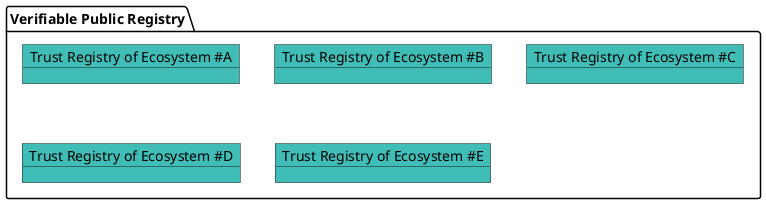
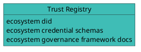
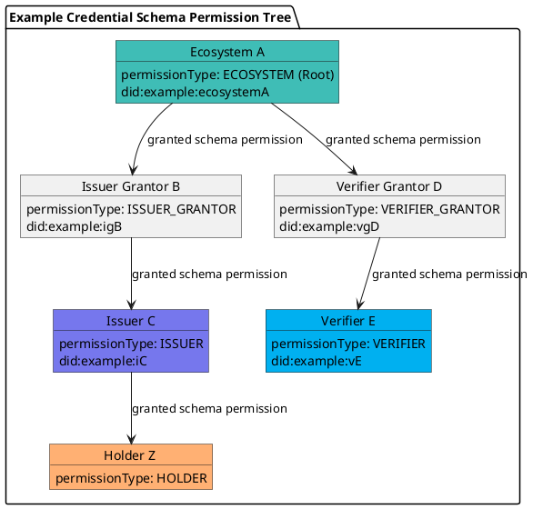
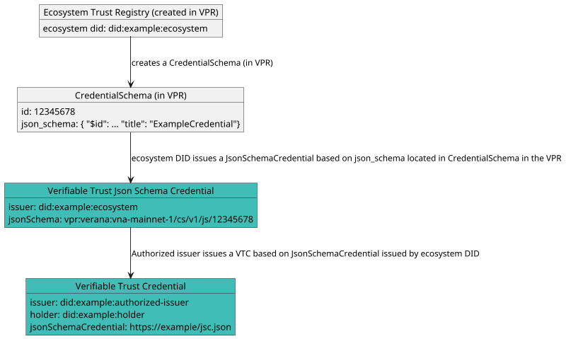

# Verifiable Trust v4 Specification

**Latest Draft:** [spec v4-draft4](https://github.com/verana-labs/verifiable-trust-spec)

**Editors:**

~ [Fabrice Rochette](https://www.linkedin.com/in/fabricerochette), ([The Verana Foundation](https://verana.io))

**Contributors:**

~ [Ariel Gentile](https://www.linkedin.com/in/aogentile/), ([The Verana Foundation](https://verana.io))
~ [Andres Vallecilla](https://www.linkedin.com/in/andres-felipe-vallecilla-puentes/), ([Mobiera](https://mobiera.com))

**Participate:**

~ [GitHub repo](https://github.com/verana-labs/verifiable-trust-spec)

~ [File a bug](https://github.com/verana-labs/verifiable-trust-spec/issues)

~ [Commit history](https://github.com/verana-labs/verifiable-trust-spec/commits/main)

---

## Abstract

Today's internet has no built-in trust layer. Users cannot verify who operates a service before connecting to it, and service providers have no standardized way to confirm the identity of their users. The result is an environment where phishing, impersonation, spam, and credential theft thrive — not because of missing technology, but because of a missing trust architecture.

Current approaches make the problem worse. Passwords are fragile and reused. Federated login concentrates control in a handful of platforms. Each service imposes its own registration flow, fragmenting the user experience while centralizing personal data in siloed systems that are routinely breached. Privacy is an afterthought, and users have little visibility into who they are really interacting with.

The rapid expansion of AI agents makes this even more urgent. Autonomous agents now interact with services, make requests, and act on behalf of users or organizations — yet there is no trust layer for them to prove who they represent, what they are authorized to do, or whether their claims are legitimate. Without verifiable identity and authorization, AI agents become a new vector for fraud, impersonation, and unauthorized access at machine speed and scale.

**Verifiable Trust** is an open, decentralized trust layer designed to address these problems at their root. It introduces a model where every service, organization, and user agent can cryptographically prove its identity, authorization, and governance context — before any connection is established.

The core idea is straightforward: a **Verifiable Service** presents verifiable credentials that identify its operator, describe its purpose, and prove its authorization within a governed ecosystem. A **Verifiable User Agent** resolves and verifies these credentials, queries a **Verifiable Public Registry** to confirm that they were issued by recognized authorities, and displays a **Proof-of-Trust** to the user — all before the first interaction takes place.

This enables mutual authentication without passwords, verifiable service discovery without centralized directories, privacy-preserving credential exchange with selective disclosure and unlinkability, and ecosystem governance that is transparent, auditable, and decentralized.

Verifiable Trust is container-agnostic, supporting both W3C Verifiable Credentials and Anonymous Credentials to balance transparency with privacy depending on the use case. It is also DID-method-agnostic, allowing ecosystems to operate across different decentralized identifier infrastructures.

This specification defines the Verifiable Trust architecture, its core concepts — Verifiable Services, Verifiable User Agents, Verifiable Trust Credentials, Essential Credential Schemas, and the trust resolution process — and the normative requirements for interoperable implementations.

## About this Document

In order to fully understand the concepts developed in this document, you should have some basic knowledge of the [ToIP stack](https://www.trustoverip.org/toip-model/), [[ref:DID]], [[ref:DIDComm]], [[ref:trust registry]], and more generally, all terms present in the [Terminology](#terminology) section.

## Conformance

As well as sections marked as non-normative, all authoring guidelines, diagrams, examples, and notes in this specification are non-normative. Everything else in this specification is normative.
The key words MAY, MUST, MUST NOT, OPTIONAL, RECOMMENDED, REQUIRED, SHOULD, and SHOULD NOT in this document are to be interpreted as described in [BCP 14](https://datatracker.ietf.org/doc/html/bcp14) [RFC2119](https://w3c.github.io/vc-data-model/#bib-rfc2119) [RFC8174](https://w3c.github.io/vc-data-model/#bib-rfc8174) when, and only when, they appear in all capitals, as shown here.

## Terminology

[[def: credential schema, credential schemas]]:
~ An [[ref: VPR]] resource which represents a verifiable credential definition and the associated permissions and business rules for issuing, verifying or holding a credential linked to this credential schema.

[[def: decentralized identifier, DID, DIDs]]:
~ A decentralized identifier, as specified in [[spec-norm:DID-CORE]].

[[def: decentralized identifier communication, DIDComm]]:
~ [DIDComm](https://identity.foundation/didcomm-messaging/spec/) uses [[ref: DIDs]] to establish confidential, ongoing connections.

[[def: decentralized web nodes, DWN, dwn]]:
~ Decentralized web nodes, see [DIF spec](https://identity.foundation/decentralized-web-node/spec/)

[[def: decentralized identifier document, DID Document, DID Documents]]:
~ A DID Document, as specified in [[spec-norm:DID-CORE]].

[[def: verifiable public registry, VPR, VPRs]]:
~ a public, normally decentralized network, which provides: trust registry features, that can be used by all its [[ref: participants]]: create trust registries, for each trust registry, define its credential schemas, who can issue, verify credential of a specific credential schema,... For more information, please refer to [VPR Spec](https://verana-labs.github.io/verifiable-trust-vpr-spec/).

[[def: verifiable service, VS, VSs]]:
~ A service, identified by a resolvable [[ref: DID]] that can be deployed anywhere by its owner, and that is conforming to this spec and has a resolvable [[ref: proof of trust]]. This can be a [[ref: DIDComm]] service, a [[ref: DWN]] service, o any other service.

[[def: verifiable user agent, VUA, VUAs]]:
~ A user agent for accessing and using [[ref: VSs]]. To be considered a [[ref: VUA]], a user agent must conform and enforce this spec, such as presenting a proof of trust to end user before accepting connecting to [[ref: VS]] compliant services, and refuse connecting to not compliant services.

[[def: essential credential schema, essential credential schemas]]:
~ Default [[ref: credential schema]], owned by a [[ref: trust registry]], that provide the basis for a trust layer to exist in the ecosystem so that [[ref: VUA]] can generate a [[ref: proof of trust]].

[[def: holder, holders]]:
~ A role an entity might perform by possessing one or more verifiable credentials and generating verifiable presentations from them. A holder is often, but not always, a [[ref: subject]] of the verifiable credentials they are holding. Holders store their credentials in credential repositories. Example holders include organizations, persons, things.

[[def: issuer, issuers]]:
~ A role an entity can perform by asserting claims about one or more [[ref: subjects]], creating a verifiable credential from these claims, and transmitting the verifiable credential to a [[ref: holder]]. Example issuers include corporations, non-profit organizations, trade associations, governments, and individuals.

[[def: linked-vp]]:
~ A presentation of a [[ref: verifiable credential]] as specified in [LINKED-VP](https://identity.foundation/linked-vp/).

[[def: participant, participants]]:
~ An entity that uses an [[ref: VPR]] and its trust layer to provide or use services.

[[def: proof of trust]]:
~ Visual representation using [[ref: essential credential schemas]] of a [[ref: trust resolution]] process of a [[ref: Verifiable Service]], for identifying the [[ref: VS]], its owner, and the [[ref: issuer]] of the verifiable credential of its owner.

[[def: session]]:
~ A session defines a connection to a DID Document provided service from a third party VS or VUA.

[[def: subject, subjects]]:
~ A thing about which claims are made. Example subjects include human beings, animals, things, and organization, a [[ref: DID]]...

[[def:trust registry, trust registries]]
~ An approved list of [[ref: issuers]] and [[ref: verifiers]] that are authorized to issue/verify certain credentials in an ecosystem.

[[def: trust resolution]]:
~ Process run by, for example a [[ref: VUA]] or a [[ref: VS]], which purpose is to recursively resolve [[ref: DID]] by digging into [[ref: DID Documents]] and look for [[ref: linked-vp]] entries and their [[ref: issuer]] [[ref: DIDs]], and trust-registry entries to gather whether the service provided by the [[ref: DID]] is trustable (and legitimate), or not.

[[def: verifier, verifiers]]:
~ A role an entity performs by receiving one or more verifiable credentials, optionally inside a verifiable presentation for processing. Example verifiers include service providers.

[[def: verifiable credential, verifiable credentials]]:
~ A verifiable credential as defined in [[spec-norm:VC-DATA-MODEL]].

## Understanding Verifiable Trust

*This section is non-normative.*

When a user is invited to connect to a service, a verifiable trust-compliant user agent performs *trust resolution* on the service, presents the resulting Proof-of-Trust to the user, and prompts them to either accept or refuse the connection.


Trust Resolution is as simple as calling a method passing the DID of the service we want to resolve, to display a **Proof-of-Trust** to the end-user:

```json
resolve_trust("did:example:gaia")
```

and receive a response similar to this one:

```json
{
  "did":"did:example:gaia",
  "verified": true,
  "service_provider": {
      "id": "did:example:def",
      "type": "Organization",
      "name": "Gaia Registry LLC",
      "country": "zz",
      "reputation": {
        "issuedCredentials": 1234,
        "verifiedCredentials": 7678,
        "trustDepositValue": 176327.124356,
        "amountSlashed": 0,
        "stars": 5.0
      },
      "issuer": "did:example:zzz",
      ...
  },
  "service": {
      "name": "Gaia Registry",
      "termsAndConditions": "http://example.com",
      "privacyPolicy": "http://example.com",
      "minimumAgeRequired": 16,
      "description": "Create your Metaverse ID at Gaia Registry! Protect your identity with biometrics and easily recover it if you loose your phone. Use your Gaia Identity to connect to fancy services with no password."
      ...
  },
  "credentials" : [
    {
      "type": "TrademarkCredential",
      ...
    }
  ]
  ...
}
```

Let's explain how the Verifiable Trust does it.


The core idea behind Verifiable Trust is simple: trust should not be implicit, but it should be verifiable, transparent, and decentralized.

In this example, a Verifiable Service (VS) presents several Verifiable Credentials to prove:

- Who operates the service, using an Essential Credential Schema (ECS) Service Verifiable Trust Credential (data shown in red)
- What the service offers, using another ECS Service Verifiable Trust Credential (data shown in blue)
- Trademark information, using a Trademark Verifiable Trust Credential (data shown in green)

Additionally, the Verifiable Service presents computed reputation information (data shown in black). While this reputation data may support trust decisions, it is not directly defined by this specification. Refer to the [VPR Spec](https://verana-labs.github.io/verifiable-trust-vpr-spec/) for more information.

Verifiable Trust introduces the following core concepts:

- Verifiable Service (VS)
- Verifiable User Agent (VUA)
- Verifiable Public Registry (VPR)
- Verifiable Trust Credentials (VTC)
- Essential Credential Schemas (ECS)

The Proof-of-Trust is established by recursively resolving the credentials presented by (in this example) a service. What makes this trust verifiable is the use of cryptographic mechanisms built into Decentralized Identifiers (DIDs) and Verifiable Credentials, as applied across these five key concepts.

Because these concepts are deeply interdependent, you may need to explore them together, and revisit them several times to fully grasp the Verifiable Trust model.

### What is a Verifiable Service (VS)?

*This section is non-normative.*

A Verifiable Service (VS) is a service capable of identifying itself to a peer before any connection is established.

Peers wishing to connect to a VS can review the Verifiable Credentials presented by the service, verify their legitimacy through trust resolution, and decide whether to proceed with the connection based on the outcome.

A VS is also required to verify the trustworthiness of peers attempting to connect to it, whether those peers are other Verifiable Services (VS) or Verifiable User Agents (VUA), and must reject connections from non-verifiable peers.

Furthermore, if a Verifiable Service wants to issue credentials or request credential presentation, it must first prove that it is authorized to perform these actions. Otherwise, the peer must refuse the request.

### What is a Verifiable User Agent (VUA)?

*This section is non-normative.*

A Verifiable User Agent (VUA) is software, such as a browser, app, or wallet, designed to connect with Verifiable Services (VS) and other VUAs. When establishing connections, a VUA must verify the identity and trustworthiness of its peers and allow connections only to compliant VS or VUA peers.

As part of this process, the VUA must perform trust resolution by:

- Verifying the Verifiable Credentials presented by the peers
- Querying Verifiable Public Registries (VPRs) to confirm that these credentials were issued by recognized and authorized issuers.

This ensures that all connections are based on verifiable trust, not assumptions.

### What is a Verifiable Public Registry (VPR)?

:::note
There is a [separated VPR spec](https://verana-labs.github.io/verifiable-trust-vpr-spec/). The following summarizes the main features of a VPR.
:::

*This section is non-normative.*

A **Verifiable Public Registry (VPR)** is a **“registry of registries”**, a public service that provides foundational infrastructure for decentralized trust ecosystems. It offers:

- **Trust Registry Management**:  
  Ecosystems can create and manage their own **Trust Registries**, each with:
  - Defined **Credential Schemas**
  - Assigned roles for **Issuers**, **Verifiers**, and **Grantors** (Trust Registry Operators)
  - Custom **business models** and permission policies

- **Query API for Trust Resolution**:  
  A standardized API used by **Verifiable Services (VSs)** and **Verifiable User Agents (VUAs)** to perform trust resolution, enabling them to query registry data and validate roles and permissions in real time. Query API must include support for the [TRQP](https://trustoverip.github.io/tswg-trust-registry-protocol/).



#### Trust Registries

*This section is non-normative.*

Each **Trust Registry** must provide, at a minimum:

- an Ecosystem controlled **resolvable DID**
- One or more **Governance Framework** document(s)
- Zero or more **Credential Schemas**

The **Verifiable Public Registry (VPR)** is agnostic to the specific **DID methods** used. Trust resolution is performed externally, outside the VPR, allowing flexibility and interoperability across ecosystems.



#### Credential Schemas

*This section is non-normative.*

**Credential Schemas** are created and managed by **trust registry** controller (Ecosystems). Each Credential Schema includes, at a minimum:

- A **JSON Schema** that defines the structure of the corresponding **Verifiable Credential**
- A **PermissionManagementMode** for **issuance policy**, which determines how `Issuer` permissions are granted. Modes include:
  - `OPEN`: Anyone can become an Issuer
  - `ECOSYSTEM`: Permissions are granted directly by the Ecosystem, the trust registry controller
  - `GRANTOR_VALIDATION`: Permissions are granted by one or several `Issuer Grantor(s)` (trust registry operator(s) responsible for selecting issuers for the ecosystem), selected by the Ecosystem.
- A **PermissionManagementMode** for **verification policy**, which determines how `Verifier` permissions are granted. Modes include:
  - `OPEN`: Anyone can act as a Verifier
  - `ECOSYSTEM`: Permissions are granted directly by the Ecosystem, the trust registry controller
  - `GRANTOR_VALIDATION`: Permissions are granted by one or several `Verifier Grantor(s)` (trust registry operator(s) responsible for selecting verifiers for the ecosystem), selected by the Ecosystem.
- A **Permission Tree** that defines the roles and relationships involved in managing the schema’s lifecycle.



Participant roles are defined in the table below:

| **Participant Role**   | **Description**                                                  |
|-----------------------|------------------------------------------------------------------|
| **Ecosystem**    | Create and control trust registries and credential Schemas. Recognize other participants by granting permission(s) to them.        |
| **Issuer Grantor**    | Trust Registry operator that grants Issuer permissions to candidate issuers.                   |
| **Verifier Grantor**  | Trust Registry operator that grants Verifier permissions to candidate verifiers.               |
| **Issuer**            | Can issue credentials of this schema.                            |
| **Verifier**          | Can request presentation of credentials of this schema.          |
| **Holder**            | Holds a credential.   |

Example of a Json Schema credential schema:

```json
{
  "$id": "vpr:verana:VPR_CHAIN_ID/cs/v1/js/VPR_CREDENTIAL_SCHEMA_ID",
  "$schema": "https://json-schema.org/draft/2020-12/schema",
  "title": "ExampleCredential",
  "description": "ExampleCredential using JsonSchema",
  "type": "object",
  "properties": {
    "credentialSubject": {
      "type": "object",
      "properties": {
        "id": {
          "type": "string",
          "format": "uri"
        },
        "firstName": {
          "type": "string",
          "minLength": 0,
          "maxLength": 256
        },
        "lastName": {
          "type": "string",
          "minLength": 1,
          "maxLength": 256
        },
        "countryOfResidence": {
          "type": "string",
          "minLength": 2,
          "maxLength": 2
        }
      },
      "required": [
        "id",
        "lastName",
        "countryOfResidence"
      ]
    }
  }
}
```

### Verifiable Trust Json Schema Credentials (VTJSCs) and Verifiable Trust Credentials (VTCs)

Data stored in a VPR is not verified at the time of storage, nor does it need to be. Verification happens outside the scope of the VPR.

This is not a limitation, it’s a feature. For example, any DID method can be used, and the VPR will never attempt to resolve or validate DIDs itself.

The VPR provides registrations, not validations, leaving trust decisions and verification where they belong: **with the relying parties**.

To make things verifiable, for a given credential schema:

- Ecosystem creates a Credential Json Schema in a VPR, linked to its Ecosystem DID.
- Ecosystem issues, with its DID, a **Json Schema Credential** linked to its credential **Json Schema** in the VPR
- Then, authorized issuers can issue **Verifiable Trust Credentials** linked to the **Json Schema Credential** issued by Ecosystem DID.



### Essential Credential Schemas

Finally, the last concept: to enable fundamental trust operations, such as identifying service providers, service names, and related entities, we define a set of **Essential Credential Schemas (ECS)** specifically designed for these purposes:

- Service: describes **services**;
- Organization: identifies **organizations**, used to identify owner of a Service;
- Persona: identifies **individuals** used to identify owner of a Service;
- User Agent: describes **user agents**, such as browsers, mobile apps, and similar software

With the Verifiable Trust concept now clearly established, we’re ready to dive into the specifications.

## Specification

### [VT-JSON-SCHEMA-CRED-W3C] Verifiable Trust Json Schema Credential

To provide cryptographic evidence that data stored in a VPR (e.g., a credential JSON Schema) is authored and controlled by the Ecosystem that operates the corresponding Trust Registry, the **Ecosystem controller** of the Trust Registry issues a VTJSC (which is a [JSON Schema Credential](https://www.w3.org/TR/vc-json-schema/)) **after** creating the `CredentialSchema` entry in the VPR.

The Json Schema Credential MUST be issued using the **Ecosystem DID recorded as the Trust Registry’s Ecosystem identifier** in the VPR, and MUST reference the corresponding `CredentialSchema` entry.

A VTJSC MUST include, at a minimum, the following attributes:

- `@context`: MUST include `https://www.w3.org/ns/credentials/v2`
- `id`: URL of the credential (e.g., a `https://example/vtjsc.json`)
- `type`: MUST include `VerifiableCredential`, `JsonSchemaCredential` and `VerifiableTrustJsonSchemaCredential`
- `issuer`: the Ecosystem DID that controls the Trust Registry
- `credentialSchema`: an object containing:
  - `id`: `https://www.w3.org/ns/credentials/json-schema/v2.json`
  - `type`: `JsonSchema`
  - `digestSRI`: sha384-S57yQDg1MTzF56Oi9DbSQ14u7jBy0RDdx0YbeV7shwhCS88G8SCXeFq82PafhCrW
- `credentialSubject`: an object containing:
  - `id`: the identifier of the `CredentialSchema` entry in the VPR
  - `type`: `JsonSchema`
  - `jsonSchema.$ref`: a reference to the JSON Schema stored in the VPR
  - `digestSRI`: a Subresource Integrity digest of the referenced JSON Schema
- a valid cryptographic proof, as defined by the Verifiable Credentials specification

::: note
[vc-json-schema](https://www.w3.org/TR/vc-json-schema/#jsonschemacredential) defines the `credentialSchema` attribute content. It MUST be exactly as specified in [vc-json-schema](https://www.w3.org/TR/vc-json-schema/#jsonschemacredential).
:::
This credential provides verifiable evidence of:

- **Control of the Trust Registry Ecosystem DID** (because it is the issuer of the credential)
- **Authenticity of the CredentialSchema declaration** (because the credential binds the Ecosystem DID to the VPR `CredentialSchema` entry)

```json
{
  "@context": [
    "https://www.w3.org/ns/credentials/v2"
  ],
  "id": "https://example/vtjsc.json",
  "type": ["VerifiableCredential", "JsonSchemaCredential", "VerifiableTrustJsonSchemaCredential"],
  "issuer": "did:example:ecosystem",

  "credentialSchema": {
    "id": "https://www.w3.org/ns/credentials/json-schema/v2.json",
    "type": "JsonSchema",
    "digestSRI": "sha384-S57yQDg1MTzF56Oi9DbSQ14u7jBy0RDdx0YbeV7shwhCS88G8SCXeFq82PafhCrW"
  },

  "credentialSubject": {
    "id": "vpr:verana:vna-mainnet-1/cs/v1/js/12345678",
    "type": "JsonSchema",
    "jsonSchema": {
      "$ref": "vpr:verana:vna-mainnet-1/cs/v1/js/12345678"
    },
    "digestSRI": "sha384-ABCSGyugst67rs67rdbugsy0RDdx0YbeV7shwhCS88G8SCXeFq82PafhCeZ"
  }
}
```

### [VT-ECOSYSTEM-DIDDOC] Ecosystem DID Document

Finally, the Ecosystem MUST publish each **VTJSC** as a **Linked Verifiable Presentation** in the **DID Document** associated with the **Trust Registry Ecosystem DID** registered in the VPR.

Publishing VTJSC in the Ecosystem DID Document ensures that:

- Credential Schemas defined in the VPR are **publicly discoverable**
- The binding between a Credential Schema and its **controlling Ecosystem DID** is **cryptographically verifiable**
- Wallets, issuers, and verifiers can **resolve and validate schema trust roots** without relying on off-chain registries or implicit trust assumptions

The Ecosystem DID Document MUST include a `service` entry of type `LinkedVerifiablePresentation` that references a Verifiable Presentation containing one or more VTJSC issued by the Ecosystem DID.

Example:

```json
"service": [
    {
      "id": "did:example:ecosystem#vpr-schemas-example-vtjsc-vp",
      "type": "LinkedVerifiablePresentation",
      "serviceEndpoint": ["https://ecosystem/schemas-example-vtjsc-vp.json"]
    }
    ...
  ]
```

### [VT-CRED] Verifiable Trust Credential

Once an Ecosystem has:

- Created its **Credential Schemas** in the VPR
- Issued the corresponding **VTJSC** using the Ecosystem DID
- Published those VTJSC as **Linked Verifiable Presentations** in the Ecosystem DID Document

authorized issuers MAY issue Verifiable Credentials that conform to those schemas.

Verifiable Credentials that comply with the Verifiable Trust Specification are referred to as **Verifiable Trust Credentials (VTCs)**.

A Verifiable Trust Credential MUST be linked to the applicable **VTJSC** issued by the Trust Registry Ecosystem DID. For W3C VTCs ([VT-CRED-W3C]), this link is established directly via the `credentialSchema` property. For AnonCreds VTCs ([VT-CRED-ANON]), the link is indirect: the AnonCreds Credential Definition references the VTJSC via `relatedJsonSchemaCredentialId`. In both cases, this establishes a verifiable and discoverable trust chain between:

- the issued credential,
- the governing schema definition,
- and the Ecosystem that controls the Trust Registry in which the schema is defined.

During verification, wallets and verifiers can resolve the referenced VTJSC, verify its authenticity, and determine whether the issuing DID was authorized to issue credentials under that schema. For W3C VTCs, authorization is checked at the objectively determined issuance time (see [VT-CRED-W3C]). For AnonCreds VTCs, authorization is checked at credential reception time (see [VT-CRED-ANON] and [CIT]).

#### Issuance Time and Unlinkability Considerations

*This section is non-normative.*

Verifiable Trust Credentials are designed to support multiple credential container formats and proof systems in order to balance **auditability**, **interoperability**, and **privacy**. Two recurring challenges must be considered when issuing and presenting credentials: **proving issuance time** and **preventing linkability**.

##### Proving Issuance Time

*This section is non-normative.*

In decentralized systems, relying on issuer-asserted timestamps (such as `issuanceDate`) is insufficient, as such values can be forged or backdated by the issuer.

To address this, the Verifiable Trust architecture enables **objective issuance-time determination** for W3C VTCs by anchoring a deterministic cryptographic digest of the credential in the VPR at issuance time. Verifiers can recompute this digest from the presented credential and use the corresponding VPR registration timestamp as the effective issuance time. Note that this mechanism does not apply to AnonCreds VTCs, where unlinkability takes precedence over objective issuance-time anchoring (see [VT-CRED-ANON]).

This approach is:

- Independent of issuer-declared metadata
- Resistant to backdating or timestamp forgery
- Compatible with W3C Verifiable Credentials v2.0 (which no longer mandates `issuanceDate`)

##### Proving Unlinkability

*This section is non-normative.*

Unlinkability aims to prevent a verifier from correlating multiple presentations of the same credential or identifying that two credentials were issued to the same subject.

However, strong issuance-time anchoring (e.g., via a stable digest) inherently introduces a **linkability vector**, as the same digest can be recognized across multiple presentations.

For this reason, unlinkability requirements vary depending on the **intended visibility** of the credential:

- **Public credentials** (e.g., Service, Organization, Persona ECS credentials), which are published as Linked Verifiable Presentations in DID Documents, do not require unlinkability. These credentials favor transparency, auditability, and ecosystem discoverability.
- **Private credentials** (e.g., user-held attributes, User Agent ECS credentials, KYC, entitlements) often require strong unlinkability and correlation resistance.

#### Choosing the Appropriate Credential Container

*This section is non-normative.*

The Verifiable Trust Specification is **container-agnostic** and supports multiple credential formats to address different requirements:

- **W3C Verifiable Credentials (VC v2.0)**  
  Suitable for public or semi-public credentials where:
  - auditability and interoperability are primary concerns
  - issuance time must be objectively verifiable
  - unlinkability is not required

- **Anonymous Credentials (e.g., AnonCreds)**  
  Suitable for private credentials where:
  - selective disclosure is required
  - multiple presentations must not be linkable
  - issuer authorization is verified by the holder's wallet at credential reception time rather than anchored via stable identifiers

Depending on the credential format and proof system used, ecosystems can achieve different trade-offs between:

- transparency vs. privacy
- auditability vs. unlinkability
- ecosystem governance vs. holder anonymity

#### Design Principle

The Verifiable Trust framework deliberately avoids mandating a single credential format. Instead, it defines **verifiable governance, authorization, and issuance-time semantics** that can be enforced across different credential technologies.

Ecosystems MUST clearly specify, for each credential schema, the expected credential container format and privacy properties in order to ensure consistent trust resolution and verifier behavior.

### [VT-CRED-W3C] W3C Verifiable Trust Credential (VTC)

A W3C Verifiable Trust Credential MUST include, at a minimum, the following attributes:

- `@context`: MUST include `https://www.w3.org/ns/credentials/v2`
- `id`: a globally unique identifier for the credential (e.g., a `urn:uuid:`)
- `type`: MUST include `VerifiableCredential` and `VerifiableTrustCredential`, and MAY include one or more schema-specific types
- `validFrom`: optional
- `validUntil`: optional
- `issuer`: the DID of the authorized issuer issuing the credential
- `credentialSubject`: an object containing:
  - `id`: the DID of the credential holder
  - all attributes required by the referenced Credential Schema
- `credentialSchema`: an object containing:
  - `id`: the identifier of the VTJSC issued by the Trust Registry Ecosystem DID
  - `type`: `JsonSchemaCredential`
- a valid cryptographic proof, as defined by the Verifiable Credentials specification

#### W3C VTC Example

```json
{
  "@context": [
    "https://www.w3.org/ns/credentials/v2"
  ],
  "id": "urn:uuid:7f3c9a2e-9c8e-4f6e-9c0b-1e3f2d8a91ab",
  "validFrom": "2010-01-01T19:23:24Z",
  "validUntil": "2020-01-01T19:23:24Z",
  "type": [
    "VerifiableCredential",
    "VerifiableTrustCredential",
    "ExampleCredential"
  ],
  "issuer": "did:example:authorized-issuer",
  "credentialSubject": {
    "id": "did:example:holder"
    // ... schema-defined attributes
  },
  "credentialSchema": {
    "id": "https://example/vtjsc.json",
    "type": "JsonSchemaCredential"
  }
}
```

In this example:

- credentialSchema.id references the JSON Schema Credential issued by the Trust Registry Ecosystem DID.
- The JSON Schema Credential itself is discoverable via a LinkedVerifiablePresentation in the Ecosystem DID Document.
- Authorization of the issuer is determined by evaluating VPR state (e.g., issuer permissions) at the issuance time evidenced by the credential’s anchored digest.

This design ensures that trust decisions remain fully verifiable, ecosystem-governed, and independent of centralized validation services.

#### W3C VTCs: Determining Credential Issuance Time

Verifiable Trust Credentials do not rely on an issuer-asserted `issuanceDate` field to establish the time of issuance.

Instead, the issuance time of a Verifiable Trust Credential is **objectively determined** using the credential’s cryptographic digest anchored in the VPR.

When issuing a Verifiable Trust Credential, the issuer MUST:

1. **Canonicalize** the credential using the [JSON Canonicalization Scheme (JCS)](https://www.rfc-editor.org/rfc/rfc8785) as defined in RFC 8785

2. **Compute** a deterministic **Subresource Integrity digest** (`digestSRI`) of the canonicalized credential using the `digest_algorithm` specified in the [CredentialSchema](https://verana-labs.github.io/verifiable-trust-vpr-spec/#credentialschema) (`SHA384` or `SHA512`)

3. **Register** this `digestSRI` in the VPR by calling [CreateOrUpdatePermissionSession](https://verana-labs.github.io/verifiable-trust-vpr-spec/#mod-perm-msg-10-create-or-update-permission-session) with the `digest_sri` parameter. The VPR stores the digest with the block timestamp via [Store Digest](https://verana-labs.github.io/verifiable-trust-vpr-spec/#mod-di-msg-1-store-digest).

During verification, a trust resolution process MUST:

1. **Canonicalize** the received credential using [JCS (RFC 8785)](https://www.rfc-editor.org/rfc/rfc8785)
2. **Recompute** the `digestSRI` from the canonicalized credential using the `digest_algorithm` from the [CredentialSchema](https://verana-labs.github.io/verifiable-trust-vpr-spec/#credentialschema)
3. **Query** the VPR using [Get Digest](https://verana-labs.github.io/verifiable-trust-vpr-spec/#mod-di-qry-1-get-digest) to locate the corresponding digest entry
4. **Use** the `created` timestamp from the returned `Digest` entry as the **effective issuance time** of the credential

This mechanism provides a verifiable, tamper-resistant issuance-time signal that:

- Cannot be forged or backdated by the issuer
- Allows verification that the issuer was authorized to issue the credential **at the time of issuance**

#### [VT-CRED-W3C-LINKED-VP] W3C VTC Linked VP

A DID Document MAY present an unlimited number of Verifiable Trust Credential as Linked-VPs. Linked-VPs MUST be signed by the DID controller of the DID Document, and MUST be declared with a fragment that starts with `#vpr-schemas-` and ends with `-vtc-vp`. Example:

```json
"service": [
    {
      "id": "did:example:ecosystem#vpr-schemas-example-vtc-vp",
      "type": "LinkedVerifiablePresentation",
      "serviceEndpoint": ["https://ecosystem/schemas-example-vtc-vp.json"]
    }
    ...
  ]
```

> The `example` component of the fragment identifier is an **arbitrary, controller-defined qualifier** and MAY be any value chosen by the DID controller to prevent fragment collisions within the same DID Document (e.g., a schema name, logical grouping, version label, or sequence identifier). It has no normative meaning beyond uniqueness within the DID Document.

### [VT-CRED-ANON] AnonCreds Verifiable Trust Credential (VTC)

An AnonCreds Verifiable Trust Credential is a Verifiable Trust Credential issued using the [AnonCreds](https://anoncreds.github.io/anoncreds-spec/) specification. AnonCreds credentials provide **zero-knowledge proof (ZKP)** capabilities that are essential for credentials requiring strong privacy guarantees.

AnonCreds VTCs are REQUIRED when:

- **Selective disclosure** is needed — the holder reveals only the requested attributes, not the full credential.
- **Unlinkability** is needed — multiple presentations of the same credential MUST NOT be linkable by verifiers or colluding parties.
- **Predicate proofs** are needed — the holder proves a boolean expression (e.g., `age >= 18`) without revealing the underlying claim value.
- **Holder correlation resistance** is needed — no correlatable identifier is shared during issuance or presentation.

::: note
Using AnonCreds for ECS User Agent VTCs is REQUIRED as specified in [VUA-REQ]. See also [VT-ECS-UA-CRED-ANON].
:::

#### AnonCreds VTC Setup

In the Verifiable Trust concept, AnonCreds VTCs do **not** require publishing a separate [AnonCreds Schema](https://anoncreds.github.io/anoncreds-spec/#schema-publisher-publish-schema-object) to a VDR. Instead, the credential schema is already defined by the [VT-JSON-SCHEMA-CRED-W3C] (VTJSC) issued by the Ecosystem DID, and the AnonCreds Credential Definition references it.

Before issuing AnonCreds VTCs, the following setup MUST be completed:

1. **Credential Definition**: The issuer MUST create and publish a [Credential Definition](https://anoncreds.github.io/anoncreds-spec/#issuer-create-and-publish-credential-definition-object). The Credential Definition contains the issuer's public keys used for signing credentials and is required by holders and verifiers for presentation generation and verification. The Credential Definition MUST include a `relatedJsonSchemaCredentialId` that references the VTJSC issued by the Ecosystem DID for the corresponding `CredentialSchema`. The `attributes` list MUST match the attributes defined in the referenced VTJSC.

2. **Revocation Registry** (optional): If credential revocation is needed, the issuer MUST create and publish a [Revocation Registry Definition](https://anoncreds.github.io/anoncreds-spec/#issuer-create-and-publish-revocation-registry-objects) and an initial Revocation Status List.

3. **Link Secret**: Each holder MUST create and store a [link secret](https://anoncreds.github.io/anoncreds-spec/#holder-create-and-store-link-secret), a private value that enables credential-to-holder binding across multiple credentials without revealing a correlatable identifier.

##### AnonCreds Credential Definition Example

```json
[
  {
    "id": "did:example:issuer/resources/creddef-123",
    "name": "gov-id",
    "version": "1.0",
    "attributes": [
      "birthDate",
      "documentNumber",
      "documentType",
      "firstName",
      "lastName",
      "nationality"
    ],
    "revocationSupported": false,
    "relatedJsonSchemaCredentialId": "https://example-ecosystem/vt/schemas-gov-id-jsc.json"
  }
]
```

In this example, `relatedJsonSchemaCredentialId` points to the VTJSC issued by the Ecosystem DID. This establishes the trust chain between the AnonCreds Credential Definition and the ecosystem-governed schema, without duplicating the schema definition in a separate AnonCreds-specific registry.

#### AnonCreds VTC Issuance

AnonCreds credential issuance follows the [AnonCreds Issuance Data Flow](https://anoncreds.github.io/anoncreds-spec/#anoncreds-issuance-data-flow):

1. The issuer sends a **Credential Offer** referencing the Credential Definition.
2. The holder evaluates the offer, retrieves the Credential Definition from the VDR, and sends a **Credential Request** that includes a blinded commitment to the holder's link secret.
3. The issuer verifies the request and issues the credential with a **blind signature** over the credential attributes and the blinded link secret.
4. The holder unblinds the signature, verifies it, and stores the credential.

The issuer never learns the holder's link secret, and only the holder can unblind the final credential signature.

#### AnonCreds VTC Presentation

AnonCreds holders never present the raw signed credential to verifiers. Instead, the holder derives a **verifiable presentation** — a zero-knowledge proof that demonstrates:

- Knowledge of a valid credential signature from a specific issuer (identified by Credential Definition).
- The values of selectively disclosed attributes.
- The truth of requested predicate expressions over undisclosed integer attributes.
- That the credential has not been revoked (if applicable), without revealing a correlatable revocation identifier.
- That all source credentials in a multi-credential presentation are bound to the same link secret.

Presentations follow the [AnonCreds Presentation Data Flow](https://anoncreds.github.io/anoncreds-spec/#anoncreds-presentation-data-flow). Verifiers create a **Presentation Request** specifying requested attributes, predicates, and non-revocation intervals.

#### AnonCreds VTCs: Issuance Time

Unlike W3C VTCs, AnonCreds VTCs do **not** anchor a `digestSRI` in the VPR to establish issuance time. Because AnonCreds presentations are derived zero-knowledge proofs — not the original credential — a verifier cannot independently recompute a digest from the presentation, making a VPR-anchored digest binding impractical without introducing correlation risks that conflict with AnonCreds' privacy goals.

Issuer authorization checks at credential reception time are covered by [CIT].

#### AnonCreds VTC W3C Representation

AnonCreds credentials MAY be represented in the [W3C Verifiable Credentials format](https://anoncreds.github.io/anoncreds-spec/#w3c-verifiable-credentials-representation). In this representation:

- `@context` MUST include the AnonCreds W3C context
- `type` MUST include `VerifiableCredential` and `AnonCredsCredential`
- `credentialSchema` MUST reference the AnonCreds Credential Definition. The Credential Definition itself links back to the VTJSC via `relatedJsonSchemaCredentialId`.
- `proof` MUST include an `AnonCredsProof2023` entry

```json
{
  "@context": [
    "https://www.w3.org/2018/credentials/v1",
    "https://raw.githubusercontent.com/anoncreds/anoncreds-spec/main/data/anoncreds-w3c-context.json"
  ],
  "type": [
    "VerifiableCredential",
    "AnonCredsCredential"
  ],
  "issuer": "did:example:authorized-issuer",
  "credentialSchema": {
    "type": "AnonCredsDefinition",
    "definition": "did:example:authorized-issuer/resources/creddef-123"
  },
  "credentialSubject": {
    "userAgentType": "mobile-wallet"
  },
  "proof": {
    "type": "AnonCredsProof2023",
    "signature": "AAAgf9w5.....8Z_x3FqdwRHoWruiF0FlM"
  }
}
```

#### AnonCreds VTC Privacy Properties

AnonCreds VTCs provide the following privacy properties relevant to the Verifiable Trust framework:

- **No correlatable holder identifier**: The link secret is never revealed; presentations prove knowledge of it via ZKP.
- **Unlinkable presentations**: Each presentation generates unique proof values, preventing verifiers from linking multiple presentations of the same credential.
- **Selective disclosure**: Only requested attributes are revealed; unrequested attributes remain hidden.
- **Predicate proofs**: Integer attributes (e.g., dates, ages) can be proven via boolean expressions without revealing the actual values.
- **Non-revocation proofs**: Revocation status is proven without disclosing a correlatable credential index.
- **Multi-credential binding**: A holder can prove that multiple credentials were issued to the same entity (same link secret) without revealing the link secret itself.

### [ECS] Essential Credential Schemas

Essential Credential Schemas are the Verifiable Trust basic needed schemas for enabling a minimum trust resolution in Services and User Agents by answering these questions:

- who is the provider of this Verifiable Service?
- what is the minimum age required to access this Verifiable Service?
- is the User Agent trying to connect to a Verifiable Service a Verifiable User Agent?
- ...

Ecosystems can create Essential Credential Schemas (ECS) by creating a Trust Registry in a [[ref: VPR]]. There are 4 kinds of ECS:

- Service;
- Organization;
- Persona;
- UserAgent.

#### [ECS-TR] Essential Credential Schemas Trust Registry

To provide an Essential Credential Schemas Trust Registry, an Ecosystem creates its Trust Registry in a [[ref: VPR]] by creating a `TrustRegistry` entry `tr`.

For this Trust Registry to qualify as an ECS Trust Registry and to be used for trust resolution in [[ref: VSs]] and [[ref: VUAs]], it MUST provide, associated to the `TrustRegistry` entry `tr`, one `CredentialSchema` entry for each of [ECS-SERVICE], [ECS-ORG], [ECS-PERSONA], and [ECS-UA], each with a `json_schema` attribute as defined in the corresponding section.

Additional CredentialSchema entries MAY be provided by the Trust Registry.

#### [ECS-SERVICE] Service Credential Json Schema

Used to identify Verifiable Services.

Credential subject object of schema MUST contain the following attributes:

- `id` (string) (mandatory): the [[ref: DID]] of the service the credential will be issued to. URI format, max length: 2048 chars.
- `name` (string) (mandatory): service name. UTF8 charset, min length: 1 char, max length: 512 chars.
- `type` (string) (mandatory): service type. UTF8 charset, min length: 1 char, max length: 128 chars. Service types will be defined later.
- `description` (string) (mandatory): service description. UTF8 charset, max length: 4096 chars.
- `descriptionFormat` (string) (*optional*): media type indicating how the `description` value MUST be interpreted.  
  Allowed values:
  - `text/plain`
  - `text/markdown`  
  If omitted, `text/plain` MUST be assumed.
- `logo` (image) (mandatory): base64-encoded image of the service logo (as shown in browsers/apps/search engines). Allowed media types: image/png, image/jpeg, image/svg+xml. Max length: 1,400,000 chars (≈ 1 MiB decoded).
- `minimumAgeRequired` (integer) (mandatory): minimum required age to connect to service. Allowed values: 0 to 255 (inclusive).
- `termsAndConditions` (string) (mandatory): URI of the terms and conditions of the service. URI format, max length: 4096 chars.
- `termsAndConditionsDigestSri` (string) (optional): Subresource Integrity digest of the termsAndConditions resource, encoded as <algorithm>-<base64-digest> (SRI format). Max length: 256 chars.
- `privacyPolicy` (string) (mandatory): URI of the privacy policy of the service. URI format, max length: 4096 chars.
- `privacyPolicyDigestSri` (string) (optional): Subresource Integrity digest of the privacyPolicy resource, encoded as <algorithm>-<base64-digest> (SRI format). Max length: 256 chars.

the resulting `json_schema` attribute will be the following Json Schema.

- `VPR_CREDENTIAL_SCHEMA_ID` is replaced by the `schema_id` of the created `CredentialSchema` entry in the VPR.

```json
{
  "$id": "vpr:verana:VPR_CHAIN_ID/cs/v1/js/VPR_CREDENTIAL_SCHEMA_ID",
  "$schema": "https://json-schema.org/draft/2020-12/schema",
  "title": "ServiceCredential",
  "description": "Identifies a Verifiable Service and defines the minimum trust and access requirements required to interact with it.",
  "type": "object",
  "properties": {
    "credentialSubject": {
      "type": "object",
      "properties": {
        "id": {
          "type": "string",
          "format": "uri",
          "maxLength": 2048
        },
        "name": {
          "type": "string",
          "minLength": 1,
          "maxLength": 512
        },
        "type": {
          "type": "string",
          "minLength": 1,
          "maxLength": 128
        },
        "description": {
          "type": "string",
          "maxLength": 4096
        },
        "descriptionFormat": {
          "type": "string",
          "enum": ["text/plain", "text/markdown"],
          "default": "text/plain"
        },
        "logo": {
          "type": "string",
          "contentEncoding": "base64",
          "maxLength": 1400000,
          "oneOf": [
            { "contentMediaType": "image/png" },
            { "contentMediaType": "image/jpeg" },
            { "contentMediaType": "image/svg+xml" }
          ]
        },
        "minimumAgeRequired": {
          "type": "integer",
          "minimum": 0,
          "maximum": 255
        },
        "termsAndConditions": {
          "type": "string",
          "format": "uri",
          "maxLength": 4096
        },
        "termsAndConditionsDigestSri": {
          "type": "string",
          "maxLength": 256
        },
        "privacyPolicy": {
          "type": "string",
          "format": "uri",
          "maxLength": 4096
        },
        "privacyPolicyDigestSri": {
          "type": "string",
          "maxLength": 256
        }
      },
      "required": [
        "id",
        "name",
        "type",
        "description",
        "logo",
        "minimumAgeRequired",
        "termsAndConditions",
        "privacyPolicy"
      ]
    }
  }
}
```

#### [ECS-ORG] OrganizationCredential Json Schema

Used to identify Organizations that operate Verifiable Services.

Credential subject object of schema MUST contain the following attributes:

- `id` (string) (*mandatory*): the [[ref: DID]] of the organization the credential has been issued to, which is the subject of the [[ref: verifiable credential]].  
  URI format, max length: 2048 chars.

- `name` (string) (*mandatory*): name of the organization.  
  UTF8 charset, min length: 1 char, max length: 512 chars.

- `logo` (image) (*mandatory*): base64-encoded image of the organization logo (as shown in browsers and search engines).  
  Allowed media types: `image/png`, `image/jpeg`, `image/svg+xml`.  
  Max length: 1,400,000 chars (≈ 1 MiB decoded).

- `registryId` (string) (*mandatory*): identifier of the organization in an external authoritative registry (e.g., company register).  
  UTF8 charset, min length: 1 char, max length: 256 chars.

- `registryUri` (string) (*optional*): URI pointing to the organization’s record in the external registry.  
  URI format, max length: 4096 chars.

- `address` (string) (*mandatory*): postal address of the organization.  
  UTF8 charset, min length: 1 char, max length: 1024 chars.

- `countryCode` (string) (*mandatory*): primary country of legal registration of the organization, expressed as an ISO 3166-1 alpha-2 country code.  
  Pattern: `^[A-Z]{2}$`.

- `legalJurisdiction` (string) (*optional*): legal jurisdiction applicable to the organization when sub-national jurisdictions matter (e.g., `US-CA`).  
  Pattern: `^[A-Z]{2}(-[A-Z0-9]{1,3})?$`, max length: 64 chars.

- `organizationKind` (string) (*optional*): informational classification of the organization (free-text, non-normative), intended for display or filtering purposes.  
  UTF8 charset, max length: 64 chars.

- `lei` (string) (*optional*): Legal Entity Identifier (LEI), if known and asserted by the issuer during onboarding.  
  Pattern: `^[A-Z0-9]{20}$`.

**Implementation notes (non-normative):**

- `credentialSubject.id` (the DID) is the **sole authoritative identifier** for trust resolution within the Verifiable Trust system.
- External identifiers such as `lei` and `registryId` are **informational references** and MUST NOT be treated as authoritative sources of truth unless supported by verifiable credentials issued under their respective governance frameworks (e.g., vLEI).
- `countryCode` provides a baseline jurisdiction signal. When applicable law depends on sub-national jurisdiction, `legalJurisdiction` SHOULD be provided and takes precedence for legal interpretation (e.g., moderation, liability, compliance).

The resulting `json_schema` attribute will be the following Json Schema.

- `VPR_CREDENTIAL_SCHEMA_ID` is replaced by the `schema_id` of the created `CredentialSchema` entry in the VPR.
- `VPR_CHAIN_ID` is replaced by the network name.

```json
{
  "$id": "vpr:verana:VPR_CHAIN_ID/cs/v1/js/VPR_CREDENTIAL_SCHEMA_ID",
  "$schema": "https://json-schema.org/draft/2020-12/schema",
  "title": "OrganizationCredential",
  "description": "Identifies a legal organization that operates one or more Verifiable Services.",
  "type": "object",
  "properties": {
    "credentialSubject": {
      "type": "object",
      "properties": {
        "id": {
          "type": "string",
          "format": "uri",
          "maxLength": 2048
        },
        "name": {
          "type": "string",
          "minLength": 1,
          "maxLength": 512
        },
        "logo": {
          "type": "string",
          "contentEncoding": "base64",
          "maxLength": 1400000,
          "oneOf": [
            { "contentMediaType": "image/png" },
            { "contentMediaType": "image/jpeg" },
            { "contentMediaType": "image/svg+xml" }
          ]
        },
        "registryId": {
          "type": "string",
          "minLength": 1,
          "maxLength": 256
        },
        "registryUri": {
          "type": "string",
          "format": "uri",
          "maxLength": 4096
        },
        "address": {
          "type": "string",
          "minLength": 1,
          "maxLength": 1024
        },
        "countryCode": {
          "type": "string",
          "minLength": 2,
          "maxLength": 2,
          "pattern": "^[A-Z]{2}$"
        },
        "legalJurisdiction": {
          "type": "string",
          "minLength": 1,
          "maxLength": 64,
          "pattern": "^[A-Z]{2}(-[A-Z0-9]{1,3})?$"
        },
        "organizationKind": {
          "type": "string",
          "minLength": 1,
          "maxLength": 64
        },
        "lei": {
          "type": "string",
          "pattern": "^[A-Z0-9]{20}$"
        }
      },
      "required": [
        "id",
        "name",
        "logo",
        "registryId",
        "address",
        "countryCode"
      ]
    }
  }
}
```

#### [ECS-PERSONA] Persona Credential Json Schema

Used to identify Personas (human-controlled avatars) that operate Verifiable Services.

Credential subject object of schema MUST contain the following attributes:

- `id` (string) (*mandatory*): the [[ref: DID]] of the Persona the credential has been issued to, which is the subject of the [[ref: verifiable credential]].  
  URI format, max length: 2048 chars.

- `name` (string) (*mandatory*): name of the Persona.  
  UTF8 charset, min length: 1 char, max length: 256 chars.

- `description` (string) (*optional*): description of the Persona.  
  UTF8 charset, max length: 16384 chars.

- `descriptionFormat` (string) (*optional*): media type indicating how the `description` value MUST be interpreted.  
  Allowed values:
  - `text/plain`
  - `text/markdown`  
  If omitted, `text/plain` MUST be assumed.

- `avatar` (image) (*optional*): base64-encoded image of the Persona avatar (as shown in browsers and search engines).  
  Allowed media types: `image/png`, `image/jpeg`, `image/svg+xml`.  
  Max length: 1,400,000 chars (≈ 1 MiB decoded).

- `controllerCountryCode` (string) (*mandatory*): primary country of residence of the Persona controller (the human), expressed as an ISO 3166-1 alpha-2 country code.  
  Pattern: `^[A-Z]{2}$`.

- `controllerJurisdiction` (string) (*optional*): sub-national jurisdiction of the controller’s residence when applicable law varies by sub-jurisdiction (e.g., `US-CA`).  
  Pattern: `^[A-Z]{2}(-[A-Z0-9]{1,3})?$`, max length: 64 chars.

**Implementation notes (non-normative):**

- `controllerCountryCode` and `controllerJurisdiction` are included to enable jurisdictional policy enforcement (e.g., moderation, compliance). They MUST NOT be interpreted as verified legal domicile unless supported by stronger evidence/credentials.
- The Persona DID (`credentialSubject.id`) remains the authoritative identifier for trust resolution within the Verifiable Trust system.
- If `controllerJurisdiction` is present, it SHOULD take precedence over `controllerCountryCode` for legal interpretation purposes.

The resulting `json_schema` attribute will be the following Json Schema.

- `VPR_CREDENTIAL_SCHEMA_ID` is replaced by the `schema_id` of the created `CredentialSchema` entry in the VPR.

```json
{
  "$id": "vpr:verana:VPR_CHAIN_ID/cs/v1/js/VPR_CREDENTIAL_SCHEMA_ID",
  "$schema": "https://json-schema.org/draft/2020-12/schema",
  "title": "PersonaCredential",
  "description": "Identifies a Persona (human-controlled avatar) that operates one or more Verifiable Services.",
  "type": "object",
  "properties": {
    "credentialSubject": {
      "type": "object",
      "properties": {
        "id": {
          "type": "string",
          "format": "uri",
          "maxLength": 2048
        },
        "name": {
          "type": "string",
          "minLength": 1,
          "maxLength": 256
        },
        "description": {
          "type": "string",
          "minLength": 0,
          "maxLength": 16384
        },
        "descriptionFormat": {
          "type": "string",
          "enum": ["text/plain", "text/markdown"],
          "default": "text/plain"
        },
        "avatar": {
          "type": "string",
          "contentEncoding": "base64",
          "maxLength": 1400000,
          "oneOf": [
            { "contentMediaType": "image/png" },
            { "contentMediaType": "image/jpeg" },
            { "contentMediaType": "image/svg+xml" }
          ]
        },
        "controllerCountryCode": {
          "type": "string",
          "minLength": 2,
          "maxLength": 2,
          "pattern": "^[A-Z]{2}$"
        },
        "controllerJurisdiction": {
          "type": "string",
          "minLength": 1,
          "maxLength": 64,
          "pattern": "^[A-Z]{2}(-[A-Z0-9]{1,3})?$"
        }
      },
      "required": [
        "id",
        "name",
        "controllerCountryCode"
      ]
    }
  }
}
```

#### [ECS-UA] User Agent Credential Json Schema

Credential subject object of schema MUST contain the following attributes:

- `id` (string) (*mandatory*): the [[ref: DID]] of the **User Agent instance** the credential is issued to, which is the subject of the [[ref: verifiable credential]].  
  URI format, max length: 2048 chars.

- `version` (string) (*mandatory*): the software version of the User Agent instance.  
  This value is used by Verifiable Services and other Verifiable User Agents for compatibility checks, feature negotiation, and policy enforcement.  
  UTF8 charset, min length: 1 char, max length: 64 chars.

- `build` (string) (*optional*): an optional build or release identifier (e.g., build number, commit hash, or vendor-specific release tag) providing finer-grained versioning when required.  
  UTF8 charset, min length: 1 char, max length: 128 chars.

**Notes (non-normative):**

- The **issuer DID** of the credential uniquely identifies the User Agent software product line, as software vendors MUST hold one Issuer authorization per software.
- A UserAgentCredential is issued per User Agent instance, allowing the instance to cryptographically prove which software and version it is running.
- Only identity-critical information is included in this schema. Descriptive, legal, or branding metadata (name, logo, policies, etc.) are intentionally excluded to keep trust resolution minimal and deterministic.

The resulting `json_schema` attribute will be the following Json Schema.

- `VPR_CREDENTIAL_SCHEMA_ID` is replaced by the `schema_id` of the created `CredentialSchema` entry in the VPR.

```json
{
  "$id": "vpr:verana:VPR_CHAIN_ID/cs/v1/js/VPR_CREDENTIAL_SCHEMA_ID",
  "$schema": "https://json-schema.org/draft/2020-12/schema",
  "title": "UserAgentCredential",
  "description": "Identifies a User Agent instance and the software version it runs. The issuer identifies the software product line.",
  "type": "object",
  "properties": {
    "credentialSubject": {
      "type": "object",
      "properties": {
        "id": {
          "type": "string",
          "format": "uri",
          "maxLength": 2048
        },
        "version": {
          "type": "string",
          "minLength": 1,
          "maxLength": 64
        },
        "build": {
          "type": "string",
          "minLength": 1,
          "maxLength": 128
        }
      },
      "required": [
        "id",
        "version"
      ]
    }
  }
}
```

### [VT-ECS-JSON-SCHEMA-CRED-W3C] Essential Schema VTJSCs

- VTJSC [VT-ECS-SERVICE-JSON-SCHEMA-CRED-W3C]: a [VT-JSON-SCHEMA-CRED-W3C] linked to a Json Schema of a CredentialSchema entry that conforms to [ECS-SERVICE].
- VTJSC [VT-ECS-ORG-JSON-SCHEMA-CRED-W3C]: a [VT-JSON-SCHEMA-CRED-W3C] linked to a Json Schema of a CredentialSchema entry that conforms to [ECS-ORG]. MUST have `validFrom` and `validUntil` properties.
- VTJSC [VT-ECS-PERSONA-JSON-SCHEMA-CRED-W3C]: a [VT-JSON-SCHEMA-CRED-W3C] linked to a Json Schema of a CredentialSchema entry that conforms to [ECS-PERSONA]. MUST have `validFrom` and `validUntil` properties.
- VTJSC [VT-ECS-UA-JSON-SCHEMA-CRED-W3C]: a [VT-JSON-SCHEMA-CRED-W3C] linked to a Json Schema of a CredentialSchema entry that conforms to [ECS-UA].

### [VT-ECS-CRED] Essential Schema Verifiable Trust Credentials

- Service Credential [VT-ECS-SERVICE-CRED-W3C]: a [VT-CRED-W3C] linked to a [VT-ECS-SERVICE-JSON-SCHEMA-CRED-W3C]. [VT-ECS-SERVICE-CRED-W3C-LINKED-VP] MUST be declared in DID Document with a "LinkedVerifiablePresentation" service entry with fragment `#vpr-schemas-service-vtc-vp`. Example:

```json
  "service": [
    {
      "id": "did:example:service#vpr-schemas-service-vtc-vp",
      "type": "LinkedVerifiablePresentation",
      "serviceEndpoint": ["https://example.com/vpr-schemas-service-vtc-vp.json"]
    }
  ]
```

- Organization Credential [VT-ECS-ORG-CRED-W3C]: a [VT-CRED-W3C] linked to a [VT-ECS-ORG-JSON-SCHEMA-CRED-W3C]. [VT-ECS-ORG-CRED-W3C-LINKED-VP] MUST be declared in DID Document with a "LinkedVerifiablePresentation" service entry with fragment `#vpr-schemas-org-vtc-vp`. Example:

```json
  "service": [
    {
      "id": "did:example:organization#vpr-schemas-org-vtc-vp",
      "type": "LinkedVerifiablePresentation",
      "serviceEndpoint": ["https://example.com/vpr-schemas-org-vtc-vp.json"]
    }
  ]
```

- Persona Credential [VT-ECS-PERSONA-CRED-W3C]: a [VT-CRED-W3C] linked to a [VT-ECS-PERSONA-JSON-SCHEMA-CRED-W3C]. [VT-ECS-PERSONA-CRED-W3C-LINKED-VP] MUST be declared in DID Document with a "LinkedVerifiablePresentation" service entry with fragment `#vpr-schemas-persona-vtc-vp`. Example:

```json
  "service": [
   {
    "id": "did:example:persona#vpr-schemas-persona-vtc-vp",
    "type": "LinkedVerifiablePresentation",
    "serviceEndpoint": ["https://example.com/vpr-schemas-persona-vtc-vp.json"]
   }
  ]
```

- User Agent Credential [VT-ECS-UA-CRED-ANON]: a [VT-CRED-ANON] linked to a [VT-ECS-UA-JSON-SCHEMA-CRED-W3C]. MUST NOT be declared in a DID Document, as it is issued to User Agent instances.

### [VT-ECS-ECOSYSTEM-DIDDOC] Ecosystem DID Document for declaring Essential Credential Schemas

If an Ecosystem Trust Registry wishes to provide ECS trust resolution, it MUST present VT Json Schema Credential(s) of all ECSs, as well as the corresponding VPR entry for verification. To do that, Ecosystem MUST define the following entries in its DID Document, for each ECS:

- a "LinkedVerifiablePresentation" service entry with fragment name equal to `#vpr-schemas-service-vtjsc-vp`, that MUST point to a self-issued and presented [VT-ECS-SERVICE-JSON-SCHEMA-CRED-W3C].
- a "LinkedVerifiablePresentation" service entry with fragment name equal to `#vpr-schemas-org-vtjsc-vp`, that MUST point to a self-issued and presented [VT-ECS-ORG-JSON-SCHEMA-CRED-W3C].
- a "LinkedVerifiablePresentation" service entry with fragment name equal to `#vpr-schemas-persona-vtjsc-vp`, that MUST point to a self-issued and presented [VT-ECS-PERSONA-JSON-SCHEMA-CRED-W3C].
- a "LinkedVerifiablePresentation" service entry with fragment name equal to `#vpr-schemas-ua-vtjsc-vp`, that MUST point to a self-issued and presented [VT-ECS-UA-JSON-SCHEMA-CRED-W3C].

Example:

```json
  "service": [
    {
      "id": "did:example:ecosystem#vpr-schemas-service-vtjsc-vp",
      "type": "LinkedVerifiablePresentation",
      "serviceEndpoint": ["https://ecosystem/ecs-service-vtjsc-vp.json"]
    },
    {
      "id": "did:example:ecosystem#vpr-schemas-org-vtjsc-vp",
      "type": "LinkedVerifiablePresentation",
      "serviceEndpoint": ["https://ecosystem/ecs-org-vtjsc-vp.json"]
    },
    {
      "id": "did:example:ecosystem#vpr-schemas-persona-vtjsc-vp",
      "type": "LinkedVerifiablePresentation",
      "serviceEndpoint": ["https://ecosystem/ecs-persona-vtjsc-vp.json"]
    },
    {
      "id": "did:example:ecosystem#vpr-schemas-ua-vtjsc-vp",
      "type": "LinkedVerifiablePresentation",
      "serviceEndpoint": ["https://ecosystem/ecs-ua-vtjsc-vp.json"]
    }
    
    ...
  ]
```

### [VS-REQ] Verifiable Service Basic Requirements and Linked VPs

- [VS-REQ-1] A [[ref: VS]] MUST be identified by a [[ref: DID]].  
  The [[ref: DID]] of a [[ref: VS]] MUST resolve to a [[ref: DID Document]].

- [VS-REQ-2] A [[ref: VS]] DID Document MUST present, as a Linked Verifiable Presentation (linked-vp), a Verifiable Trust Credential that conforms to [VT-ECS-SERVICE-CRED-W3C].

- [VS-REQ-3] If the issuer of the Verifiable Trust Service Essential Credential referenced in [VS-REQ-2] is the same [[ref: DID]] as the [[ref: VS]] itself, the VS DID Document MUST also present **exactly one** Verifiable Trust Credential that conforms to **either** [VT-ECS-ORG-CRED-W3C] **or** [VT-ECS-PERSONA-CRED-W3C].

- [VS-REQ-4] If the issuer of the Verifiable Trust Service Essential Credential referenced in [VS-REQ-2] is **not** the [[ref: DID]] of the [[ref: VS]], then the DID Document of the credential issuer MUST present **exactly one** Verifiable Trust Credential that conforms to **either** [VT-ECS-ORG-CRED-W3C] **or** [VT-ECS-PERSONA-CRED-W3C].

- [VS-REQ-5] A [[ref: VS]] DID Document MAY present additional Verifiable Trust Credentials as Linked Verifiable Presentations, as specified in [VT-CRED-W3C-LINKED-VP].

- [VS-REQ-6] A [[ref: VS]] MUST verify issuers of Verifiable Trust Credentials.

::: note
In other words, to qualify as a Verifiable Service:

- the service MAY directly identify itself by presenting an Organization or Persona Essential Credential; **or**
- the issuer of the Service Essential Credential MUST identify itself by presenting an Organization or Persona Essential Credential.

This ensures that every Verifiable Service is ultimately bound to a legally or naturally accountable entity.
:::

### [VUA-REQ] Requirements for a User Agent to qualify as a Verifiable User Agent (VUA)

- [VUA-REQ-1] When a [[ref: VUA]] initiates or accepts a connection with a [[ref: VS]], the VUA MUST be able to present a [VT-ECS-UA-CRED-ANON] (ECS User Agent Verifiable Trust Credential) upon request by the [[ref: VS]].

- [VUA-REQ-2] When a [[ref: VUA]] initiates or accepts a connection with another [[ref: VUA]], the VUA MUST be able to present a [VT-ECS-UA-CRED-ANON] upon request by the peer [[ref: VUA]].

- [VUA-REQ-3] A [[ref: VUA]] MUST verify:
  - credential issuers when receiving credential offers, and
  - credential verifiers when receiving presentation requests.  

::: note
Using [anoncreds](https://anoncreds.github.io/anoncreds-spec/) for ECS User Agent VTCs is REQUIRED to reduce correlation and tracking risks, together with selective disclosure and unlinkable presentations.
:::

::: note
These requirements ensure that a Verifiable User Agent can cryptographically prove the identity and authenticity of the software it represents, while preserving user privacy and enabling policy-based trust decisions by services and peer user agents.
:::

### [CIB] Credential Issuance by

- [CIB-1] A [[ref: VS]] or a [[ref: VUA]] CAN issue [VT-CRED] VT Credentials.
- [CIB-2] A [[ref: VS]] or a [[ref: VUA]] MUST NOT issue credentials that are not compliant with [VT-CRED].
- [CIB-3] A [[ref: VS]] or a [[ref: VUA]] MUST NOT issue a credential if it cannot prove it is authorized by the Ecosystem controller of the schema.

### [PRB] Presentation Requested by

- [PRB-1] A [[ref: VS]] or a [[ref: VUA]] CAN request presentation of [VT-CRED] VT Credentials
- [PRB-2] A [[ref: VS]] or a [[ref: VUA]] MUST NOT request presentation of credentials that are not compliant with [VT-CRED].
- [PRB-3] A [[ref: VS]] or a [[ref: VUA]] MUST NOT request presentation of a credential if it cannot prove it is authorized by the Ecosystem controller of the schema.

### [CIT] Credential Issued to

- [CIT-1] A [[ref: VS]] or a [[ref: VUA]] CAN be offered [VT-CRED] VT Credentials.
- [CIT-2] A [[ref: VS]] or a [[ref: VUA]] MUST NOT be offered credentials that are not compliant with [VT-CRED].
- [CIT-3] When a [[ref: VS]] or a [[ref: VUA]] is offered a credential, it MUST verify that the issuer is authorized by the Ecosystem that controls the schema to issue a credential of this schema.

### [PRT] Presentation Requested to

- [PRT-1] A [[ref: VS]] or a [[ref: VUA]] CAN request presentation of [VT-CRED] VT Credentials
- [PRT-2] A [[ref: VS]] or a [[ref: VUA]] MUST NOT request presentation of credentials that are not compliant with [VT-CRED].
- [PRT-3] When a [[ref: VS]] or a [[ref: VUA]] receives a presentation request, before presenting a credential, it MUST verify that the verifier is authorized by the Ecosystem that controls the schema to verify the requested credential of this schema.

### [VS-CONN-VS] Requirements for a VS to accept a connection from another service

When a [[ref: VS]] VS-1 receive a connection request from a service Service-2 to one of its services specified in DID Document, VS-1 MUST verify service Service-2 complies with [VS-REQ], else VS-1 MUST NOT accept the connection, unless purpose of the service provided by VS-1 is the issuance of [VT-ECS-ORG-CRED-W3C] or [VT-ECS-PERSONA-CRED-W3C] credentials.

### [VS-CONN-VUA] Requirements for a VS to accept a connection from a User Agent

When a [[ref: VS]] receives a connection from a User Agent, it MUST request the presentation of a [VT-ECS-UA-CRED-ANON] credential before starting to provide the service, and verify the presented credential (if any). If no credential is presented or presented credential is not verifiable, [[ref: VS]] MUST NOT provide the service.

### [VUA-CONN-VS] Requirements for a VUA to accept connecting to a service

When a [[ref: VUA]] start a [[ref: session]] with a service, [[ref: VUA]] MUST verify VS complies with [VS-REQ], else VUA MUST NOT connect to VS.

### [VUA-CONN-VUA] Requirements for two VUAs to connect

When a [[ref: VUA]] receives a connection from a User Agent, it MUST request the presentation of a [VT-ECS-UA-CRED-ANON] credential before starting to provide the service, and verify the presented credential (if any).

When a [[ref: VUA]] initiates a connection to another User Agent, it MUST request the presentation of a [VT-ECS-UA-CRED-ANON] credential before starting to provide the service, and verify the presented credential (if any).

For communication channel between User Agents to be enabled, both User Agents MUST have requested and verified the [VT-ECS-UA-CRED-ANON] credential presented by the peer.

### [TR] Trust Resolution

- [TR-1] Trust resolution MUST be **recursive**. When a [[ref: VS]] or a [[ref: VUA]] encounters a DID during trust resolution — whether as a credential issuer, a service operator, or a credential subject — it MUST resolve that DID and verify its associated credentials using the same trust resolution process.

- [TR-2] Every Verifiable Trust Credential encountered during trust resolution MUST be verified as follows:
  - For W3C VTCs ([VT-CRED-W3C]): verify the credential signature using the issuer's DID Document.
  - For AnonCreds VTCs ([VT-CRED-ANON]): verify the zero-knowledge proof using the issuer's Credential Definition.

- [TR-3] For every Verifiable Trust Credential encountered during trust resolution, the referenced VTJSC MUST be resolved and verified:
  - For W3C VTCs: the VTJSC is located directly via `credentialSchema.id`.
  - For AnonCreds VTCs: the VTJSC is located indirectly via the Credential Definition's `relatedJsonSchemaCredentialId`.
  - The VTJSC signature MUST be verified, and it MUST be confirmed that the VTJSC is issued by an Ecosystem DID and binds to a valid `CredentialSchema` entry in the VPR.

- [TR-4] For W3C VTCs, the **effective issuance time** MUST be determined by recomputing the credential's `digestSRI` and locating the corresponding digest entry in the VPR. The timestamp associated with that digest entry is the effective issuance time. This step does not apply to AnonCreds VTCs (see [VT-CRED-ANON]).

- [TR-5] The issuer of every Verifiable Trust Credential encountered during trust resolution MUST be verified as authorized:
  - For W3C VTCs: the issuer MUST have been authorized by the Ecosystem for the referenced VTJSC **at the effective issuance time** determined by [TR-4].
  - For AnonCreds VTCs: the issuer MUST be currently authorized by the Ecosystem for the referenced VTJSC. Issuer authorization at credential reception time is enforced by the holder's wallet as specified in [CIT].

- [TR-6] Every DID that appears as an issuer of a credential during trust resolution MUST itself be verified as a **Verifiable Service** conforming to [VS-REQ]. The credentials presented by that issuer's DID Document MUST themselves be verified by recursively applying [TR-1] through [TR-6].

- [TR-7] The recursion defined in [TR-1] and [TR-6] terminates at the **Ecosystem DID**, which is the issuer of the VTJSC and the controller of the Trust Registry. The Ecosystem DID is the trust root.

- [TR-8] If any verification step in [TR-1] through [TR-7] fails for any credential or DID encountered during trust resolution, the trust resolution MUST be considered failed, and the connection or credential MUST be rejected.

### [WL] ECS Ecosystem whitelists and vpr: scheme resolution

- [WL-VPR] Compliant [[ref: VSs]] and [[ref: VUAs]] MUST maintain a list of VPRs and how to access them (resolution). As VPRs are decentralized, this gives the option to the VUA vendor or VS provider to run a VPR node and use its own node endpoints for trust resolution.

**Example:**

```json

{ 
  verifiablePublicRegistries: [ 
    { 
      "id": "vna-mainnet-1",
      "scheme": "vpr:verana:vna-mainnet-1",
      "api": [
        "https://idx-mainnet-node-1/",
        "https://idx-mainnet-node-2/"
      ],
      "rpc": [
        "https://rpc-mainnet-node-1/",
        "https://rpc-mainnet-node-2/"
      ],
      "resolver": [
        "https://rsv-mainnet-node-1/",
        "https://rsv-mainnet-node-2/"
      ],
      "version": "1",
      "production": true
    },
    { 
      "id": "vna-testnet-1",
      "scheme": "vpr:verana:vna-testnet-1",
      "api": [
        "https://idx-testnet-node-1/",
        "https://idx-testnet-node-2/"
      ],
      "rpc": [
        "https://rpc-testnet-node-1/",
        "https://rpc-testnet-node-2/"
      ],
      "resolver": [
        "https://rsv-testnet-node-1/",
        "https://rsv-testnet-node-2/"
      ],
      "version": "1",
      "production": true
    }
  ]
}
```

- [WL-ECS]: Compliant [[ref: VSs]] and [[ref: VUAs]] MUST maintain a list of DIDs of Ecosystems they trust for providing essential credential schemas.

Example:

```json

{ 
  ecsEcosystems: [ 
    { 
      "did": "did:example:ecosystem",
      "vpr": "vna-mainnet-1"
    },
    { 
      "did": "did:example:ecosystem-test",
      "vpr": "vna-testnet-1"
    }
  ]
}
```

## Trust Resolution Examples

*This section is non-normative.*

Trust resolution in the Verifiable Trust ecosystem is performed **outside the VPR itself** and relies on auxiliary services (indexers, crawlers, resolvers) that continuously crawl, cache, and index public Verifiable Trust artifacts.

These services do **not create trust**; they merely **make trust resolvable**. All trust decisions remain cryptographically verifiable and independently reproducible by relying parties.

Such services typically ingest and index:

- VPR entries (Trust Registries, Credential Schemas, Permissions, ...)
- Ecosystem DID Documents
- Linked Verifiable Presentations published in DID Documents
- Verifiable Trust Credentials and Verifiable Trust Json Schema Credentials
- On-chain digestSRI anchoring data (for W3C VTCs)

Using this indexed data, a relying party (or a wallet acting on its behalf) can answer higher-level trust questions such as the following.

### Recursive Resolution Principle

Trust resolution is inherently **recursive**. Every DID encountered during resolution — whether as a credential issuer, a service operator, or a schema controller — MUST itself be resolved and verified. Specifically, any DID that appears as an issuer of a credential MUST be verified as a **Verifiable Service** (see [VS-REQ]), and all credentials it presents MUST themselves undergo the same resolution steps. This recursion terminates at the **Ecosystem DID**, which serves as the trust root: it is the issuer of the VTJSC and the controller of the Trust Registry.

Examples below illustrate how trust resolution is performed assuming that all required Verifiable Trust artifacts are already available to the relying party. No assumptions are made about how the data was obtained; only the logical resolution steps are described.

### Get the credential with `id = "xxxx"`

- Retrieve the Verifiable Credential identified by `xxxx`
- Extract:
  - the credential `issuer`
  - the `credentialSchema.id`
  - the `credentialSubject.id`
  - the cryptographic proof

### Verify the credential is cryptographically valid

- For W3C VTCs: verify the credential signature using the issuer's DID Document and ensure the credential conforms to W3C Verifiable Credentials v2.0 processing rules
- For AnonCreds VTCs: verify the zero-knowledge proof using the issuer's Credential Definition

### Resolve the referenced JSON Schema Credential

- For W3C VTCs: read `credentialSchema.id` from the credential to locate the VTJSC directly
- For AnonCreds VTCs: resolve the Credential Definition referenced in the credential, then read its `relatedJsonSchemaCredentialId` to locate the VTJSC
- Verify:
  - the vtjsc signature
  - that it is issued by an Ecosystem DID
  - that it binds to a valid `CredentialSchema` entry in the VPR

### Determine the issuance time of the credential (W3C VTCs only)

This step applies to W3C VTCs only. AnonCreds VTCs do not support objective issuance-time determination (see [VT-CRED-ANON]).

- Recompute the credential’s deterministic `digestSRI`
- Locate the corresponding digest entry in the VPR
- Use the timestamp associated with that digest as the **effective issuance time**

### Verify issuer authorization

- Identify the Ecosystem DID that issued the vtjsc
- Query the Trust Registry governed by that Ecosystem
- For W3C VTCs: verify that the credential issuer DID was authorized for the referenced vtjsc **at the effective issuance time** determined above
- For AnonCreds VTCs: verify that the credential issuer DID is currently authorized for the referenced vtjsc. Issuer authorization at credential reception time is enforced by the holder's wallet as specified in [CIT].

If this check fails, the credential MUST be rejected.

### Verify the issuer is a Verifiable Service

The credential issuer MUST be a Verifiable Service. To verify this:

- Resolve the issuer DID Document
- Verify that the issuer qualifies as a **Verifiable Service** by checking that:
  - it presents a valid VT-ECS-SERVICE-CRED-W3C; and
  - either:
    - the service DID itself presents a valid VT-ECS-ORG-CRED-W3C or VT-ECS-PERSONA-CRED-W3C, or
    - the issuer of the service credential presents such a credential
- Verify all issuer permissions
- **Recursively apply the same trust resolution steps** to each credential found in the issuer's DID Document (verify signature, resolve VTJSC, determine issuance time, verify authorization, verify that *its* issuer is also a Verifiable Service)

### Determine the governing Ecosystem

- From the vtjsc, read the `issuer` field
- This DID identifies the Ecosystem that:
  - controls the Trust Registry
  - defines the credential schema
  - governs issuer authorization rules

This Ecosystem is the ultimate trust root for the credential.

### Summary

A relying party can therefore answer the following questions deterministically:

- Is this credential authentic?
- When was it issued? (W3C VTCs only)
- I have a session with `uuid=7e55834f-5a81-4029-9121-2cab1268fb43` with Verifiable Service `did=did:Example:123`. Can this DID request the presentation of a credential of vtjsc with `id=https://example/vtjsc.json` to me?
- Was the issuer authorized? (at issuance time for W3C VTCs; at reception time for AnonCreds VTCs)
- Which Ecosystem governs this credential?
- Is the issuer itself a Verifiable Service (if required)?

All trust decisions are derived from verifiable artifacts and cryptographic proofs, without relying on issuer-asserted claims or implicit trust.

