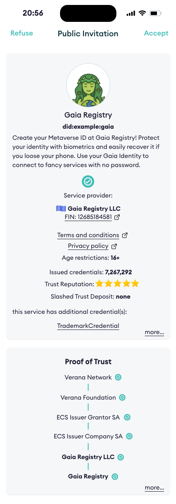
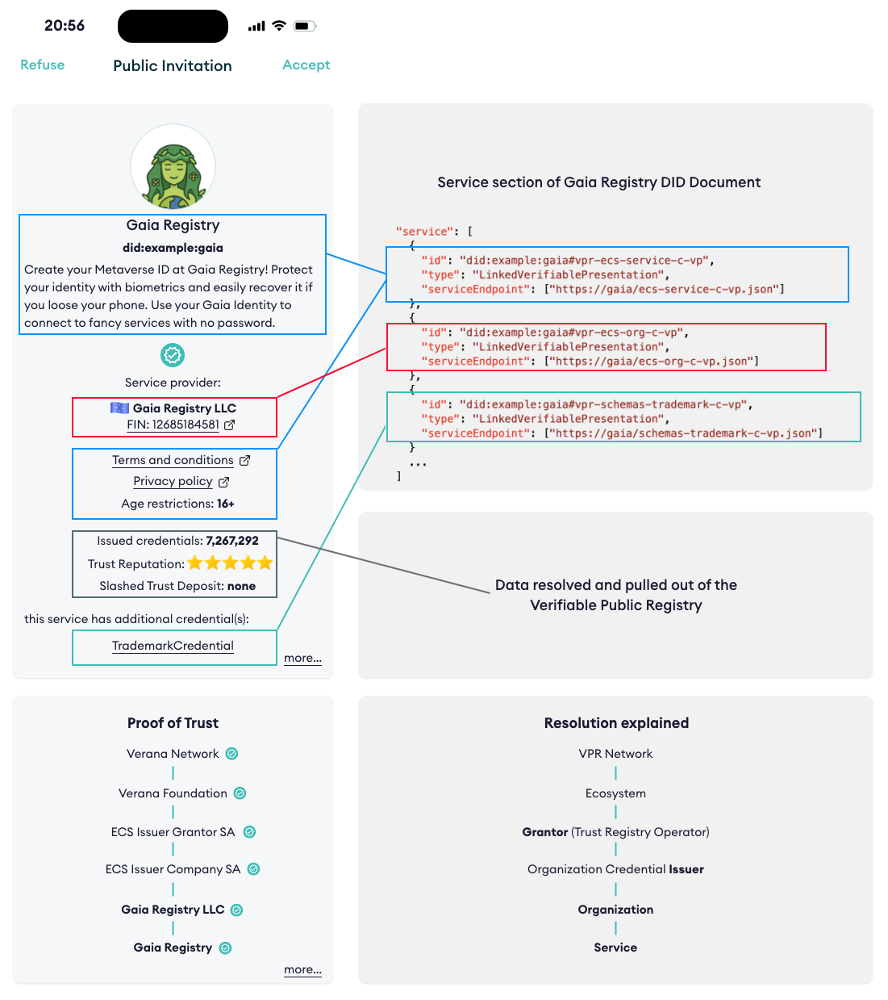
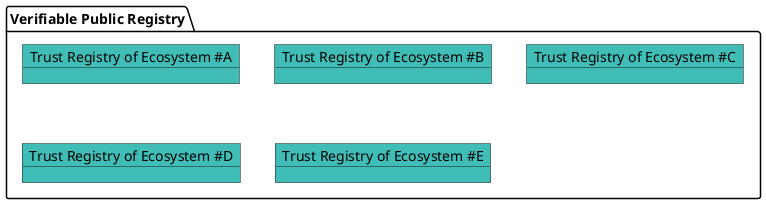
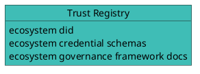
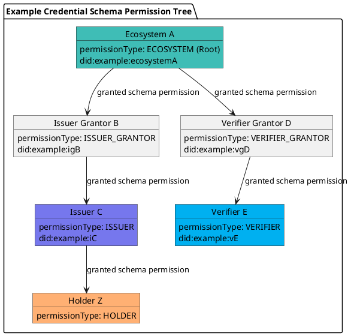
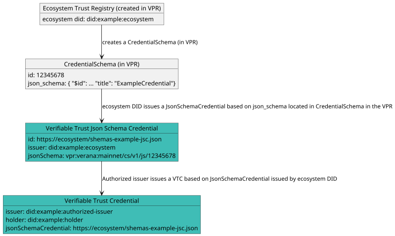

# Verifiable Trust v2 Specification

**Specification Status:** *Draft*

**Latest Draft:** [verana-labs/verifiable-trust-spec](https://github.com/verana-labs/verifiable-trust-spec)

**Editors:**

~ [Fabrice Rochette](https://www.linkedin.com/in/fabricerochette) (The Verana Foundation, 2060.io)

**Contributors:**

~ [Ariel Gentile](https://www.linkedin.com/in/aogentile/) (The Verana Foundation, 2060.io)
~ [Andres Vallecilla](https://www.linkedin.com/in/andres-felipe-vallecilla-puentes/) (Mobiera)

**Participate:**

~ [GitHub repo](https://github.com/verana-labs/verifiable-trust-spec)

~ [File a bug](https://github.com/verana-labs/verifiable-trust-spec/issues)

~ [Commit history](https://github.com/verana-labs/verifiable-trust-spec/commits/main)

---

## Abstract

The internet is broken. Existing communication channels are insecure and outdated. Because they rely on public identifiers — like email addresses, usernames, or phone numbers — anyone who knows your identifier can reach you, whether you invited them or not.

Worse, there’s no reliable way to verify the identity of either service providers or users. This leaves the door wide open to spam, phishing, fraud, and identity theft.

On the service side, each provider imposes its own fragmented registration process, often with complex password requirements or forced reliance on federated login systems, effectively handing control over to large third-party platforms.

Although the World Wide Web was originally built for openness and interoperability, dominant players have reshaped it into a closed, centralized system that most people and organizations now depend on. Privacy has become an afterthought, and personal data is routinely harvested, exploited, or leaked.

To rebuild a trustworthy internet, we need new communication channels - channels that are secure by design, based on mutual verification, and governed by decentralized trust.

Connecting to a service, proving who you are, or creating an account should be as simple and safe as presenting a verifiable credential.

A universal, open trust layer is essential for this vision to succeed.

That’s the purpose of **Verifiable Trust**.

## About this Document

In order to fully understand the concepts developed in this document, you should have some basic knowledge of the [ToIP stack](https://www.trustoverip.org/toip-model/), [[ref:DID]], [[ref:DIDComm]], [[ref:trust registry]], and more generally, all terms present in the [Terminology](#terminology) section.

## Conformance

As well as sections marked as non-normative, all authoring guidelines, diagrams, examples, and notes in this specification are non-normative. Everything else in this specification is normative.
The key words MAY, MUST, MUST NOT, OPTIONAL, RECOMMENDED, REQUIRED, SHOULD, and SHOULD NOT in this document are to be interpreted as described in [BCP 14](https://datatracker.ietf.org/doc/html/bcp14) [RFC2119](https://w3c.github.io/vc-data-model/#bib-rfc2119) [RFC8174](https://w3c.github.io/vc-data-model/#bib-rfc8174) when, and only when, they appear in all capitals, as shown here.

## Terminology

[[def: credential schema, credential schemas]]:
~ An [[ref: VPR]] resource which represents a verifiable credential definition and the associated permissions and business rules for issuing, verifying or holding a credential linked to this credential schema.

[[def: decentralized identifier, DID, DIDs]]:
~ A decentralized identifier, as specified in [[spec-norm:DID-CORE]].

[[def: decentralized identifier communication, DIDComm]]:
~ [DIDComm](https://identity.foundation/didcomm-messaging/spec/) uses [[ref: DIDs]] to establish confidential, ongoing connections.

[[def: decentralized web nodes, DWN, dwn]]:
~ Decentralized web nodes, see [DIF spec](https://identity.foundation/decentralized-web-node/spec/)

[[def: decentralized identifier document, DID Document, DID Documents]]:
~ A DID Document, as specified in [[spec-norm:DID-CORE]].

[[def: verifiable public registry, VPR, VPRs]]:
~ a public, normally decentralized network, which provides: trust registry features, that can be used by all its [[ref: participants]]: create trust registries, for each trust registry, define its credential schemas, who can issue, verify credential of a specific credential schema,... For more information, please refer to [VPR Spec](https://verana-labs.github.io/verifiable-trust-vpr-spec/).

[[def: verifiable service, VS, VSs]]:
~ A service, identified by a resolvable [[ref: DID]] that can be deployed anywhere by its owner, and that is conforming to this spec and has a resolvable [[ref: proof of trust]]. This can be a [[ref: DIDComm]] service, a [[ref: DWN]] service, o any other service.

[[def: verifiable user agent, VUA, VUAs]]:
~ A user agent for accessing and using [[ref: VSs]]. To be considered a [[ref: VUA]], a user agent must conform and enforce this spec, such as presenting a proof of trust to end user before accepting connecting to [[ref: VS]] compliant services, and refuse connecting to not compliant services.

[[def: essential credential schema, essential credential schemas]]:
~ Default [[ref: credential schema]], owned by a [[ref: trust registry]], that provide the basis for a trust layer to exist in the ecosystem so that [[ref: VUA]] can generate a [[ref: proof of trust]].

[[def: holder, holders]]:
~ A role an entity might perform by possessing one or more verifiable credentials and generating verifiable presentations from them. A holder is often, but not always, a [[ref: subject]] of the verifiable credentials they are holding. Holders store their credentials in credential repositories. Example holders include organizations, persons, things.

[[def: issuer, issuers]]:
~ A role an entity can perform by asserting claims about one or more [[ref: subjects]], creating a verifiable credential from these claims, and transmitting the verifiable credential to a [[ref: holder]]. Example issuers include corporations, non-profit organizations, trade associations, governments, and individuals.

[[def: json schema, json schemas]]:
~ A json schema as defined in [JSON-SCHEMA](https://json-schema.org).

[[def: json schema credential, json schema credentials]]:
~ A json schema credential as defined in [[spec-norm:VC-JSON-SCHEMA]].

[[def: linked-vp]]:
~ A presentation of a [[ref: verifiable credential]] as specified in [LINKED-VP](https://identity.foundation/linked-vp/).

[[def: participant, participants]]:
~ An entity that uses an [[ref: VPR]] and its trust layer to provide or use services.

[[def: proof of trust]]:
~ Visual representation using [[ref: essential credential schemas]] of a [[ref: trust resolution]] process of a [[ref: Verifiable Service]], for identifying the [[ref: VS]], its owner, and the [[ref: issuer]] of the verifiable credential of its owner.

[[def: session]]:
~ A session defines a connection to a DID Document provided service from a third party VS or VUA.

[[def: subject, subjects]]:
~ A thing about which claims are made. Example subjects include human beings, animals, things, and organization, a [[ref: DID]]...

[[def:trust registry, trust registries]]
~ An approved list of [[ref: issuers]] and [[ref: verifiers]] that are authorized to issue/verify certain credentials in an ecosystem.

[[def: trust resolution]]:
~ Process run by, for example a [[ref: VUA]] or a [[ref: VS]], which purpose is to recursively resolve [[ref: DID]] by digging into [[ref: DID Documents]] and look for [[ref: linked-vp]] entries and their [[ref: issuer]] [[ref: DIDs]], and trust-registry entries to gather whether the service provided by the [[ref: DID]] is trustable (and legitimate), or not.

[[def: verifier, verifiers]]:
~ A role an entity performs by receiving one or more verifiable credentials, optionally inside a verifiable presentation for processing. Example verifiers include service providers.

[[def: verifiable credential, verifiable credentials]]:
~ A verifiable credential as defined in [[spec-norm:VC-DATA-MODEL]].

## Understanding Verifiable Trust

*This section is non-normative.*

When a user is invited to connect to a service, a verifiable trust-compliant user agent performs *trust resolution* on the service, presents the resulting Proof-of-Trust to the user, and prompts them to either accept or refuse the connection.



Trust Resolution is as simple as calling a method passing the DID of the service we want to resolve, to display a **Proof-of-Trust** to the end-user:

```json
resolve_trust("did:example:gaia")
```

and receive a response similar to this one:

```json
{
  "did":"did:example:gaia",
  "verified": true,
  "service_provider": {
      "id": "did:example:def",
      "type": "Organization",
      "name": "Gaia Registry LLC",
      "country": "zz",
      "reputation": {
        "issuedCredentials": 1234,
        "verifiedCredentials": 7678,
        "trustDepositValue": 176327.124356,
        "amountSlashed": 0,
        "stars": 5.0
      },
      "issuer": "did:example:zzz",
      ...
  },
  "service": {
      "name": "Gaia Registry",
      "termsAndConditions": "http://example.com",
      "privacyPolicy": "http://example.com",
      "minimumAgeRequired": 16,
      "description": "Create your Metaverse ID at Gaia Registry! Protect your identity with biometrics and easily recover it if you loose your phone. Use your Gaia Identity to connect to fancy services with no password."
      ...
  },
  "credentials" : [
    {
      "type": "TrademarkCredential",
      ...
    }
  ]
  ...
}
```

Let's explain how the Verifiable Trust does it.



The core idea behind Verifiable Trust is simple: trust should not be implicit, but it should be verifiable, transparent, and decentralized.

In this example, a Verifiable Service (VS) presents several Verifiable Credentials to prove:

- Who operates the service, using an Essential Credential Schema (ECS) Service Verifiable Trust Credential (data shown in red)
- What the service offers, using another ECS Service Verifiable Trust Credential (data shown in blue)
- Trademark information, using a Trademark Verifiable Trust Credential (data shown in green)

Additionally, the Verifiable Service presents computed reputation information (data shown in black). While this reputation data may support trust decisions, it is not directly defined by this specification. Refer to the [VPR Spec](https://verana-labs.github.io/verifiable-trust-vpr-spec/) for more information.

Verifiable Trust introduces the following core concepts:

- Verifiable Service (VS)
- Verifiable User Agent (VUA)
- Verifiable Public Registry (VPR)
- Verifiable Trust Credentials
- Essential Credential Schemas (ECS)

The Proof-of-Trust is established by recursively resolving the credentials presented by (in this example) a service. What makes this trust verifiable is the use of cryptographic mechanisms built into Decentralized Identifiers (DIDs) and Verifiable Credentials, as applied across these five key concepts.

Because these concepts are deeply interdependent, you may need to explore them together, and revisit them several times to fully grasp the Verifiable Trust model.

### What is a Verifiable Service (VS)?

*This section is non-normative.*

A Verifiable Service (VS) is a service capable of identifying itself to a peer before any connection is established.

Peers wishing to connect to a VS can review the Verifiable Credentials presented by the service, verify their legitimacy through trust resolution, and decide whether to proceed with the connection based on the outcome.

A VS is also required to verify the trustworthiness of peers attempting to connect to it, whether those peers are other Verifiable Services (VS) or Verifiable User Agents (VUA), and must reject connections from non-verifiable peers.

Furthermore, if a Verifiable Service wants to issue credentials or request credential presentation, it must first prove that it is authorized to perform these actions. Otherwise, the peer must refuse the request.

### What is a Verifiable User Agent (VUA)?

*This section is non-normative.*

A Verifiable User Agent (VUA) is software, such as a browser, app, or wallet, designed to connect with Verifiable Services (VS) and other VUAs. When establishing connections, a VUA must verify the identity and trustworthiness of its peers and allow connections only to compliant VS or VUA peers.

As part of this process, the VUA must perform trust resolution by:

- Verifying the Verifiable Credentials presented by the peers
- Querying Verifiable Public Registries (VPRs) to confirm that these credentials were issued by recognized and authorized issuers.

This ensures that all connections are based on verifiable trust, not assumptions.

### What is a Verifiable Public Registry (VPR)?

:::note
There is a [separated VPR spec](https://verana-labs.github.io/verifiable-trust-vpr-spec/). The following summarizes the main features of a VPR.
:::

*This section is non-normative.*

A **Verifiable Public Registry (VPR)** is a **“registry of registries”**, a public service that provides foundational infrastructure for decentralized trust ecosystems. It offers:

- **Trust Registry Management**:  
  Ecosystems can create and manage their own **Trust Registries**, each with:
  - Defined **Credential Schemas**
  - Assigned roles for **Issuers**, **Verifiers**, and **Grantors** (Trust Registry Operators)
  - Custom **business models** and permission policies

- **Query API for Trust Resolution**:  
  A standardized API used by **Verifiable Services (VSs)** and **Verifiable User Agents (VUAs)** to perform trust resolution, enabling them to query registry data and validate roles and permissions in real time. Query API must include support for the [TRQP](https://trustoverip.github.io/tswg-trust-registry-protocol/).



#### Trust Registries

*This section is non-normative.*

Each **Ecosystem Trust Registry** is uniquely identified by a **resolvable DID** and must provide, at a minimum:

- One or more **Governance Framework** document(s)
- Zero or more **Credential Schemas**

The **Verifiable Public Registry (VPR)** is agnostic to the specific **DID methods** used. Trust resolution is performed externally, outside the VPR, allowing flexibility and interoperability across ecosystems.



#### Credential Schemas

*This section is non-normative.*

**Credential Schemas** are created and managed by **Trust Registry owners** (Ecosystems). Each Credential Schema includes, at a minimum:

- A **JSON Schema** that defines the structure of the corresponding **Verifiable Credential**
- A **PermissionManagementMode** for **issuance policy**, which determines how `Issuer` permissions are granted. Modes include:
  - `OPEN`: Anyone can become an Issuer
  - `ECOSYSTEM`: Permissions are granted directly by the Ecosystem, the Trust Registry controller
  - `GRANTOR_VALIDATION`: Permissions are granted by one or several `Issuer Grantor(s)` (Trust Registry operator(s) responsible for selecting issuers for the ecosystem), selected by the Ecosystem.
- A **PermissionManagementMode** for **verification policy**, which determines how `Verifier` permissions are granted. Modes include:
  - `OPEN`: Anyone can act as a Verifier
  - `ECOSYSTEM`: Permissions are granted directly by the Ecosystem, the Trust Registry controller
  - `GRANTOR_VALIDATION`: Permissions are granted by one or several `Verifier Grantor(s)` (Trust Registry operator(s) responsible for selecting verifiers for the ecosystem), selected by the Ecosystem.
- A **Permission Tree** that defines the roles and relationships involved in managing the schema’s lifecycle.



Participant roles are defined in the table below:

| **Participant Role**   | **Description**                                                  |
|-----------------------|------------------------------------------------------------------|
| **Trust Registry**    | Create and control Credential Schemas. Grant other roles.        |
| **Issuer Grantor**    | Trust Registry operator that grants Issuer permissions to candidate issuers.                   |
| **Verifier Grantor**  | Trust Registry operator that grants Verifier permissions to candidate verifiers.               |
| **Issuer**            | Can issue credentials of this schema.                            |
| **Verifier**          | Can request presentation of credentials of this schema.          |
| **Holder**            | Special role used for selected business models.          |

Example of a Json Schema credential schema:

```json
{
  "$id": "vpr:verana:mainnet/cs/v1/js/VPR_CREDENTIAL_SCHEMA_ID",
  "$schema": "https://json-schema.org/draft/2020-12/schema",
  "title": "ExampleCredential",
  "description": "ExampleCredential using JsonSchema",
  "type": "object",
  "properties": {
    "credentialSubject": {
      "type": "object",
      "properties": {
        "id": {
          "type": "string",
          "format": "uri"
        },
        "firstName": {
          "type": "string",
          "minLength": 0,
          "maxLength": 256
        },
        "lastName": {
          "type": "string",
          "minLength": 1,
          "maxLength": 256
        },
        "expirationDate": {
          "type": "string",
          "format": "date"
        },
        "countryOfResidence": {
          "type": "string",
          "minLength": 2,
          "maxLength": 2
        }
      },
      "required": [
        "id",
        "lastName",
        "birthDate",
        "expirationDate",
        "countryOfResidence"
      ]
    }
  }
}
```

### Verifiable Trust Credentials

Data stored in a VPR is not verified at the time of storage, nor does it need to be. Verification happens outside the scope of the VPR.

This is not a limitation, it’s a feature. For example, any DID method can be used, and the VPR will never attempt to resolve or validate DIDs itself.

The VPR provides registrations, not validations, leaving trust decisions and verification where they belong: **with the relying parties**.

To make things verifiable, for a given credential schema:

- Ecosystem creates a Credential Json Schema in a VPR, linked to its Ecosystem DID.
- Ecosystem issues, with its DID, a **Json Schema Credential** linked to its credential **Json Schema** in the VPR
- Then, authorized issuers can issue **Verifiable Trust Credentials** linked to the **Json Schema Credential** issued by Ecosystem DID.

.



#### Json Schema Credentials

*This section is non-normative.*

To prove that data stored in a VPR, such as a credential json schema, is authentic, after creating the JSON Schema, the **Ecosystem owner** of the Trust Registry issues a [JSON Schema Credential](https://www.w3.org/TR/vc-json-schema/) using the **DID registered as the Trust Registry’s Ecosystem identifier** in the VPR.

This credential serves as a verifiable proof of:

- Ownership of the **Credential Schema**
- Control over the corresponding **Trust Registry Ecosystem DID**.

```json
{
  "@context": [
      "https://www.w3.org/ns/credentials/v2"
  ],
  "id": "https://ecosystem/shemas-example-jsc.json",
  "type": ["VerifiableCredential", "JsonSchemaCredential"],
  "issuer": "did:example:ecosystem",
  "issuanceDate": "2024-01-01T19:23:24Z",
  "credentialSchema": {
    "id": "https://www.w3.org/ns/credentials/json-schema/v2.json",
    "type": "JsonSchema",
    "digestSRI": "sha384-S57yQDg1MTzF56Oi9DbSQ14u7jBy0RDdx0YbeV7shwhCS88G8SCXeFq82PafhCrW"
  },
  "credentialSubject": {
    "id": "vpr:verana:mainnet/cs/v1/js/12345678",
    "type": "JsonSchema",
    "jsonSchema": {
      "$ref": "vpr:verana:mainnet/cs/v1/js/12345678"
    },
    "digestSRI": "sha384-ABCSGyugst67rs67rdbugsy0RDdx0YbeV7shwhCS88G8SCXeFq82PafhCeZ" 
  }
}
```

Finally, the Ecosystem must publish both the **JSON Schema Credential** and the **location of the Trust Registry** within the **DID Document** associated with the declared **Trust Registry Ecosystem DID** in the VPR.

This ensures that the Credential Schema and its controlling Trust Registry are publicly discoverable and cryptographically verifiable.

```json
"service": [
    {
      "id": "did:example:ecosystem#vpr-schemas-example-jsc-vp",
      "type": "LinkedVerifiablePresentation",
      "serviceEndpoint": ["https://ecosystem/schemas-example-jsc-vp.json"]
    },
    {
      "id": "did:example:trust-registry#vpr-schemas-trust-registry-1234",
      "type": "VerifiablePublicRegistry",
      "version": "1.0",
      "serviceEndpoint": ["vpr:verana:mainnet"]
    }
    ...
  ]
```

#### Issuing Verifiable Trust Credentials

*This section is non-normative.*

Once the Ecosystem has:

- Created its **Credential Schemas** in the VPR
- Issued the corresponding **JSON Schema Credentials**
- Properly configured the `"service"` section of its **Ecosystem DID Document**

it is now possible to issue **Verifiable Credentials** based on these schemas.

Credentials that comply with the **Verifiable Trust Specification** are referred to as **Verifiable Trust Credentials (VTC)**. These credentials must include, in their `credentialSchema` attribute, a reference to the corresponding **JSON Schema Credential** issued by the Trust Registry Ecosystem DID. This linkage ensures cryptographic proof of the schema's origin and trustworthiness.

In our previous example, that would mean and ExampleCredential should look like this example:

```json
{
  "@context": [
    "https://www.w3.org/ns/credentials/v2"
  ],
  "id": "did:example:holder",
  "type": ["VerifiableCredential", "VerifiableTrustCredential", "ExampleCredential"],
  "issuer": "did:example:authorized-issuer",
  "credentialSubject": {
     "id": "did:example:holder",
    ...
  },
  ...
  "credentialSchema": {
    "id": "https://ecosystem/schemas-example-jsc.json",
    "type": "JsonSchemaCredential"
  }
}

```

### Essential Credential Schemas

Finally, the last concept: to enable fundamental trust operations, such as identifying service providers, service names, and related entities, we define a set of **Essential Credential Schemas (ECS)** specifically designed for these purposes:

- Service: identifies **services**
- Organization: identifies **organizations**
- Person: identifies **individuals** (not necessarily tied to legal or citizen identity)
- User Agent: identifies **user agents**, such as browsers, mobile apps, and similar software

With the Verifiable Trust concept now clearly established, we’re ready to dive into the specifications.

## Specification

### [VT-JSON-SCHEMA-CRED] Verifiable Trust Json Schema Credential

A Verifiable Trust Json Schema Credential is a [[ref: json schema credential]] self-issued by a Trust Registry Ecosystem DID, that MUST refer to the json schema of a `CredentialSchema` entry created in a `VPR`. Issuer of the Verifiable Trust Json Schema Credential MUST be the same DID that the Ecosystem DID of the `TrustRegistry` entry created in the [[ref: VPR]] than owns the `CredentialSchema` entry in the [[ref: VPR]].

A Verifiable Trust Json Schema Credential MUST have a `credentialSchema` property that contains exactly the following:

```json
  "credentialSchema": {
    "id": "https://www.w3.org/ns/credentials/json-schema/v2.json",
    "type": "JsonSchema",
    "digestSRI": "sha384-S57yQDg1MTzF56Oi9DbSQ14u7jBy0RDdx0YbeV7shwhCS88G8SCXeFq82PafhCrW"
  }
```

Additionally, it MUST have a `credentialSubject` object with:

- a `id` properties that is the URL to access the [[ref: json schema]] in the VPR,
- `type` MUST be set to "JsonSchema",
- an object `jsonSchema` MUST be present with an `$ref` properties that is the URL to access the [[ref: json schema]] in the VPR
- a digestSRI property that MUST match the [[ref: json schema]] file content hash.

Example of a Verifiable Trust Json Schema Credential:

```json
{
  "@context": [
      "https://www.w3.org/ns/credentials/v2"
  ],
  "id": "https://ecosystem/schemas-example-jsc.json",
  "type": ["VerifiableCredential", "JsonSchemaCredential"],
  "issuer": "did:example:ecosystem",
  "issuanceDate": "2024-01-01T19:23:24Z",
  "credentialSchema": {
    "id": "https://www.w3.org/ns/credentials/json-schema/v2.json",
    "type": "JsonSchema",
    "digestSRI": "sha384-S57yQDg1MTzF56Oi9DbSQ14u7jBy0RDdx0YbeV7shwhCS88G8SCXeFq82PafhCrW"
  },
  "credentialSubject": {
    "id": "vpr:verana:mainnet/cs/v1/js/12345678",
    "type": "JsonSchema",
    "jsonSchema": {
      "$ref": "vpr:verana:mainnet/cs/v1/js/12345678"
    },
    "digestSRI": "sha384-ABCSGyugst67rs67rdbugsy0RDdx0YbeV7shwhCS88G8SCXeFq82PafhCeZ" 
  }
}
```

### [VT-ECOSYSTEM-DIDDOC] Ecosystem DID Document

For each `CredentialSchema` entry an Ecosystem has created in his Trust Registry in a [[ref: VPR]], the Ecosystem MUST self-issue the corresponding Verifiable Trust Json Schema Credential as specified in [VT-JSON-SCHEMA-CRED].

Additionally, in MUST present (as a [[ref: linked-vp]]) the Verifiable Trust Json Schema Credential(s) in its DID Document, as well as the corresponding VPR entry for verification. To do so, it MUST define the following entries in its DID Document:

- for each `CredentialSchema` entry it wants to be resolvable, a "LinkedVerifiablePresentation" service entry with a fragment that MUST start with `#vpr-schemas`, that MUST point to a self-issued Verifiable Trust Json Schema Credential as specified in [VT-JSON-SCHEMA-CRED].
- a `VerifiablePublicRegistry` service entry with fragment name equal to the concatenation of  `#vpr-schemas-trust-registry-` and the id of the Ecosystem's Trust Registry in the VPR.

Example:

```json
"service": [
    {
      "id": "did:example:ecosystem#vpr-schemas-example-jsc-vp",
      "type": "LinkedVerifiablePresentation",
      "serviceEndpoint": ["https://ecosystem/schemas-example-jsc-vp.json"]
    },
    {
      "id": "did:example:ecosystem#vpr-schemas-trust-registry-1234",
      "type": "VerifiablePublicRegistry",
      "version": "1.0",
      "serviceEndpoint": ["vpr:verana:mainnet"]
    }
    ...
  ]
```

### [VT-CRED] Verifiable Trust Credential

A Verifiable Trust Credential MUST have a `credentialSchema` property:

- `id` must point to a [[ref: json schema credential]] issued by the trust registry [[ref: DID]] owner of the schema in the VPR;
- `type` MUST be `JsonSchemaCredential`.

As a matter of fact, a Verifiable Trust Credential MUST conform to the dereferenced [[ref: json schema]] of the `JsonSchemaCredential`.

Example:

```json
{
  "@context": [
    "https://www.w3.org/ns/credentials/v2"
  ],
  "id": "did:example:holder",
  "type": ["VerifiableCredential", "VerifiableTrustCredential", "ExampleCredential"],
  "issuer": "did:example:authorized-issuer",
  "credentialSubject": {
     "id": "did:example:holder",
    ...
  },
  ...
  "credentialSchema": {
    "id": "https://ecosystem/schemas-example-jsc.json",
    "type": "JsonSchemaCredential"
  }
}

```

### [VT-LINKED-VP] Verifiable Trust Credential Linked VP

A DID Document MAY present an unlimited number of Verifiable Trust Credential as Linked-VPs. Linked-VPs MUST be signed by the DID controller of the DID Document, and MUST be declared with a fragment that starts with `#vpr-schemas-` and ends with `-c-vp`. Example:

```json
"service": [
    {
      "id": "did:example:ecosystem#vpr-schemas-example-c-vp",
      "type": "LinkedVerifiablePresentation",
      "serviceEndpoint": ["https://ecosystem/schemas-example-c-vp.json"]
    }
    ...
  ]
```

### [ECS] Essential Credential Schemas

Essential Credential Schemas are the Verifiable Trust basic needed schemas for enabling a minimum trust resolution in Services and User Agents by answering these questions:

- who is the provider of this Verifiable Service?
- what is the minimum age required to access this Verifiable Service?
- is the User Agent trying to connect to a Verifiable Service a Verifiable User Agent?
- ...

Ecosystems can create Essential Credential Schemas (ECS) by creating a Trust Registry in a [[ref: VPR]]. There are 4 kinds of ECS:

- Service;
- Organization;
- Person;
- UserAgent.

An Ecosystem creates its Trust Registry in a [[ref: VPR]] by creating a `TrustRegistry` entry `tr`. For this Trust Registry to qualify for being used for trust resolution in [[ref: VSs]] and [[ref: VUAs]], it MUST provide, associated to the `TrustRegistry` entry `tr`, at least one `CredentialSchema` entry, with a respective `json_schema` attribute defined as follows in [ECS-SERVICE], [ECS-ORG], [ECS-PERSON], [ECS-UA].

:::warning
All ECS json schema are unstable and may change for v2 stable version of this spec
:::

#### [ECS-SERVICE] Service Credential Json Schema

Used to identify Services.

Credential subject object of schema MUST contain the following attributes:

- `id` (string) (*mandatory*): the [[ref: DID]] of the service the credential will be issued to.
- `name` (string) (*mandatory*): service name. UTF8 charset, max length: 512 bytes.
- `type` (string) (*mandatory*): service type. UTF8 charset, max length: 128 bytes. Service types will be defined later.
- `description` (string) (*mandatory*): service description. UTF8 charset, max length: 4096 bytes.
- `logo` (image) (*mandatory*): the logo of the service, as it will be shown in browsers, apps, search engines...
- `minimumAgeRequired` (integer) (*mandatory*): minimum required age to connect to service. Allowed value: 0 to 255. Used by browsers that provide a simple birth date based parental control.
- `termsAndConditions` (string) (*mandatory*): URL of the terms and conditions of the service. It is recommended to store terms and conditions in a file, in a repository that allows file hash verification (IPFS).
- `termsAndConditionsHash` (string) (*optional*): If terms and conditions of the service are stored in a file, optional hash of the file for data integrity verification.
- `privacyPolicy` (string) (*mandatory*): URL of the terms and conditions of the service. MAY be the same URL that `terms_and_conditions` if file are combined. It is recommended to store privacy policy in a file repository that allows file hash verification (IPFS).
- `privacyPolicyHash` (string) (*optional*): If privacy policy of the service are stored in a file, optional hash of the file for data integrity verification.

the resulting `json_schema` attribute will be the following Json Schema.

- `VPR_CREDENTIAL_SCHEMA_ID` is replaced by the `schema_id` of the created `CredentialSchema` entry in the VPR.

```json
{
  "$id": "vpr:verana:mainnet/cs/v1/js/VPR_CREDENTIAL_SCHEMA_ID",
  "$schema": "https://json-schema.org/draft/2020-12/schema",
  "title": "ServiceCredential",
  "description": "ServiceCredential using JsonSchema",
  "type": "object",
  "properties": {
    "credentialSubject": {
      "type": "object",
      "properties": {
        "id": {
          "type": "string",
          "format": "uri"
        },
        "name": {
          "type": "string",
          "minLength": 1,
          "maxLength": 512
        },
        "type": {
          "type": "string",
          "minLength": 1,
          "maxLength": 128
        },
        "description": {
          "type": "string",
          "minLength": 0,
          "maxLength": 4096
        },
        "logo": {
          "type": "string",
          "contentEncoding": "base64",
          "contentMediaType": "image/png"
        },
        "minimumAgeRequired": {
          "type": "number",
          "minimum": 0,
          "exclusiveMaximum": 150
        },
        "termsAndConditions": {
          "type": "string",
          "format": "uri",
          "maxLength": 2048
        },
        "termsAndConditionsHash": {
          "type": "string"
        },
        "privacyPolicy": {
          "type": "string",
          "format": "uri",
          "maxLength": 2048
        },
        "privacyPolicyHash": {
          "type": "string"
        }
      },
      "required": [
        "id",
        "name",
        "type",
        "description",
        "logo",
        "minimumAgeRequired",
        "termsAndConditions",
        "privacyPolicy"
      ]
    }
  }
}
```

#### [ECS-ORG] OrganizationCredential Json Schema

Used to identify Verifiable Services run by Organizations.

Credential subject object of schema MUST contain the following attributes:

- `id` (string) (*mandatory*): the [[ref: DID]] of the service the credential has been issued to, which is the subject of the [[ref: verifiable credential]].
- `name` (string) (*mandatory*): name of the organization.
- `logo` (image) (*mandatory*): the logo of the organization, as it will be shown in browsers and search engines.
- `registryId` (string) (*mandatory*): registry id of the organization.
- `registryUrl` (string) (*optional*): link to registry data.
- `address` (string) (*mandatory*): address of the organization.
- `type` (string) (*mandatory*): type of organization. PUBLIC, PRIVATE, FOUNDATION.
- `countryCode` (string) (*mandatory*): country where the company is registered.

the resulting `json_schema` attribute will be the following Json Schema.

- `VPR_CREDENTIAL_SCHEMA_ID` is replaced by the `schema_id` of the created `CredentialSchema` entry in the VPR.

```json
{
  "$id": "vpr:verana:mainnet/v1/cs/js/VPR_CREDENTIAL_SCHEMA_ID",
  "$schema": "https://json-schema.org/draft/2020-12/schema",
  "title": "OrganizationCredential",
  "description": "OrganizationCredential using JsonSchema",
  "type": "object",
  "properties": {
    "credentialSubject": {
      "type": "object",
      "properties": {
        "id": {
          "type": "string",
          "format": "uri"
        },
        "name": {
          "type": "string",
          "minLength": 0,
          "maxLength": 256
        },
        "logo": {
          "type": "string",
          "contentEncoding": "base64",
          "contentMediaType": "image/png"
        },
        "registryId": {
          "type": "string",
          "minLength": 0,
          "maxLength": 256
        },
        "registryUrl": {
          "type": "string",
          "minLength": 0,
          "maxLength": 256
        },
        "address": {
          "type": "string",
          "minLength": 0,
          "maxLength": 1024
        },
        "type": {
          "type": "string",
          "enum": ["PUBLIC", "PRIVATE", "FOUNDATION"]
        },
        "countryCode": {
          "type": "string",
          "minLength": 2,
          "maxLength": 2
        }
      },
      "required": [
        "id",
        "name",
        "logo",
        "registryId",
        "registryUrl",
        "address",
        "type",
        "countryCode"
      ]
    }
  }
}
```

#### [ECS-PERSON] Person Credential Json Schema

Used to identify Verifiable Services run by Persons.

Credential subject object of schema MUST contain the following attributes:

- `id` (string) (*mandatory*): the [[ref: DID]] the credential has been issued to.
- `firstName` (string) (*optional*): first name of the person.
- `lastName` (string) (*mandatory*): last name of the person.
- `avatar` (image) (*optional*): the avatar of this person, as it will be shown in browsers and search engines.
- `birthDate` (date) (*mandatory*): date of birth.
- `countryOfResidence` (string) (*mandatory*): the country of residence.

the resulting `json_schema` attribute will be the following Json Schema.

- `VPR_CREDENTIAL_SCHEMA_ID` is replaced by the `schema_id` of the created `CredentialSchema` entry in the VPR.

```json
{
  "$id": "vpr:verana:mainnet/v1/cs/js/VPR_CREDENTIAL_SCHEMA_ID",
  "$schema": "https://json-schema.org/draft/2020-12/schema",
  "title": "PersonCredential",
  "description": "PersonCredential using JsonSchema",
  "type": "object",
  "properties": {
    "credentialSubject": {
      "type": "object",
      "properties": {
        "id": {
          "type": "string",
          "format": "uri"
        },
        "firstName": {
          "type": "string",
          "minLength": 0,
          "maxLength": 256
        },
        "lastName": {
          "type": "string",
          "minLength": 1,
          "maxLength": 256
        },
        "avatar": {
          "type": "string",
          "contentEncoding": "base64",
          "contentMediaType": "image/png"
        },
        "birthDate": {
          "type": "string",
          "format": "date"
        },
        "countryOfResidence": {
          "type": "string",
          "minLength": 2,
          "maxLength": 2
        }
      },
      "required": [
        "id",
        "lastName",
        "birthDate",
        "countryOfResidence"
      ]
    }
  }
}
```

#### [ECS-UA] User Agent Credential Json Schema

Credential subject object of schema MUST contain the following attributes:

- `id` (string) (*mandatory*): the [[ref: DID]] of the user agent the credential will be issued to.
- `name` (string) (*mandatory*): agent name. UTF8 charset, max length: 512 bytes.
- `description` (string) (*mandatory*): agent description. UTF8 charset, max length: 4096 bytes.
- `category` (string) (*mandatory*): the category of the agent, ie SOCIAL_NETWORK,...
- `logo` (image) (*mandatory*): the logo of the agent, as it will be shown in search engines.
- `wallet` (boolean) (*mandatory*): If the agent provides verifiable credential wallet features.
- `termsAndConditions` (string) (*mandatory*): URL of the terms and conditions of the service. It is recommended to store terms and conditions in a file, in a repository that allows file hash verification (IPFS).
- `termsAndConditionsHash` (string) (*optional*): If terms and conditions of the service are stored in a file, optional hash of the file for data integrity verification.
- `privacyPolicy` (string) (*mandatory*): URL of the terms and conditions of the service. MAY be the same URL that `terms_and_conditions` if file are combined. It is recommended to store privacy policy in a file repository that allows file hash verification (IPFS).
- `privacyPolicyHash` (string) (*optional*): If privacy policy of the service are stored in a file, optional hash of the file for data integrity verification.

the resulting `json_schema` attribute will be the following Json Schema.

- `VPR_CREDENTIAL_SCHEMA_ID` is replaced by the `schema_id` of the created `CredentialSchema` entry in the VPR.

```json
{
  "$id": "vpr:verana:mainnet/v1/cs/js/VPR_CREDENTIAL_SCHEMA_ID",
  "$schema": "https://json-schema.org/draft/2020-12/schema",
  "title": "UserAgentCredential",
  "description": "UserAgentCredential using JsonSchema",
  "type": "object",
  "properties": {
    "credentialSubject": {
      "type": "object",
      "properties": {
        "id": {
          "type": "string",
          "format": "uri"
        },
        "name": {
          "type": "string",
          "minLength": 1,
          "maxLength": 512
        },
        "description": {
          "type": "string",
          "minLength": 0,
          "maxLength": 4096
        },
        "category": {
          "type": "string",
          "minLength": 1,
          "maxLength": 128
        },
        "logo": {
          "type": "string",
          "contentEncoding": "base64",
          "contentMediaType": "image/png"
        },
        "wallet": {
          "type": "boolean"
        },
        "termsAndConditions": {
          "type": "string",
          "format": "uri",
          "maxLength": 2048
        },
        "termsAndConditionsHash": {
          "type": "string"
        },
        "privacyPolicy": {
          "type": "string",
          "format": "uri",
          "maxLength": 2048
        },
        "privacyPolicyHash": {
          "type": "string"
        }
      },
      "required": [
        "id",
        "name",
        "description",
        "category",
        "logo",
        "wallet",
        "termsAndConditions",
        "privacyPolicy"
      ]
    }
  }
}
```

### [VT-ECS-JSON-SCHEMA-CRED] Essential Schema Json Schema Credentials

- Json Schema Credential [VT-ECS-SERVICE-JSON-SCHEMA-CRED]: a [VT-JSON-SCHEMA-CRED] linked to a Json Schema of a CredentialSchema entry that conforms to [ECS-SERVICE].
- Json Schema Credential [VT-ECS-ORG-JSON-SCHEMA-CRED]: a [VT-JSON-SCHEMA-CRED] linked to a Json Schema of a CredentialSchema entry that conforms to [ECS-ORG].
- Json Schema Credential [VT-ECS-PERSON-JSON-SCHEMA-CRED]: a [VT-JSON-SCHEMA-CRED] linked to a Json Schema of a CredentialSchema entry that conforms to [ECS-PERSON].
- Json Schema Credential [VT-ECS-UA-JSON-SCHEMA-CRED]: a [VT-JSON-SCHEMA-CRED] linked to a Json Schema of a CredentialSchema entry that conforms to [ECS-UA].

### [VT-ECS-CRED] Verifiable Trust Essential Schema Credentials

- Service Credential [VT-ECS-SERVICE-CRED]: a [VT-CRED] linked to a [VT-ECS-SERVICE-JSON-SCHEMA-CRED]. MUST be declared in DID Document with a "LinkedVerifiablePresentation" service entry with fragment `#vpr-ecs-service-c-vp`. Example:

```json
  "service": [
    {
      "id": "did:example:service#vpr-ecs-service-c-vp",
      "type": "LinkedVerifiablePresentation",
      "serviceEndpoint": ["https://service/ecs-service-c-vp.json"]
    }
    ...
  ]
```

- Organization Credential [VT-ECS-ORG-CRED]: a [VT-CRED] linked to a [VT-ECS-ORG-JSON-SCHEMA-CRED]. MUST be declared in DID Document with a "LinkedVerifiablePresentation" service entry with fragment `#vpr-ecs-org-c-vp`. Example:

```json
  "service": [
    {
      "id": "did:example:service#vpr-ecs-org-c-vp",
      "type": "LinkedVerifiablePresentation",
      "serviceEndpoint": ["https://service/ecs-org-c-vp.json"]
    }
    ...
  ]
```

- Person Credential [VT-ECS-PERSON-CRED]: a [VT-CRED] linked to a [VT-ECS-PERSON-JSON-SCHEMA-CRED]. MUST be declared in DID Document with a "LinkedVerifiablePresentation" service entry with fragment `#vpr-ecs-person-c-vp`. Example:

```json
  "service": [
    {
      "id": "did:example:service#vpr-ecs-person-c-vp",
      "type": "LinkedVerifiablePresentation",
      "serviceEndpoint": ["https://service/ecs-person-c-vp.json"]
    }
    ...
  ]
```

- User Agent Credential [VT-ECS-UA-CRED]: a [VT-CRED] linked to a [VT-ECS-UA-JSON-SCHEMA-CRED].

### [VT-ECS-ECOSYSTEM-DIDDOC] Ecosystem DID Document for declaring Essential Credential Schemas

If an Ecosystem Trust Registry wishes to provide ECS trust resolution, it MUST present VT Json Schema Credential(s) of the ECSs they support, as well as the corresponding VPR entry for verification. To do that, Ecosystem MUST define the following entries in its DID Document, for each ECS they support:

- a "LinkedVerifiablePresentation" service entry with fragment name equal to `#vpr-ecs-service-jsc-vp`, that MUST point to a self-issued and presented [VT-ECS-SERVICE-JSON-SCHEMA-CRED].
- a "LinkedVerifiablePresentation" service entry with fragment name equal to `#vpr-ecs-org-jsc-vp`, that MUST point to a self-issued and presented [VT-ECS-ORG-JSON-SCHEMA-CRED].
- a "LinkedVerifiablePresentation" service entry with fragment name equal to `#vpr-ecs-person-jsc-vp`, that MUST point to a self-issued and presented [VT-ECS-PERSON-JSON-SCHEMA-CRED].
- a "LinkedVerifiablePresentation" service entry with fragment name equal to `#vpr-ecs-ua-jsc-vp`, that MUST point to a self-issued and presented [VT-ECS-UA-JSON-SCHEMA-CRED].

Example:

```json
  "service": [
    {
      "id": "did:example:ecosystem#vpr-ecs-service-jsc-vp",
      "type": "LinkedVerifiablePresentation",
      "serviceEndpoint": ["https://ecosystem/ecs-service-jsc-vp.json"]
    },
    {
      "id": "did:example:ecosystem#vpr-ecs-org-jsc-vp",
      "type": "LinkedVerifiablePresentation",
      "serviceEndpoint": ["https://ecosystem/ecs-org-jsc-vp.json"]
    },
    {
      "id": "did:example:ecosystem#vpr-ecs-person-jsc-vp",
      "type": "LinkedVerifiablePresentation",
      "serviceEndpoint": ["https://ecosystem/ecs-person-jsc-vp.json"]
    },
    {
      "id": "did:example:ecosystem#vpr-ecs-ua-jsc-vp",
      "type": "LinkedVerifiablePresentation",
      "serviceEndpoint": ["https://ecosystem/ecs-ua-jsc-vp.json"]
    },
    {
      "id": "did:example:ecosystem#vpr-ecs-trust-registry-789041745",
      "type": "VerifiablePublicRegistry",
      "version": "1.0",
      "serviceEndpoint": ["vpr:verana:mainnet"]
    }
    
    ...
  ]
```

### [VS-REQ] Verifiable Service Basic Requirements and Linked VPs

- [VS-REQ-1] A [[ref: VS]] MUST be identified by a [[:ref DID]]. The [[:ref DID]] of a [[ref: VS]] MUST resolve to a [[ref: DID Document]].
- [VS-REQ-2] A [[ref: VS]] DID Document MUST present (linked-vp) a Verifiable Trust Credential that conforms to [VT-ECS-SERVICE-CRED].
- [VS-REQ-3] If the issuer of the VT Service Essential Credential of [VS-REQ-2] is the [[ref: DID]] of this service, service DID Document MUST present a Verifiable Trust Credential that conforms to [VT-ECS-ORG-CRED] or (exclusive) [VT-ECS-PERSON-CRED].
- [VS-REQ-4] If the issuer of the VT Service Credential of [VS-REQ-2] is not the [[ref: DID]] of this service, DID Document of the VT Service Credential issuer MUST present a Verifiable Trust Credential that conforms to [VT-ECS-ORG-CRED] or (exclusive) [VT-ECS-PERSON-CRED].
- [VS-REQ-5] A [[ref: VS]] DID Document CAN present other Verifiable Trust Credentials as specified in [VT-LINKED-VP].

::: note
In other words, to be a VS, a service MUST identify itself directly by presenting an Organization or a Person Essential Credential, or the issuer of its Service Essential Credential MUST identify itself by presenting an Organization or a Person Essential Credential.
:::

### [VUA-REQ] Requirements for a User Agent to be a VUA

- [VUA-REQ-1] A [[ref: VUA]] that connects to a [[ref: VS]] MUST present a [VT-ECS-UA-CRED] ECS User Agent Verifiable Trust Credential when requested by the [[ref: VS]].
- [VUA-REQ-2] A [[ref: VUA]] that connects to another [[ref: VUA]] MUST present a [VT-ECS-UA-CRED] ECS User Agent Verifiable Trust Credential when requested by the other [[ref: VUA]].

:::note
It is RECOMMENDED to use selective disclosure for [VT-ECS-UA-CRED] presentations to prevent correlation.
:::

### [CIB] Credential Issuance by

- [CIB-1] A [[ref: VS]] or a [[ref: VUA]] CAN issue [VT-CRED] VT Credentials.
- [CIB-2] A [[ref: VS]] or a [[ref: VUA]] MUST NOT issue credentials that are not compliant with [VT-CRED].
- [CIB-3] A [[ref: VS]] or a [[ref: VUA]] MUST NOT issue a credential if it cannot prove [VT-PROOF-ISSUER] it is authorized by the Ecosystem controller of the schema.

### [PRB] Presentation Requested by

- [PRB-1] A [[ref: VS]] or a [[ref: VUA]] CAN request presentation of [VT-CRED] VT Credentials
- [PRB-2] A [[ref: VS]] or a [[ref: VUA]] MUST NOT request presentation of credentials that are not compliant with [VT-CRED].
- [PRB-3] A [[ref: VS]] or a [[ref: VUA]] MUST NOT request presentation of a credential if it cannot prove [VT-PROOF-VERIFIER] it is authorized by the Ecosystem controller of the schema.

### [CIT] Credential Issued to

- [CIT-1] A [[ref: VS]] or a [[ref: VUA]] CAN be offered [VT-CRED] VT Credentials.
- [CIT-2] A [[ref: VS]] or a [[ref: VUA]] MUST NOT be offered credentials that are not compliant with [VT-CRED].
- [CIT-3] When a [[ref: VS]] is offered a credential, it MUST verify [VT-PROOF-ISSUER] that the issuer is authorized by the Ecosystem that controls the schema to issue a credential of this schema.

### [PRT] Presentation Requested to

- [PRT-1] A [[ref: VS]] or a [[ref: VUA]] CAN request presentation of [VT-CRED] VT Credentials
- [PRT-2] A [[ref: VS]] or a [[ref: VUA]] MUST NOT request presentation of credentials that are not compliant with [VT-CRED].
- [PRT-3] When a [[ref: VS]] receives a presentation request, before presenting a credential, it MUST verify [VT-PROOF-VERIFIER] that the verifier is authorized by the Ecosystem that controls the schema to verify the requested credential of this schema.

### [VS-CONN-VS] Requirements for a VS to accept a connection from another service

When a [[ref: VS]] VS-1 receive a connection request from a service Service-2 to one of its services specified in DID Document, VS-1 MUST verify service Service-2 complies with [VS-REQ], else VS-1 MUST NOT accept the connection, unless purpose of the service provided by VS-1 is the issuance of [VT-ECS-ORG-CRED] or [VT-ECS-PERSON-CRED] credentials.

### [VS-CONN-VUA] Requirements for a VS to accept a connection from a User Agent

When a [[ref: VS]] receives a connection from a User Agent, it MUST request the presentation of a [VT-ECS-UA-CRED] credential before starting to provide the service, and verify the presented credential (if any). If no credential is presented or presented credential is not verifiable, [[ref: VS]] MUST NOT provide the service.

### [VUA-CONN-VS] Requirements for a VUA to accept connecting to a service

When a [[ref: VUA]] start a [[ref: session]] with a service, [[ref: VUA]] MUST verify VS complies with [VS-REQ], else VUA MUST NOT connect to VS.

### [VUA-CONN-VUA] Requirements for two VUAs to connect

When a [[ref: VUA]] receives a connection from a User Agent, it MUST request the presentation of a [VT-ECS-UA-CRED] credential before starting to provide the service, and verify the presented credential (if any).

When a [[ref: VUA]] initiates a connection to another User Agent, it MUST request the presentation of a [VT-ECS-UA-CRED] credential before starting to provide the service, and verify the presented credential (if any).

For communication channel between User Agents to be enabled, both User Agents MUST have requested and verified the  [VT-ECS-UA-CRED] credential presented by the peer.

### [WL] ECS Ecosystem whitelists and vpr: scheme resolution

- [WL-VPR] Compliant [[ref: VSs]] and [[ref: VUAs]] MUST maintain a list of VPRs and how to access them (resolution). As VPRs are decentralized, this gives the option to the VUA vendor or VS provider to run a VPR node and use its own node endpoints for trust resolution.

Example:

```json

{ 
  verifiablePublicRegistries: [ 
    { 
      "name": "vpr:verana:mainnet",
      "baseurls": [
        "https://user-agent-vpr-node-1/vpr/",
        "https://user-agent-vpr-node-2/vpr/",
      ]
      "version": "1"
      "production": true
    },
    { 
      "name": "vpr:verana:testnet",
      "baseurls": [
        "https://user-agent-vpr-node-testnet/vpr/"
      ]
      "version": "1"
      "production": false
    },
    { 
      "name": "vpr:verana:devnet",
      "baseurls": [
        "https://user-agent-vpr-node-devnet/vpr/"
      ]
      "version": "2"
      "production": false
    }
  ]
}
```

- [WL-ECS]: Compliant [[ref: VSs]] and [[ref: VUAs]] MUST maintain a list of DIDs of Ecosystems they trust for providing essential credential schemas.

Example:

```json

{ 
  ecsEcosystems: [ 
    { 
      "did": "did:example:ecosystem",
      "vpr": "vpr:verana:mainnet"
    },
    { 
      "did": "did:example:ecosystem-test",
      "vpr": "vpr:verana:testnet"
    }
  ]
}
```

:::warning
Everything below this point is outdated and should be ignored
:::

### [VT-RESOL] Verification of permission(s) in Verifiable Public Registries

Please refer to Permission Module in [[ref: VPR]] specs.

Process for verifying trust is always following the same rules. You'll find few examples below.

#### Verify that an Organization Credential has been issued by an authorized issuer

"We" refers to a VUA or a VS.

- for a given service, get its Organization credential linked verifiable presentation in its DID Document.
- get and load the linked `Json Schema Credential`. Verify that the issuer (the Trust Registry owner of this schema) of this `Json Schema Credential` is in your `essentialSchemaTrustRegistries` list. Verify the `digestSRI` of the `credentialSchema` and the `credentialSubject` properties.
- get the credential schema id `schema_id` from the `credentialSubject` of the `Json Schema Credential`.
- use the VPR API such as "Get a Credential Schema" and "Get Trust Registry" methods. Verify that the Trust Registry DID matches the DID of the `Json Schema Credential`. If schema is open for anyone to issue, no need to do any further check.
- If schema is not open, call "Find Permissions With DID" method to verify that issuer of the organization credential had a valid permission for this schema at the time the credential was issued. If yes, credential has been issued by an authorized issuer.

#### Verify that a VT Credential has been issued by an authorized issuer

We consider presentation receiver has already performed the checks and credential schema has credential verification set to OPEN (anyone can verify). "We" refers to a VUA or a VS.

- receive a credential presentation or get it as a linked verifiable presentation in a DID Document.
- get and load the linked `Json Schema Credential`. Verify that the issuer (the Trust Registry owner of this schema) of this `Json Schema Credential` is in your `trustRegistries` list. Verify the `digestSRI` of the `credentialSchema` and the `credentialSubject` properties.
- get the credential schema id `schema_id` from the `credentialSubject` of the `Json Schema Credential`.
- use the VPR API such as "Get a Credential Schema" and "Get Trust Registry" methods. Verify that the Trust Registry DID matches the DID of the `Json Schema Credential`. If schema is open for anyone to issue, no need to do any further check.
- If schema is not open, call "Find Permissions With DID" method to verify that issuer of the organization credential had a valid permission for this schema at the time the credential was issued. If yes, credential has been issued by an authorized issuer.

#### Verify that a service has the right to request the presentation of a Credential of a given Issuer for a given schema

We consider we verified that the service is complying with this spec before connecting to it. "We" refers to a VUA or a VS.

A requester want to request the presentation of a credential.

- the requester shares the `schemaId` to us;
- we use the VPR API such as "Get a Credential Schema" and "Get Trust Registry" methods and check if verification is open for this schema. If schema is not open, then verifier MUST create a transaction. We share a `sessionId` (uuid) to requester;
- we shared a list of found credential in the wallet(s) `(issuerPermId, walletAgentPermId)` (that implies we resolved the permIds by using the "Find Permissions With DID" method *at* issuance date)
- requester chooses a credential, verifies `issuerPermId` and `walletAgentPermId`
- if a payment is required, the verifier uses the "Create or update Permission Session" method to pay.
- requester inform us which credential it wants.
- if schema is not open, we call "Get Permission Session" to verify requester paid using the `sessionId`.
- we present the selected credential to verifier.

:::note
Services that will want to request presentation of credential will need a crypto wallet and keys if VPR is a blockchain
:::

## Implementations

*This section is non-normative.*

Implementations are provided by the community, being the [Verana Foundation](https://verana.io) and [2060.io](https://2060.io) the most active contributors at the moment.

### Trust Resolution

#### Typescript Implementation

::todo
Provide repo info
:::

### VUAs Implementations

#### Hologram Messaging

*This section is non-normative.*

Hologram Messaging is a Verifiable Credential wallet and messaging app with true privacy preserving features. Unlike other messaging apps, Hologram is a self-custody app, which means user’s data is only stored on device, and exclusively under user’s control.

Hologram is the first ever-built VUA and is already available in the app stores, look for "Hologram Messaging" in apple store, google play or huawei's app gallery. It has a user interface very similar to that well known apps like whatsapp, signal or telegram.

Based on the [DIDComm](https://didcomm.org) open protocol, Hologram provides classic features such has peer-to-peer chat with verifiable credential exchange (to be able to verify who I am chatting to), as well as a Verifiable Chatbot browser to connect to any decentralized Hologram Chatbot VS. Anyone can create an Hologram Service, publish its DID, and invite users to connect by using Hologram (or any other compatible User Agent), request Verifiable Credential Presentations, issue credentials, perform calls and video calls, exchange content, read NFC chips, and more. Integration of p2p money transfers and payments are underway.

Because Hologram is using the [DIDComm](https://didcomm.org) open protocol, anyone can create a new interoperable VUA so that Hologram users will natively be able to chat with users from others compatible VUAs.

### VSs Implementations

#### Hologram Services

*This section is non-normative.*

Hologram Services can be of 2 kinds:

- Chatbot Services
- Basic Out-of-band Services, for Verifiable Credential Presentation Request and/or Verifiable Credential Issuance.

Creation of an Hologram Service is really straightforward, just have a look at [2060.io github repository](https://github.com/2060-io) for examples.

Popular Chatbot Services include:

- UnicID, a chatbot service for obtaining a Verifiable Credential by reading a NFC-compatible passport or Id Card with a mobile phone. Service reads the document, then perform a biometric face matching with liveness detection to verify that user of the mobile phone is the same person than the picture of the face registered in the NFC chip of the document, and if there is a match, a Verifiable Credential is issued to user. After issuing the credential, service does not keep any user-related data.

- AvatarID, a service for creating a unique avatar, protected by a biometric hash of user's face. If user looses his/her phone, he/she can restore the Avatar by performing a biometric face matching with liveness detection.

Basic Out-of-band Services include:

- VC Authenticator: an OpenID connect plugin for logging-in a user by requesting presentation of a verifiable credential
- VC Verifier: a simple service for generating a Verifiable Credential Presentation Request link so that user present the credential and service instantly receives corresponding data to an URL callback.

### User Agent Display of Trust Resolution

VUAs MUST show a representation of the trust resolution for any connection, with VSs or other VUAs.

#### Credential Wallets

#### Connection Invitation

#### Presentation Request

### Internationalization

*This section is non normative.*

It is the responsibility of browsers and search engines to properly translate credential attributes, as credential schemas are always defined in a single language, that SHOULD be english.
