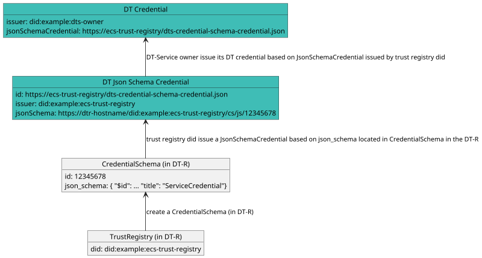

# Decentralized Trust v1 Specification

**Specification Status:** *Draft*

**Latest Draft:** [verana-labs/decentralized-trust-spec](https://github.com/verana-labs/decentralized-trust-spec)

**Editors:**

~ [Fabrice Rochette](https://www.linkedin.com/in/fabricerochette) (2060.io)

<!-- -->

**Participate:**

~ [GitHub repo](https://github.com/verana-labs/decentralized-trust-spec)

~ [File a bug](https://github.com/verana-labs/decentralized-trust-spec/issues)

~ [Commit history](https://github.com/verana-labs/decentralized-trust-spec/commits/main)

---

## Abstract

The Internet is broken. All existing communication channels are insecure, and obsolete. Because all existing communication channels rely on public identifiers, anyone that knows your identifier can reach you.

Furthermore, existing communication channels do not provide a sure-fire way of verifying service provider and end-user Identity. This is an open door to spam, phishing, fraud, identity theft...

Regarding service providers and services, each service has it own registration process, fastidious password rules... And/or they are usually using federated login, that makes you depend on a third party service for accessing your accounts.

If the World Wide Web was initially designed for interoperability, major companies have managed to transform it to a closed, centralized internet, that we all depend on.

Not to talk about privacy, and what's done with our data.

To build a new, trustable internet, we need new, zero trust communication channels, where both ends can be clearly identified, and where providing a service, accessing a service, or creating a new account, should be as simple as clicking a link or presenting a credential.

Decentralized Trust Services are services that are using a secure bidirectional persistent communication channel that, combined to trust layers such as [Decentralized Trust Registries](https://github.com/verana-labs/decentralized-trust-registry-spec), enable establishing a zero trust communication channel between peers.

## About this Document

In order to fully understand the concepts developed in this document, you should have some basic knowledge of [[ref:DID]], [[ref:DIDComm]], [[ref:DT-Service]], [[ref:trust registry]], ledger-based applications, and more generally, all terms present in the [Terminology](#terminology) section.

## Introduction

### What is a Trustable Communication Channel?

*This section is non-normative.*

A trustable communication channel is a persistent communication channel, where participants have been fully authenticated with a [[ref: verifiable credential]].

A communication channel is considered a trustable communication channel if:

- communication channel supports verifiable credentials, either through linked-vp and/or present proof;
- communication channel is persistent;
- all communication channel participants presented a [[ref: verifiable credential]], and presented [[ref: verifiable credentials]] were considered acceptable by other participants (authorized issuers, and optionally matching claims).
- when public resolvable DID(s) are involved for establishing the connection, ciphering keys for bootstrapping the connection MUST be keys defined in DID Document(s);
- when direct did:peer DIDs are involved for bootstrapping the connection, they can be accepted only if originating from a compliant user agent.

All the above is detailed in this spec.

:::note
Presented credentials do not necessarily need to be human/organization identity related. An IoT service could present a deviceId credential to authenticate itself.
:::

### What is a Decentralized Trust - Service?

*This section is non-normative.*

A [[ref: decentralized trust service]] is a service that provide a way to identify itself *before* connecting to it. Entities that want to connect to a [[ref: decentralized trust service]] can review its presented [[ref: verifiable credentials]], prove their legitimacy by performing a [[ref: trust resolution]], and based on the result, decide to connect or not.

Additionally, a [[ref: decentralized trust service]] that would like to issue or request verification of credentials must prove it is allowed to do so.

### What is a Decentralized Trust - User Agent?

*This section is non-normative.*

A [[ref: decentralized trust user agent]] is a software (a browser, an app, a wallet...) 

service that provide a way to identify itself *before* connecting to it. Entities that want to connect to a [[ref: decentralized trust service]] can review its presented [[ref: verifiable credentials]], prove their legitimacy by performing a [[ref: trust resolution]], and based on the result, decide to connect or not.

Additionally, a [[ref: decentralized trust service]] that would like to issue or request verification of credentials must prove it is allowed to do so.

### Conformance

As well as sections marked as non-normative, all authoring guidelines, diagrams, examples, and notes in this specification are non-normative. Everything else in this specification is normative.
The key words MAY, MUST, MUST NOT, OPTIONAL, RECOMMENDED, REQUIRED, SHOULD, and SHOULD NOT in this document are to be interpreted as described in [BCP 14](https://datatracker.ietf.org/doc/html/bcp14) [RFC2119](https://w3c.github.io/vc-data-model/#bib-rfc2119) [RFC8174](https://w3c.github.io/vc-data-model/#bib-rfc8174) when, and only when, they appear in all capitals, as shown here.

## Terminology

[[def: credential schema, credential schemas]]:
~ An [[ref: DT-R]] resource which represents a verifiable credential definition and the associated permissions and business rules for issuing, verifying or holding a credential linked to this credential schema.

[[def: decentralized identifier, DID, DIDs]]:
~ A decentralized identifier, as specified in [[spec-norm:DID-CORE]].

[[def: decentralized identifier communication, DIDComm]]:
~ [DIDComm](https://identity.foundation/didcomm-messaging/spec/) uses [[ref: DIDs]] to establish confidential, ongoing connections.

[[def: decentralized identifier document, DID Document, DID Documents]]:
~ A DID Document, as specified in [[spec-norm:DID-CORE]].

[[def: decentralized trust registry, DTR, DT-R, DT-Registry]]:
~ a decentralized, ledger-based network, which provides: trust registry features that can be used by all its [[ref: participants]], including credential schema management, issuer and verifier management; and a tokenized business model for charging/rewarding [[ref: participants]]. For more information, please refer to [DT-R Spec](https://verana-labs.github.io/decentralized-trust-registry-spec/).

[[def: decentralized trust service, DTS, DTSs, DT-S, DT-Service, DT-Services]]:
~ A service, identified by a resolvable [[ref: DID]] that can be deployed anywhere by its owner, and that is conforming to this spec and has a resolvable [[ref: proof of trust]].

[[def: decentralized trust user agent, DT-UA, DT-UAs]]:
~ A user agent for accessing and using [[ref: DT-Services]]. To be considered a [[ref: DT-UA]], a user agent must conform and enforce this spec, such as presenting a proof of trust to end user before accepting connecting to [[ref: DT-S]] compliant services, and refuse connecting to not compliant services.

[[def: essential credential schema, essential credential schemas]]:
~ Default [[ref: credential schema]], owned by a [[ref: trust registry]], that provide the basis for a trust layer to exist in the ecosystem so that [[ref: DT-UA]] can generate a [[ref: proof of trust]].

[[def: holder, holders]]:
~ A role an entity might perform by possessing one or more verifiable credentials and generating verifiable presentations from them. A holder is often, but not always, a [[ref: subject]] of the verifiable credentials they are holding. Holders store their credentials in credential repositories. Example holders include organizations, persons, things.

[[def: issuer, issuers]]:
~ A role an entity can perform by asserting claims about one or more [[ref: subjects]], creating a verifiable credential from these claims, and transmitting the verifiable credential to a [[ref: holder]]. Example issuers include corporations, non-profit organizations, trade associations, governments, and individuals.

[[def: json schema, json schemas]]:
~ A json schema as defined in [JSON-SCHEMA](https://json-schema.org).

[[def: json schema credential, json schema credentials]]:
~ A json schema credential as defined in [[spec-norm:VC-JSON-SCHEMA]].

[[def: linked-vp]]:
~ A presentation of a [[ref: verifiable credential]] as specified in [LINKED-VP](https://identity.foundation/linked-vp/).

[[def: participant, participants]]:
~ An entity that uses an [[ref: DT-R]] and its trust layer to provide or use services.

[[def: proof of trust]]:
~ Visual representation using [[ref: essential credential schemas]] of a [[ref: trust resolution]] process of a [[ref: DT-Service]], for identifying the [[ref: DT-Service]], its owner, and the [[ref: issuer]] of the verifiable credential of its owner.

[[def: session]]:
~ A session defines a connection to a DID Document provided service from a third party DT-S or DT-UA.

[[def: subject, subjects]]:
~ A thing about which claims are made. Example subjects include human beings, animals, things, and organization, a [[ref: DID]]...

[[def:trust registry, trust registries]]
~ An approved list of [[ref: issuers]] and [[ref: verifiers]] that are authorized to issue/verify certain credentials in an ecosystem.

[[def: trust resolution]]:
~ Process run by, for example a [[ref: DT-UA]] or a [[ref: DT-S]], which purpose is to recursively resolve [[ref: DID]] by digging into [[ref: DID Documents]] and look for [[ref: linked-vp]] entries and their [[ref: issuer]] [[ref: DIDs]], and trust-registry entries to gather whether the service provided by the [[ref: DID]] is trustable (and legitimate), or not.

[[def: verifier, verifiers]]:
~ A role an entity performs by receiving one or more verifiable credentials, optionally inside a verifiable presentation for processing. Example verifiers include service providers.

[[def: verifiable credential, verifiable credentials]]:
~ A verifiable credential as defined in [[spec-norm:VC-DATA-MODEL]].

## Specification

### [ECS] Essential Credential Schemas

Essential Credential Schemas (ECS) are created and managed by a Trust Registry in a [[ref: DT-R]]. There are 4 kinds of ECS:

- Service;
- Organization;
- Person;
- UserAgent.

A Trust Registry creates itself in a [[ref: DT-R]] by creating a `TrustRegistry` entry `tr`. For this Trust Registry to qualify for being used for trust resolution in [[ref: DT-Service]] and [[ref: DT-UA]], it MUST provide, associated to the `TrustRegistry` entry `tr`, all 4 `CredentialSchema` entries, with a respective `json_schema` attribute defined as follows in [ECS-SERVICE], [ECS-ORG], [ECS-PERSON], [ECS-USER-AGENT].

#### [ECS-SERVICE] Service Credential Json Schema

Credential subject object of schema MUST contain the following attributes:

- `id` (string) (*mandatory*): the [[ref: DID]] of the service the credential will be issued to.
- `name` (string) (*mandatory*): service name. UTF8 charset, max length: 512 bytes.
- `type` (string) (*mandatory*): service type. UTF8 charset, max length: 128 bytes. Service types will be defined later.
- `description` (string) (*mandatory*): service description. UTF8 charset, max length: 4096 bytes.
- `logo` (image) (*mandatory*): the logo of the service, as it will be shown in browsers and search engines.
- `minimumAgeRequired` (integer) (*mandatory*): minimum required age to connect to service. Allowed value: 0 to 255. Used by browsers that provide a simple birth date based parental control.
- `termsAndConditions` (string) (*mandatory*): URL of the terms and conditions of the service. It is recommended to store terms and conditions in a file, in a repository that allows file hash verification (IPFS).
- `termsAndConditionsHash` (string) (*optional*): If terms and conditions of the service are stored in a file, optional hash of the file for data integrity verification.
- `privacyPolicy` (string) (*mandatory*): URL of the terms and conditions of the service. MAY be the same URL that `terms_and_conditions` if file are combined. It is recommended to store privacy policy in a file repository that allows file hash verification (IPFS).
- `privacyPolicyHash` (string) (*optional*): If privacy policy of the service are stored in a file, optional hash of the file for data integrity verification.

the resulting `json_schema` attribute will be the following Json Schema. Replace:

- `{$schema_id}` with the `schema_id` of the created `CredentialSchema` entry.

```json
{
  "$id": "https://dtr-hostname/dtr/v1/cs/js/{$schema_id}",
  "$schema": "https://json-schema.org/draft/2020-12/schema",
  "title": "ServiceCredential",
  "description": "ServiceCredential using JsonSchema",
  "type": "object",
  "properties": {
    "credentialSubject": {
      "type": "object",
      "properties": {
        "id": {
          "type": "string",
          "format": "uri"
        },
        "name": {
          "type": "string",
          "minLength": 1,
          "maxLength": 512
        },
        "type": {
          "type": "string",
          "minLength": 1,
          "maxLength": 128
        },
        "description": {
          "type": "string",
          "minLength": 0,
          "maxLength": 4096
        },
        "logo": {
          "type": "string",
          "contentEncoding": "base64",
          "contentMediaType": "image/png"
        },
        "minimumAgeRequired": {
          "type": "number",
          "minimum": 0,
          "exclusiveMaximum": 150
        },
        "termsAndConditions": {
          "type": "string",
          "format": "uri",
          "maxLength": 2048
        },
        "termsAndConditionsHash": {
          "type": "string"
        },
        "privacyPolicy": {
          "type": "string",
          "format": "uri",
          "maxLength": 2048
        },
        "privacyPolicyHash": {
          "type": "string"
        }
      },
      "required": [
        "id",
        "name",
        "type",
        "description",
        "logo",
        "minimumAgeRequired",
        "termsAndConditions",
        "privacyPolicy"
      ]
    }
  }
}
```

#### [ECS-ORG] OrganizationCredential Json Schema

Credential subject object of schema MUST contain the following attributes:

- `id` (string) (*mandatory*): the [[ref: DID]] of the service the credential has been issued to, which is the subject of the [[ref: verifiable credential]].
- `name` (string) (*mandatory*): name of the organization.
- `logo` (image) (*mandatory*): the logo of the organization, as it will be shown in browsers and search engines.
- `registryId` (string) (*mandatory*): registry id of the organization.
- `registryUrl` (string) (*mandatory*): link to registry data.
- `address` (string) (*mandatory*): address of the organization.
- `type` (enum) (*mandatory*): type of organization. PUBLIC, PRIVATE, FOUNDATION.
- `countryCode` (string) (*mandatory*): country where the company is registered.

the resulting `json_schema` attribute will be the following Json Schema. Replace:

- `{$schema_id}` with the `schema_id` of the created `CredentialSchema` entry.


```json
{
  "$id": "https://dtr-hostname/dtr/v1/cs/js/{$schema_id}",
  "$schema": "https://json-schema.org/draft/2020-12/schema",
  "title": "OrganizationCredential",
  "description": "OrganizationCredential using JsonSchema",
  "type": "object",
  "properties": {
    "credentialSubject": {
      "type": "object",
      "properties": {
        "id": {
          "type": "string",
          "format": "uri"
        },
        "name": {
          "type": "string",
          "minLength": 0,
          "maxLength": 256
        },
        "logo": {
          "type": "string",
          "contentEncoding": "base64",
          "contentMediaType": "image/png"
        },
        "registryId": {
          "type": "string",
          "minLength": 0,
          "maxLength": 256
        },
        "registryUrl": {
          "type": "string",
          "minLength": 0,
          "maxLength": 256
        },
        "address": {
          "type": "string",
          "minLength": 0,
          "maxLength": 1024
        },
        "type": {
          "type": "enum",
          "value": ["PUBLIC", "PRIVATE", "FOUNDATION"]
        },
        "countryCode": {
          "type": "string",
          "minLength": 2,
          "maxLength": 2
        }
      },
      "required": [
        "id",
        "name",
        "logo",
        "registryId",
        "registryUrl",
        "address",
        "type",
        "countryCode"
      ]
    }
  }
}
```

#### [ECS-PERSON] Person Credential Json Schema

Credential subject object of schema MUST contain the following attributes:

- `id` (string) (*mandatory*): the [[ref: DID]] of the service the credential has been issued to.
- `firstName` (string) (*optional*): first name of the person.
- `lastName` (string) (*mandatory*): last name of the person.
- `avatar` (image) (*optional*): the avatar of this person, as it will be shown in browsers and search engines.
- `birthDate` (date) (*mandatory*): date of birth.
- `countryOfResidence` (string) (*mandatory*): the country of residence.

the resulting `json_schema` attribute will be the following Json Schema. Replace:

- `{$schema_id}` with the `schema_id` of the created `CredentialSchema` entry.

```json
{
  "$id": "https://dtr-hostname/dtr/v1/cs/js/{$schema_id}",
  "$schema": "https://json-schema.org/draft/2020-12/schema",
  "title": "PersonCredential",
  "description": "PersonCredential using JsonSchema",
  "type": "object",
  "properties": {
    "credentialSubject": {
      "type": "object",
      "properties": {
        "id": {
          "type": "string",
          "format": "uri"
        },
        "firstName": {
          "type": "string",
          "minLength": 0,
          "maxLength": 256
        },
        "lastName": {
          "type": "string",
          "minLength": 1,
          "maxLength": 256
        },
        "avatar": {
          "type": "string",
          "contentEncoding": "base64",
          "contentMediaType": "image/png"
        },
        "birthDate": {
          "type": "string",
          "format": "date"
        },
        "countryOfResidence": {
          "type": "string",
          "minLength": 2,
          "maxLength": 2
        }
      },
      "required": [
        "id",
        "lastName",
        "birthDate",
        "countryOfResidence"
      ]
    }
  }
}
```

#### [ECS-USER-AGENT] User Agent Credential Json Schema

Credential subject object of schema MUST contain the following attributes:

- `id` (string) (*mandatory*): the [[ref: DID]] of the user agent the credential will be issued to.
- `name` (string) (*mandatory*): agent name. UTF8 charset, max length: 512 bytes.
- `description` (string) (*mandatory*): agent description. UTF8 charset, max length: 4096 bytes.
- `category` (string) (*mandatory*): the category of the agent, ie SOCIAL_NETWORK,...
- `logo` (image) (*mandatory*): the logo of the agent, as it will be shown in search engines.
- `wallet` (boolean) (*mandatory*): If the agent implements the DTW (Decentralized Trust Wallet) spec, and thus provides wallet features.
- `termsAndConditions` (string) (*mandatory*): URL of the terms and conditions of the service. It is recommended to store terms and conditions in a file, in a repository that allows file hash verification (IPFS).
- `termsAndConditionsHash` (string) (*optional*): If terms and conditions of the service are stored in a file, optional hash of the file for data integrity verification.
- `privacyPolicy` (string) (*mandatory*): URL of the terms and conditions of the service. MAY be the same URL that `terms_and_conditions` if file are combined. It is recommended to store privacy policy in a file repository that allows file hash verification (IPFS).
- `privacyPolicyHash` (string) (*optional*): If privacy policy of the service are stored in a file, optional hash of the file for data integrity verification.

the resulting `json_schema` attribute will be the following Json Schema. Replace:

- `{$schema_id}` with the `schema_id` of the created `CredentialSchema` entry.

```json
{
  "$id": "https://dtr-hostname/dtr/v1/cs/js/{$schema_id}",
  "$schema": "https://json-schema.org/draft/2020-12/schema",
  "title": "ServiceCredential",
  "description": "ServiceCredential using JsonSchema",
  "type": "object",
  "properties": {
    "credentialSubject": {
      "type": "object",
      "properties": {
        "id": {
          "type": "string",
          "format": "uri"
        },
        "name": {
          "type": "string",
          "minLength": 1,
          "maxLength": 512
        },
        "description": {
          "type": "string",
          "minLength": 0,
          "maxLength": 4096
        },
        "category": {
          "type": "string",
          "minLength": 1,
          "maxLength": 128
        },
        "logo": {
          "type": "string",
          "contentEncoding": "base64",
          "contentMediaType": "image/png"
        },
        "wallet": {
          "type": "boolean"
        },
        "termsAndConditions": {
          "type": "string",
          "format": "uri",
          "maxLength": 2048
        },
        "termsAndConditionsHash": {
          "type": "string"
        },
        "privacyPolicy": {
          "type": "string",
          "format": "uri",
          "maxLength": 2048
        },
        "privacyPolicyHash": {
          "type": "string"
        }
      },
      "required": [
        "id",
        "name",
        "description",
        "category",
        "logo",
        "wallet",
        "termsAndConditions",
        "privacyPolicy"
      ]
    }
  }
}
```

### [DT-JSON-SCHEMA-CRED] Decentralized Trust Json Schema Credential

A DT Json Schema Credential is a [[ref: json schema credential]] self-issued by a Trust Registry DID, that MUST refer to the json schema of a `CredentialSchema` entry created in a `DT-R`. Issuer of the DT Json Schema Credential MUST be the same DID that the DID of the `TrustRegistry` entry created in the [[ref: DT-R]] than owns the `CredentialSchema` entry in the [[ref: DT-R]].

A DT Json Schema Credential MUST have a `credentialSchema` property that contains exactly the following:

```json
  "credentialSchema": {
    "id": "https://w3c.github.io/vc-json-schema/schema/json-schema-credential-schema.json",
    "type": "JsonSchema",
    "digestSRI": "sha384-S57yQDg1MTzF56Oi9DbSQ14u7jBy0RDdx0YbeV7shwhCS88G8SCXeFq82PafhCrW"
  }
```

Additionally, it MUST have a `credentialSubject` object with:

- a `id` properties that is the URL to access the [[ref: json schema]] in the DT-R,
- `type` MUST be set to "JsonSchema",
- an object `jsonSchema` MUST be present with an `$ref` properties that is the URL to access the [[ref: json schema]] in the DT-R
- a digestSRI property that MUST match the [[ref: json schema]] file content hash.

Example of a DT Json Schema Credential:

DtJsonSchemaCredential.json:

```json

{
  "@context": [
      "https://www.w3.org/ns/credentials/v2"
  ],
  "id": "https://ecs-trust-registry/dt-credential-schema-credential.json",
  "type": ["VerifiableCredential", "JsonSchemaCredential"],
  "issuer": "did:example:ecs-trust-registry",
  "issuanceDate": "2024-01-01T19:23:24Z",
  "credentialSchema": {
    "id": "https://w3c.github.io/vc-json-schema/schema/json-schema-credential-schema.json",
    "type": "JsonSchema",
    "digestSRI": "sha384-S57yQDg1MTzF56Oi9DbSQ14u7jBy0RDdx0YbeV7shwhCS88G8SCXeFq82PafhCrW"
  },
  "credentialSubject": {
    "id": "https://dtr-hostname/dtr/v1/cs/js/12345678",
    "type": "JsonSchema",
    "jsonSchema": {
      "$ref": "https://dtr-hostname/dtr/v1/cs/js/12345678"
    },
    "digestSRI": "sha384-ABCSGyugst67rs67rdbugsy0RDdx0YbeV7shwhCS88G8SCXeFq82PafhCeZ" 
  }
}

```

:::note
This is subject to a slight update of [vc-json-schema](https://w3c.github.io/vc-json-schema/) as specified in this [issue](https://github.com/w3c/vc-json-schema/issues/235)
:::

### [DT-TR-DIDDOC] Trust Registry DID Document

For each `CredentialSchema` entry a Trust Registry has created in a [[ref: DT-R]], the Trust Registry MUST self-issue the corresponding DT Json Schema Credential as specified in [DT-JSON-SCHEMA-CRED].

Additionally, in MUST present the DT Json Schema Credential(s) in its DIDDocument, as well as the corresponding trust registry entry for verification. To do so, it MUST define the following entries in its DIDDocument:

- for each `CredentialSchema` entry it wants to be resolvable, a "LinkedVerifiablePresentation" service entry with a fragment that MUST start with to `#dtr-schemas`, that MUST point to a self-issued DT Json Schema Credential as specified in [DT-JSON-SCHEMA-CRED].
- a "DecentralizedTrustRegistry" service entry with fragment name equal to `#dtr-schemas-trust-registry`, that MUST point to the API of the DID's trust registry in the DT-R.

Example:

```json
  "service": [
    {
      "id": "did:example:dl-trust-registry#dtr-schemas-driving-license-credential-schema-credential",
      "type": "LinkedVerifiablePresentation",
      "serviceEndpoint": ["https://dl-trust-registry/driving-license-credential-schema-presentation.json"]
    },
    {
      "id": "did:example:dl-trust-registry#dtr-schemas-trust-registry",
      "type": "DecentralizedTrustRegistry",
      "version": "1.0",
      "serviceEndpoint": ["https://dtr-hostname/dtr/v1/"]
    }
    ...
  ]
```

If the Trust Registry wishes to provide ECS trust resolution, it MUST present 4 DT Json Credential Schemas of the 4 ECSs required for trust resolution, as well as the corresponding trust registry entry for verification. To do that, it MUST define the following entries in its DIDDocument:

- a "LinkedVerifiablePresentation" service entry with fragment name equal to `#dtr-essential-schemas-service-credential-schema-credential`, that MUST point to a self-issued Service DT Json Schema Credential as specified in [SERVICE-JSON-SCHEMA-CRED] of a service json schema as specified in [ECS-SERVICE].
- a "LinkedVerifiablePresentation" service entry with fragment name equal to `#dtr-essential-schemas-org-credential-schema-credential`, that MUST point to a self-issued [[ref: json schema credential]] of a DT json schema as specified in [ECS-ORG].
- a "LinkedVerifiablePresentation" service entry with fragment name equal to `#dtr-essential-schemas-person-credential-schema-credential`, that MUST point to a self-issued [[ref: json schema credential]] of a DT json schema as specified in [ECS-PERSON].
- a "LinkedVerifiablePresentation" service entry with fragment name equal to `#dtr-essential-schemas-user-agent-credential-schema-credential`, that MUST point to a self-issued [[ref: json schema credential]] of a DT json schema as specified in [ECS-USER-AGENT].
- a "DecentralizedTrustRegistry" service entry with fragment name equal to `#dtr-essential-schemas-trust-registry`, that MUST point to the API URL of this DID's trust registry in the DT-R.

Example:

```json
  "service": [
    {
      "id": "did:example:ecs-trust-registry#dtr-essential-schemas-service-credential-schema-credential",
      "type": "LinkedVerifiablePresentation",
      "serviceEndpoint": ["https://ecs-trust-registry/service-credential-schema-presentation.json"]
    },
    {
      "id": "did:example:ecs-trust-registry#dtr-essential-schemas-organization-credential-schema-credential",
      "type": "LinkedVerifiablePresentation",
      "serviceEndpoint": ["https://ecs-trust-registry/org-credential-schema-presentation.json"]
    },
    {
      "id": "did:example:ecs-trust-registry#dtr-essential-schemas-person-credential-schema-credential",
      "type": "LinkedVerifiablePresentation",
      "serviceEndpoint": ["https://ecs-trust-registry/person-credential-schema-presentation.json"]
    },
    {
      "id": "did:example:ecs-trust-registry#dtr-essential-schemas-user-agent-credential-schema-credential",
      "type": "LinkedVerifiablePresentation",
      "serviceEndpoint": ["https://ecs-trust-registry/user-agent-credential-schema-presentation.json"]
    },
    {
      "id": "did:example:ecs-trust-registry#dtr-essential-schemas-trust-registry",
      "type": "DecentralizedTrustRegistry",
      "version": "1.0",
      "serviceEndpoint": ["https://dtr-hostname/dtr/v1/"]
    }
    
    ...
  ]
```

### [DT-CRED] Decentralized Trust (DT) Credential

A simple diagram for a clear understanding:



A DT Credential MUST have a `credentialSchema` property:

- `id` must point to a [[ref: json schema credential]] issued by the trust registry [[ref: DID]] owner of the schema in the DT-R;
- `type` MUST be `JsonSchemaCredential`.

As a matter of fact, a DT Credential MUST conform to the dereferenced [[ref: json schema]] of the `JsonSchemaCredential`.

Example DTCredential.json:

```json

{
  "@context": [
    "https://www.w3.org/ns/credentials/v2"
  ],
  "id": "did:example:user-dts.gaiaid.io",
  "type": ["VerifiableCredential", "ServiceCredential"],
  "issuer": "did:example:user-dts.gaiaid.io",
  "credentialSubject": {
     "id": "did:example:user-dts.gaiaid.io",
    ...
  },
  ...
  "credentialSchema": {
    "id": "https://ecs-trust-registry/service-credential-schema-credential.json",
    "type": "JsonSchemaCredential"
  }
}

```

### [DT-EC] DT Essential Credentials

- DT Service Essential Credential [DT-EC-SERVICE]: a [DT-CRED] linked to a CredentialSchema entry that conforms to [ECS-SERVICE].
- DT Organization Essential Credential [DT-EC-ORG]: a [DT-CRED] linked to a CredentialSchema entry that conforms to [ECS-ORG].
- DT Person Essential Credential [DT-EC-PERSON]: a [DT-CRED] linked to a CredentialSchema entry that conforms to [ECS-PERSON].
- DT User Agent Essential Credential [DT-EC-USER-AGENT]: a [DT-CRED] linked to a CredentialSchema entry that conforms to [ECS-USER-AGENT].

### [DT-Service-REQ] Requirements for a service to be a DT-Service

- [DT-Service-REQ-1] A [[ref: DT-Service]] MUST be identified by a [[:ref DID]]. The [[:ref DID]] of a [[ref: DT-Service]] MUST resolve to a [[ref: DID Document]].
- [DT-Service-REQ-2] A [[ref: DT-Service]] DID Document MUST present (linked-vp) a DT Service Essential Credential that conforms to [DT-EC-SERVICE].
- [DT-Service-REQ-3] If the issuer of the DT Service Essential Credential of [DT-Service-REQ-2] is the [[ref: DID]] of this service, service DID Document MUST present a credential that conforms to [DT-EC-ORG] or (exclusive) a [DT-EC-PERSON].
- [DT-Service-REQ-4] If the issuer of the DT Service Credential of [DT-Service-REQ-2] is not the [[ref: DID]] of this service, issuer service MUST be a [DT-Service-REQ] [[ref: DT-Service]] that conforms to [DT-Service-REQ-3].
- [DT-Service-REQ-5] A compliant [[ref: DT-Service]] MUST dereference all service credentials, User Agent credentials, DID Documents, verify DT-Service Json Schema Credentials, Json Schema hashes, use the Decentralized Trust Registry API,... comply with [TR-WL] to resolve trust and ensure compliance by denying unauthorized actions.

::: note
In other words, to be a DT-Service, a service MUST identify itself directly by presenting an Organization or a Person Essential Credential, or the issuer of its Service Essential Credential MUST identify itself by presenting an Organization or a Person Essential Credential.
:::

- [DT-Service-REQ-5] The service MAY issue, present through linked verifiable presentation entries, or request presentation of any additional DT-Service Credential that conforms to [DT-CRED].

### [DT-Service-CI] Credential Issuance

- [DT-Service-CI-1] A [[ref: DT-Service]] CAN issue [DT-CRED] DT Credentials.
- [DT-Service-CI-2] A [[ref: DT-Service]] MUST NOT issue credentials that are not compliant with [DT-CRED].

### [DT-Service-PR] Presentation Request

- [DT-Service-PR-1] A [[ref: DT-Service]] CAN request presentation of [DT-CRED] DT Credentials
- [DT-Service-PR-2] A [[ref: DT-Service]] MUST NOT request presentation of credentials that are not compliant with [DT-CRED].

### [DT-Service-LVP] Linked Verifiable Presentations

Linked verifiable presentations of credential CAN be present in service DID Document, if present, they MUST conform to the following:

- [DT-Service-LVP-1] Verifiable presentation MUST be signed by the DT-Service DID.
- [DT-Service-LVP-2] if linked verifiable presentation id fragment start with `#dtr-schemas`, presented credential and DID Document MUST conform to [DT-CRED].
- [DT-Service-LVP-3] if linked verifiable presentation id fragment is `#dtr-essential-schemas-service-credential`, presented credential MUST be a DT Service Essential Credential [DT-EC-SERVICE].
- [DT-Service-LVP-4] if linked verifiable presentation id fragment is `#dtr-essential-schemas-org-credential`, presented credential MUST be a DT Organization Essential Credential [DT-EC-ORG].
- [DT-Service-LVP-5] if linked verifiable presentation id fragment is `#dtr-essential-schemas-person-credential`, presented credential MUST be a DT Person Essential Credential [DT-EC-PERSON].

### [DT-UA-REQ] Requirements for a User Agent to be a DT-UA

- [DT-UA-REQ-1] A [[ref: DT-UA]] MUST be identified by a [[:ref DID]]. The [[:ref DID]] of a [[ref: DT-UA]] MUST resolve to a [[ref: DID Document]].
- [DT-UA-REQ-2] A [[ref: DT-UA]] DID Document MUST present a DT Organization Essential Credential that conforms to [DT-EC-ORG] or (exclusive) to [DT-EC-PERSON].
- [DT-UA-REQ-3] A [[ref: DT-UA]] DID Document MUST present a DT User Agent Essential Credential that conforms to [DT-EC-USER-AGENT].
- [DT-UA-REQ-4] A compliant [[ref: DT-UA]] MUST dereference all service credentials, User Agent credentials, DID Documents, verify DT Json Schema Credentials, Json Schema hashes, use the Decentralized Trust Registry API,... comply with [TR-WL] to resolve trust and ensure compliance by denying unauthorized actions.

::: note
In other words, a to be a DT-UA, a User Agent MUST identify itself to the other end by sharing its DID, and the other end MUST verify it complies with [DT-UA-REQ]
:::

### [DT-Service-CONN-DT-Service] Requirements for a DT-Service to accept a connection from another service

When a [[ref: DT-Service]] DT-Service-1 receive a connection request from a service Service-2 to one of its services specified in DID Document, DT-Service-1 MUST verify service Service-2 complies with [DT-Service-SPEC], else DT-Service-1 MUST NOT accept the connection. Exception: if provided by DT-Service-1 service Service-2 wants to connect to is an issuer of [DT-EC-ORG] or [DT-EC-PERSON] and Service-2 is just missing a [DT-EC-ORG] / [DT-EC-PERSON] for being compliant, connection CAN be accepted by DT-Service-1.

### [DT-Service-CONN-DT-UA] Requirements for a DT-Service to accept a connection from a DT-UA User Agent

When a User Agent start a [[ref: session]] with a compliant [[ref: DT-Service]], [[ref: DT-Service]] MUST verify that User Agent complies with [DT-UA-SPEC], else [[ref: DT-Service]] MUST drop the connection.

### [DT-UA-CONN-DT-Service] Requirements for a DT-UA to accept connecting to a service

When a [[ref: DT-UA]] start a [[ref: session]] with a service, [[ref: DT-UA]] MUST verify DT-Service complies with [DT-Service-SPEC], else DT-UA MUST NOT connect to DT-Service.

### [DT-UA-CONN-DT-UA] Requirements for a DT-UA to accept connecting to a another User Agent

When a [[ref: DT-UA]] start a [[ref: session]] with another User Agent, [[ref: DT-UA]] MUST verify that the peer User Agent complies with [DT-UA-SPEC], else [[ref: DT-UA]] MUST drop the connection.

### [TR-WL] DT-R and Trust Registry whitelists

Compliant [[ref: DT-Services]] and [[ref: DT-UAs]] MUST maintain a list of trusted DT-Rs and trusted DT Essential Credential issuers, and ignore DT-Rs and DT ECS issuers that are not in these lists when resolving trust:

- [TR-WL-DT-R]: A list of prefix URLs of trusted DT-Rs (registry of registries).

Example:

```json

{ 
  decentralizedTrustRegistries: [ 
    { 
      "name": "dtr-mainnet",
      "baseurl": "https://dtr-mainnet/dtr/v1",
      "version": "1"
      "production": true
    },
    { 
      "name": "dtr-testnet",
      "baseurl": "https://dtr-testnet/dtr/v1",
      "version": "1"
      "production": false
    },
    { 
      "name": "dtr-devnet",
      "baseurl": "https://dtr-devnet/dtr/v2",
      "version": "2"
      "production": false
    },
  ]
}
```

- [TR-WL-ES-TR]: A list of DIDs of trusted Trust Registries for providing essential credential schemas.

Example:

```json

{ 
  essentialSchemaTrustRegistries: [ 
    { 
      "tr": "did:example:ecs-trust-registry",
      "dtr": "dtr-mainnet"
    },
    { 
      "tr": "did:efg:ecs-trust-registry",
      "dtr": "dtr-testnet"
    }
  ]
}
```

### [TR-RESOL] Verification of permission in Decentralized Trust Registries

:::todo
Use TRQP instead of native [[ref: DT-R]] queries when TRQP stabilizes
:::

Please refer to [MOD-CSP-QRY-3] and [MOD-CSP-QRY-4] in [[ref: DT-R]] specs.

Example #1: check if issuer `did:example:service-credential-issuer` is (was) granted issuance of credentials from credential schema `12345678` to wallet_user_agent_did `did:example:wallet_user_agent` through user agent `did:example:user_agent` for country `fr` at datetime `2024-10-31T01:48:52Z` for [[ref: session]]_id `09b6d2e1-684f-443a-94ae-f6bc3112b2e5`:

`POST /dtr/v1/csp/authorized_issuer`

```json
{
  "issuer_did": "did:example:service-credential-issuer",
  "user_agent_did": "did:example:user_agent",
  "wallet_user_agent_did": "did:example:wallet_user_agent",
  "schema_id": "12345678",
  "country": "fr",
  "when": "2024-10-31T01:48:52Z",
  "session_id": "09b6d2e1-684f-443a-94ae-f6bc3112b2e5"
}
```

Response:

```json
{
  "status": "AUTHORIZED"
}
```

Example #2: check if verifier `did:example:verifier` is (was) granted presentation request of a credential from credential schema `12345678` issued by issuer `did:example:service-credential-issuer` from wallet_user_agent_did `did:example:wallet_user_agent` through user agent `did:example:user_agent` for country `fr` at datetime `2024-10-31T01:48:52Z` for [[ref: session]]_id `09b6d2e1-684f-443a-94ae-f6bc3112b2e5` and [[ref: session]]_id `09b6d2e1-684f-443a-94ae-f6bc3112b2e5`:

`POST /dtr/v1/csp/authorized_verifier`

```json
{
  "verifier_did": "did:example:verifier",
  "issuer_did": "did:example:service-credential-issuer",
  "user_agent_did": "did:example:user_agent",
  "wallet_user_agent_did": "did:example:wallet_user_agent",
  "schema_id": "12345678",
  "country": "fr",
  "when": "2024-10-31T01:48:52Z",
  "session_id": "09b6d2e1-684f-443a-94ae-f6bc3112b2e5"
}
```

Response:

```json
{
  "status": "AUTHORIZED"
}
```

### Example

Let's see a full example in action. Here is a DID Document of a compliant DT-Service:

```json
  "service": [
    {
      "id": "did:example:user-dts.gaiaid.io#dtr-essential-schemas-service-credential",
      "type": "LinkedVerifiablePresentation",
      "serviceEndpoint": ["https://user-dts.gaiaid.io/service-credential-presentation.json"]
    },
    {
      "id": "did:example:user-dts.gaiaid.io#dtr-essential-schemas-org-credential",
      "type": "LinkedVerifiablePresentation",
      "serviceEndpoint": ["https://user-dts.gaiaid.io/org-credential-presentation.json"]
    },
    {
      "id": "did:example:user-dts.gaiaid.io#dtr-schemas-trademark-credential",
      "type": "LinkedVerifiablePresentation",
      "serviceEndpoint": ["https://user-dts.gaiaid.io/trademark-credential-presentation.json"]
    }
    ...
  ]
```

Let's dereference...

service-credential-presentation.json:

```json

{
  "@context": [
    "https://www.w3.org/ns/credentials/v2"
  ],
  "holder": "did:example:user-dts.gaiaid.io",
  "type": ["VerifiablePresentation"],
  "verifiableCredential": [
    {
      "@context": [
        "https://www.w3.org/ns/credentials/v2"
      ],
      "id": "did:example:user-dts.gaiaid.io",
      "type": ["VerifiableCredential", "ServiceCredential"],
      "issuer": "did:example:user-dts.gaiaid.io",
      "credentialSubject": {
        "id": "did:example:user-dts.gaiaid.io",
        ...
      },
      ...
      "credentialSchema": {
        "id": "https://ecs-trust-registry/service-credential-schema-credential.json",
        "type": "JsonSchemaCredential"
      }
    }
  ],
  "id": "https://user-dts.gaiaid.io/service-credential-presentation.json",
  "proof": {
    "type": "Ed25519Signature2018",
    "created": "2024-02-08T17:38:46Z",
    "verificationMethod": "did:example:user-dts.gaiaid.io#_Qq0UL2Fq651Q0Fjd6TvnYE-faHiOpRlPVQcY_-tA4A",
    "proofPurpose": "assertionMethod",
    "jws": "eyJhbGciOiJFZERTQSIsImI2NCI6ZmFsc2UsImNyaXQiOlsiYjY0Il19..6_k6Dbgug-XvksZvDVi9UxUTAmQ0J76pjdrQyNaQL7eVMmP_SUPZCqso6EN3aEKFSsJrjDJoPJa9rBK99mXvDw"
  }
}

```

service-credential-schema-credential.json:

```json

{
  "@context": [
      "https://www.w3.org/ns/credentials/v2"
  ],
  "id": "https://ecs-trust-registry/service-credential-schema-credential.json",
  "type": ["VerifiableCredential", "JsonSchemaCredential"],
  "issuer": "did:example:ecs-trust-registry",
  "issuanceDate": "2024-01-01T19:23:24Z",
  "credentialSchema": {
    "id": "https://w3c.github.io/vc-json-schema/schema/json-schema-credential-schema.json",
    "type": "JsonSchema",
    "digestSRI": "sha384-S57yQDg1MTzF56Oi9DbSQ14u7jBy0RDdx0YbeV7shwhCS88G8SCXeFq82PafhCrW"
  },
  "credentialSubject": {
    "id": "https://dtr-hostname/dtr/v1/cs/js/12345678",
    "type": "JsonSchema",
    "jsonSchema": {
      "$ref": "https://dtr-hostname/dtr/v1/cs/js/12345678"
    },
    "digestSRI": "sha384-ABCSGyugst67rs67rdbugsy0RDdx0YbeV7shwhCS88G8SCXeFq82PafhCrW" 
  }
}

```

:::note
Here for trust resolution we need to get did:example:ecs-trust-registry DIDDocument and verify its TrustRegistry entry (see DID Doc below)
:::

org-credential-presentation.json:

```json

{
  "@context": [
    "https://www.w3.org/ns/credentials/v2"
  ],
  "holder": "did:example:user-dts.gaiaid.io",
  "type": ["VerifiablePresentation"],
  "verifiableCredential": [
    {
      "@context": [
        "https://www.w3.org/ns/credentials/v2"
      ],
      "id": "did:example:user-dts.gaiaid.io",
      "type": ["VerifiableCredential", "OrganizationCredential"],
      "issuer": "did:example:certivera.com",
      "credentialSubject": {
        "id": "did:example:user-dts.gaiaid.io",
        ...
      },
      ...
      "credentialSchema": {
        "id": "https://ecs-trust-registry/org-credential-schema-credential.json",
        "type": "JsonSchemaCredential"
      }
    }
  ],
  "id": "https://user-dts.gaiaid.io/org-credential-presentation.json",
  "proof": {
    "type": "Ed25519Signature2018",
    "created": "2024-02-08T17:38:46Z",
    "verificationMethod": "did:example:user-dts.gaiaid.io#_Qq0UL2Fq651Q0Fjd6TvnYE-faHiOpRlPVQcY_-tA4A",
    "proofPurpose": "assertionMethod",
    "jws": "eyJhbGciOiJFZERTQSIsImI2NCI6ZmFsc2UsImNyaXQiOlsiYjY0Il19..6_k6Dbgug-XvksZvDVi9UxUTAmQ0J76pjdrQyNaQL7eVMmP_SUPZCqso6EN3aEKFSsJrjDJoPJa9rBK99mXvDw"
  }
}

```

org-credential-schema-credential.json:

```json

{
  "@context": [
      "https://www.w3.org/ns/credentials/v2"
  ],
  "id": "https://example.tr/credentials/OrganizationJsonSchemaCredential",
  "type": ["VerifiableCredential", "JsonSchemaCredential"],
  "issuer": "did:example:ecs-trust-registry",
  "issuanceDate": "2024-01-01T19:23:24Z",
  "credentialSchema": {
    "id": "https://w3c.github.io/vc-json-schema/schema/json-schema-credential-schema.json",
    "type": "JsonSchema",
    "digestSRI": "sha384-S57yQDg1MTzF56Oi9DbSQ14u7jBy0RDdx0YbeV7shwhCS88G8SCXeFq82PafhCrW"
  },
  "credentialSubject": {
    "id": "https://dtr-hostname/dtr/v1/cs/js/78901234",
    "type": "JsonSchema",
    "jsonSchema": {
      "$ref": "https://dtr-hostname/dtr/v1/cs/js/78901234"
    },
    "digestSRI": "sha384-ABCSGyugst67rs67rdbugsy0RDdx0YbeV7shwhCS88G8SCXeFq82PafhCrW"  
  }
}

```

trademark-credential-presentation.json:

```json

{
  "@context": [
    "https://www.w3.org/ns/credentials/v2"
  ],
  "holder": "did:example:user-dts.gaiaid.io",
  "type": ["VerifiablePresentation"],
  "verifiableCredential": [
    {
      "@context": [
        "https://www.w3.org/ns/credentials/v2"
      ],
      "id": "did:example:user-dts.gaiaid.io",
      "type": ["VerifiableCredential", "TrademarkCredential"],
      "issuer": "did:example:trademark.abc",
      "credentialSubject": {
        "id": "did:example:user-dts.gaiaid.io",
        ...
      },
      ...
      "credentialSchema": {
        "id": "https://trademark.abc/credentials/TrademarkJsonSchemaCredential",
        "type": "JsonSchemaCredential"
      }
      "credentialSchema": {
        "id": "https://dtr-hostname/dtr/v1/cs/js/7358717246",
        "type": "JsonSchema",
        "digestSRI": "sha384-S57yQDg1MTzF56Oi9DbSQ14u7jBy0RDdx0YbeV7shwhCS88G8SCXeFq82PafhCrW"
      }
    }
  ],
  "id": "https://user-dts.gaiaid.io/trademark-credential-presentation.json",
  "proof": {
    "type": "Ed25519Signature2018",
    "created": "2024-02-08T17:38:46Z",
    "verificationMethod": "did:example:user-dts.gaiaid.io#_Qq0UL2Fq651Q0Fjd6TvnYE-faHiOpRlPVQcY_-tA4A",
    "proofPurpose": "assertionMethod",
    "jws": "eyJhbGciOiJFZERTQSIsImI2NCI6ZmFsc2UsImNyaXQiOlsiYjY0Il19..6_k6Dbgug-XvksZvDVi9UxUTAmQ0J76pjdrQyNaQL7eVMmP_SUPZCqso6EN3aEKFSsJrjDJoPJa9rBK99mXvDw"
  }
}

```

TrademarkJsonSchemaCredential.json:

```json

{
  "@context": [
      "https://www.w3.org/ns/credentials/v2"
  ],
  "id": "https://trademark.abc/credentials/TrademarkJsonSchemaCredential",
  "type": ["VerifiableCredential", "JsonSchemaCredential"],
  "issuer": "did:example:trademark-trust-registry",
  "issuanceDate": "2024-01-01T19:23:24Z",
  "credentialSchema": {
    "id": "https://w3c.github.io/vc-json-schema/schema/json-schema-credential-schema.json",
    "type": "JsonSchema",
    "digestSRI": "sha384-S57yQDg1MTzF56Oi9DbSQ14u7jBy0RDdx0YbeV7shwhCS88G8SCXeFq82PafhCrW"
  },
  "credentialSubject": {
    "id": "https://example-dtr/cs/js/7358717246",
    "type": "JsonSchema",
    "jsonSchema": {
       "$ref": "https://example-dtr/dtr/v1/cs/js/7358717246",
    }
    "digestSRI": "sha384-GHJSGyugst67rs67rdbugsy0RDdx0YbeV7shwhCS88G8SCXeFq82PafhCrW"
  }
}

```

DID Document of did:example:ecs-trust-registry:

```json
  "service": [
    {
      "id": "did:example:ecs-trust-registry#dtr-essential-schemas-service-credential-schema-credential",
      "type": "LinkedVerifiablePresentation",
      "serviceEndpoint": ["https://ecs-trust-registry/service-credential-schema-presentation.json"]
    },
    {
      "id": "did:example:ecs-trust-registry#dtr-essential-schemas-organization-credential-schema-credential",
      "type": "LinkedVerifiablePresentation",
      "serviceEndpoint": ["https://ecs-trust-registry/org-credential-schema-presentation.json"]
    },
    {
      "id": "did:example:ecs-trust-registry#dtr-essential-schemas-person-credential-schema-credential",
      "type": "LinkedVerifiablePresentation",
      "serviceEndpoint": ["https://ecs-trust-registry/person-credential-schema-presentation.json"]
    },
    {
      "id": "did:example:ecs-trust-registry#dtr-essential-schemas-trust-registry",
      "type": "DecentralizedTrustRegistry",
      "version": "1.0",
      "serviceEndpoint": ["https://dtr-hostname/dtr/v1/"]
    }
    
    ...
  ]
```

DID Document of did:example:trademark-trust-registry:

```json
  ...
  "service": [
    {
      "id": "did:example:trademark-trust-registry#dtr-schemas-trademark-credential-schema-credential",
      "type": "LinkedVerifiablePresentation",
      "serviceEndpoint": ["https://trademark.abc/credentials/TrademarkJsonSchemaCredential"]
    },
    {
      "id": "did:example:trademark-trust-registry#dtr-schemas-trust-registry",
      "type": "DecentralizedTrustRegistry",
      "version": "1.0",
      "serviceEndpoint": ["https://dtr-hostname/dtr/v1/"]
    }
    
    ...
  ]
  ...
```

### User Agent Display of Trust Resolution

#### Credential Wallets

#### Connection Invitation

#### Presentation Request

### Internationalization

*This section is non normative.*

It is the responsibility of browsers and search engines to properly translate credential attributes, as credential schemas are always defined in a single language, that SHOULD be english.
